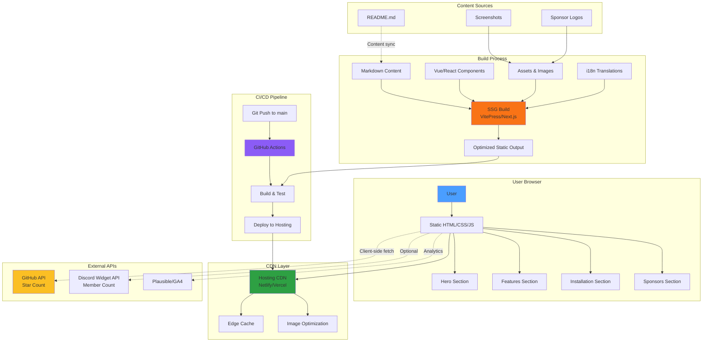

# avante.nvim Homepage - Product Requirements Document

## Executive Summary

**Problem Statement**: avante.nvim currently lacks a dedicated homepage that effectively communicates its value proposition, features, and getting started guidance to potential users. The project relies solely on the GitHub README for all documentation and marketing, which limits discoverability, professional presentation, and user onboarding experience.

**Proposed Solution**: Create a modern, responsive homepage that serves as the primary entry point for avante.nvim. The homepage will showcase the plugin's AI-powered code assistance capabilities, highlight key features including Avante Zen Mode, ACP support, and RAG capabilities, provide quick-start documentation, and establish avante.nvim as a professional, production-ready alternative to Cursor AI IDE.

**Expected Impact**:
- **Increased Adoption**: Improved discoverability and professional presentation will attract more users from the Neovim community and developers seeking Cursor alternatives
- **Better Onboarding**: Clear value proposition and getting started guides will reduce time-to-first-value for new users
- **Community Growth**: Centralized hub for documentation, demos, and community resources strengthens ecosystem
- **Brand Recognition**: Establish avante.nvim as the premier Neovim AI coding assistant and Cursor alternative

**Success Metrics**:
- Homepage deployed and accessible with sub-2s load time
- 30% increase in GitHub stars within 3 months post-launch (baseline: current count)
- 50% reduction in "how to get started" issues on GitHub
- >85% positive community sentiment on homepage design (Discord feedback)
- >2 minutes average time on page indicating engagement
- <40% bounce rate demonstrating relevant content

---

## Requirements & Scope

### Functional Requirements

**REQ-1**: Homepage must display a clear, compelling value proposition that differentiates avante.nvim from alternatives
- Hero section with tagline: "AI-Powered Code Assistance for Neovim"
- Brief description highlighting key differentiators: Cursor-like AI capabilities in Neovim, open-source, multi-provider support, extensible
- Positioning statement that acknowledges Cursor AI IDE as inspiration while emphasizing Neovim-native advantages (vim keybindings, plugin ecosystem, terminal-based workflow)
- Emphasis on bringing modern AI coding assistance to Neovim without leaving the editor

**REQ-2**: Homepage must showcase key features with visual examples
- **Core AI Features**:
  - AI-powered code suggestions and completions
  - One-click code application with diff preview
  - Multi-provider support (Claude, OpenAI, Gemini, Copilot, and 10+ other providers)
- **Advanced Capabilities**:
  - Avante Zen Mode (terminal-like AI agent experience with full Neovim power)
  - ACP (Agent Client Protocol) support with compatible agents (claude-code, gemini-cli, goose, codex, kimi-cli)
  - Project-specific instructions via avante.md files
  - RAG service for context-aware code generation
  - Custom tools and MCP (Model Context Protocol) integration via mcphub.nvim
- **Integration Features**:
  - Chat with selected files and codebase exploration
  - Claude text editor tool mode support
  - Cursor Planning Mode compatibility

**REQ-3**: Homepage must include a quick-start/installation section
- Installation instructions for popular package managers:
  - lazy.nvim (recommended, with detailed example)
  - vim-plug
  - mini.deps
  - Packer
- Minimum requirements clearly stated (Neovim 0.10.1+)
- Basic configuration example showing provider setup
- Link to full documentation for advanced configuration
- Build requirements note (cargo for source builds, or automatic binary download)

**REQ-4**: Homepage must provide clear navigation to key resources
- GitHub repository with star count
- Full documentation/Wiki
- Community Discord (with member count if available)
- Sponsorship links (Patreon for individual support)
- Installation guide and getting started resources

**REQ-5**: Homepage must include visual demonstration of the plugin in action
- High-quality screenshots of key features:
  - Sidebar with AI chat interface
  - Code suggestions with diff application
  - Avante Zen Mode showcasing terminal-like experience
  - Project instructions (avante.md) in action
- Focus on real-world use cases (refactoring, debugging, documentation generation)
- Screenshots demonstrating Cursor-like experience within Neovim
- Static screenshots prioritized for MVP to ensure fast loading
- Future consideration: Video demo or animated GIFs in post-MVP iteration

**REQ-6**: Homepage must be responsive and accessible
- Mobile-friendly responsive design with breakpoints for phone, tablet, desktop
- Fast loading performance (< 2s initial load on desktop, < 3s on mobile 4G)
- Accessibility standards (WCAG 2.1 AA minimum)
- Cross-browser compatibility (Chrome, Firefox, Safari, Edge - latest 2 versions)
- Keyboard navigation support
- Screen reader friendly with semantic HTML and ARIA labels

**REQ-7**: Homepage must support internationalization foundation
- Built with i18n support architecture for future localization
- Initial launch in English only
- Chinese translation will be added in Phase 2 post-MVP (matches existing README_zh.md)
- Content structure and code prepared to minimize translation effort
- Language switcher UI component ready for activation when translations available

**REQ-8**: Homepage must include social proof and credibility indicators
- GitHub star count (dynamic, fetched via GitHub API)
- Contributor count and community size
- **Business Sponsor acknowledgments** (confirmed from codebase):
  - **Warp** - The intelligent terminal for developers (primary sponsor)
  - **Meshy AI** - Business sponsor
  - **BabelTower API** - Business sponsor
- Sponsor logos displayed prominently with attribution
- Link to Patreon for individual sponsorships
- Optional: Community testimonials or quotes (if available from Discord)

**REQ-9**: Homepage must be SEO-optimized
- Meta tags for social sharing (Open Graph, Twitter Cards)
- Semantic HTML5 structure (header, nav, main, section, article, footer)
- Performance optimization for Core Web Vitals (LCP, FID, CLS)
- Sitemap.xml and robots.txt for search engine indexing
- Structured data markup (JSON-LD) for rich search results
- Target keywords: "Neovim AI assistant", "Cursor alternative", "AI code completion Neovim", "avante.nvim"

### Non-Functional Requirements

**NFR-1**: Performance
- Initial page load < 2 seconds on desktop (3G connection)
- Time to Interactive (TTI) < 3 seconds
- Lighthouse score > 90 for Performance, Accessibility, Best Practices, SEO
- First Contentful Paint (FCP) < 1.5 seconds
- Cumulative Layout Shift (CLS) < 0.1
- Images optimized with WebP/AVIF format and responsive sizing

**NFR-2**: Maintainability
- Static site generation for easy updates and version control
- Content separated from presentation (markdown-based content where possible)
- Version-controlled content in Git
- Documentation for updating content (README in homepage repo)
- Easy to update by non-developers for content changes
- Clear component structure and naming conventions

**NFR-3**: Deployment & Hosting
- Automated deployment via GitHub Actions
- Zero-cost hosting solution preferred (GitHub Pages, Vercel free tier, or Netlify free tier)
- **Hosting Platform**: Vercel (recommended for Next.js/Astro) or Netlify (recommended for VitePress)
- Custom domain support ready (if needed in future)
- HTTPS enabled by default
- Preview deployments for pull requests
- Automatic cache invalidation on updates

**NFR-4**: Design & Branding
- Consistent with avante.nvim visual identity
- Modern, developer-focused aesthetic
- **Dark mode as default theme** (preferred by developer audience)
- Optional light mode toggle for accessibility
- Professional and polished visual design
- Typography optimized for code and technical content
- Color scheme aligned with Neovim ecosystem aesthetics

**NFR-5**: Analytics & Monitoring
- Privacy-focused analytics integration (Plausible or Fathom preferred over Google Analytics)
- Track key user interactions:
  - Installation instructions views
  - Package manager tab selections
  - Copy button clicks for code snippets
  - CTA clicks (GitHub, Discord, Documentation)
  - Scroll depth (75%, 100%)
- Monitor page performance and errors
- GDPR compliant analytics implementation
- No cookies required for basic analytics

### Out of Scope

The following items are explicitly out of scope for the initial MVP version:

- **Interactive Web-based Demo**: Building a fully functional in-browser demo of avante.nvim (complex WebAssembly implementation, defer to screenshots)
- **Video Demonstrations**: Video content deferred to post-MVP for faster initial launch
- **User Authentication**: No login, user accounts, or personalization features
- **Multi-language Support at Launch**: Chinese and other languages will be added in Phase 2
- **Blog/News Section**: Content updates will be handled via GitHub releases, README, and Discord
- **API Documentation**: Detailed API docs remain in GitHub repository and Wiki
- **Community Forum**: Discord serves as the primary community platform
- **Plugin Marketplace**: No plans for a plugin/extension marketplace on homepage
- **In-page Search**: Search functionality not required for single-page homepage
- **Comment System**: No comments or user-generated content on homepage

### Success Criteria

The homepage launch will be considered successful when all of the following criteria are met:

1. **Deployment Complete**: Homepage is live and accessible via public URL with HTTPS
2. **Content Complete**: All REQ-1 through REQ-9 are implemented and verified
3. **Performance Met**: NFR-1 metrics achieved (Lighthouse scores > 90 on all categories)
4. **Responsive Design**: Homepage renders correctly on mobile (375px), tablet (768px), and desktop (1440px+) viewports
5. **Accessibility Verified**: WCAG 2.1 AA compliance verified with axe-core (zero violations)
6. **Cross-Browser Tested**: Functionality verified on Chrome, Firefox, Safari, and Edge (latest versions)
7. **Community Validation**: Positive feedback from core contributors and early user testing
8. **Analytics Tracking**: Analytics properly configured and tracking user interactions
9. **SEO Indexed**: Homepage indexed by major search engines (Google, Bing) within 2 weeks
10. **Sponsor Acknowledgment**: All three business sponsors (Warp, Meshy AI, BabelTower API) displayed with correct logos and links

---

## User Stories

### Personas

**Persona 1: New Neovim User (Cursor Curious)**
- A developer who uses Neovim and has heard about Cursor AI IDE but wants to stay in Neovim
- Familiar with vim keybindings and wants AI assistance without switching editors
- Wants to understand if avante.nvim can provide Cursor-like features

**Persona 2: Cursor User Considering Alternatives**
- A developer currently using Cursor AI IDE who prefers terminal-based workflows
- Wants to leverage existing Neovim configurations and plugins
- Interested in open-source alternatives with multi-provider support
- Concerned about vendor lock-in and wants flexibility

**Persona 3: Existing avante.nvim User**
- A current user who visits the homepage to quickly access documentation
- Looking for advanced features like ACP, RAG, or MCP integration
- May want to share the homepage with colleagues to promote the tool

**Persona 4: Open Source Contributor**
- Developer interested in contributing to the project
- Wants to understand the project scope and technology stack
- Looking for community resources and contribution guidelines

### Core User Stories

**US-1: Understand Value Proposition** (Related to: REQ-1)
- **As a** new Neovim user curious about Cursor AI capabilities
- **I want** to immediately understand what avante.nvim does and why it's valuable
- **So that** I can quickly decide if it's worth my time to explore further

**Acceptance Criteria**:
- Given I land on the homepage
- When I read the hero section
- Then I see a clear tagline explaining avante.nvim is an AI coding assistant for Neovim
- And I understand it provides Cursor-like AI capabilities within Neovim
- And I can see key differentiators listed (open-source, multi-provider, extensible)
- And I see a comparison reference to Cursor that explains the relationship
- And the positioning is clear within 5 seconds of page load

**Priority**: Must
**Related Requirements**: REQ-1

---

**US-2: Quick Installation** (Related to: REQ-3)
- **As a** developer ready to try avante.nvim
- **I want** to find installation instructions quickly and easily
- **So that** I can get started without hunting through documentation

**Acceptance Criteria**:
- Given I've decided to try avante.nvim
- When I scroll to or click on "Getting Started" section
- Then I see installation instructions for my preferred package manager
- And I can switch between lazy.nvim, vim-plug, Packer, and mini.deps tabs
- And I see minimum requirements clearly stated (Neovim 0.10.1+)
- And I can copy-paste a working configuration with one click
- And I see a link to full documentation for advanced setup
- And build requirements are explained (cargo optional, binary auto-download available)

**Priority**: Must
**Related Requirements**: REQ-3

---

**US-3: See Feature Demonstrations** (Related to: REQ-2, REQ-5)
- **As a** Cursor user considering alternatives
- **I want** to see visual demonstrations of avante.nvim's key features
- **So that** I can compare it to Cursor and understand if it meets my needs

**Acceptance Criteria**:
- Given I'm evaluating avante.nvim as a Cursor alternative
- When I view the features section
- Then I see high-quality screenshots of AI code suggestions in action
- And I see the diff application workflow with side-by-side comparison
- And I see Avante Zen Mode showcasing terminal-like AI agent experience
- And I understand how ACP support enables compatibility with claude-code and other agents
- And I see examples of project-specific instructions (avante.md)
- And each feature has a 1-2 sentence description explaining its value
- And I can understand the Cursor comparison without confusion

**Priority**: Must
**Related Requirements**: REQ-2, REQ-5

---

**US-4: Access Community Resources** (Related to: REQ-4, REQ-8)
- **As an** existing avante.nvim user
- **I want** to quickly navigate to documentation, GitHub, and community channels
- **So that** I can get help or contribute back to the project

**Acceptance Criteria**:
- Given I'm on the homepage
- When I look for navigation or footer links
- Then I see clear links to GitHub repository, Discord community, and documentation
- And links open in new tabs and are clearly labeled with icons
- And I can find sponsorship information (Patreon) to support the project
- And business sponsors (Warp, Meshy AI, BabelTower API) are acknowledged
- And GitHub star count is visible and up-to-date

**Priority**: Must
**Related Requirements**: REQ-4, REQ-8

---

**US-5: Mobile Access** (Related to: REQ-6, NFR-1)
- **As a** developer browsing on mobile
- **I want** the homepage to work well on my phone
- **So that** I can explore avante.nvim when I'm away from my computer

**Acceptance Criteria**:
- Given I'm viewing the homepage on a mobile device (375px width)
- When I load the page
- Then all content is readable without horizontal scrolling
- And images scale appropriately to screen width
- And navigation is accessible via hamburger menu or mobile-friendly nav
- And touch targets are appropriately sized (minimum 44x44px)
- And page loads within 3 seconds on 4G connection
- And code snippets are horizontally scrollable when needed
- And installation tabs work properly on touch devices

**Priority**: Should
**Related Requirements**: REQ-6, NFR-1

---

**US-6: Find the Homepage via Search** (Related to: REQ-9)
- **As a** developer searching for Neovim AI tools
- **I want** the homepage to appear in search results
- **So that** I can discover avante.nvim when researching solutions

**Acceptance Criteria**:
- Given I search for "Neovim AI coding assistant" or "Cursor alternative Neovim"
- When I view search results on Google
- Then avante.nvim homepage appears in the first page of results (within 1 month of launch)
- And the search snippet clearly describes what avante.nvim does
- And social sharing cards display properly when shared on Twitter, Discord, or Slack
- And Open Graph image shows avante.nvim logo or screenshot
- And title and description are optimized for click-through

**Priority**: Should
**Related Requirements**: REQ-9

---

**US-7: Explore Advanced Features** (Related to: REQ-2)
- **As an** experienced Neovim user
- **I want** to learn about advanced features like ACP, RAG, and custom tools
- **So that** I can leverage the full power of avante.nvim in my workflow

**Acceptance Criteria**:
- Given I'm interested in advanced capabilities beyond basic AI completion
- When I explore the features section
- Then I see information about ACP support and compatible agents (claude-code, gemini-cli, goose, codex, kimi-cli)
- And I see RAG service capabilities explained with use cases
- And I see custom tools and MCP integration via mcphub.nvim mentioned
- And I see Avante Zen Mode explained with alias setup
- And each advanced feature links to detailed documentation
- And I understand the practical use cases for these advanced features
- And I can identify which features differentiate avante.nvim from alternatives

**Priority**: Could
**Related Requirements**: REQ-2

---

**US-8: Understand Multi-Provider Support** (Related to: REQ-2)
- **As a** developer concerned about vendor lock-in
- **I want** to understand which AI providers avante.nvim supports
- **So that** I can choose the provider that best fits my needs and budget

**Acceptance Criteria**:
- Given I'm evaluating AI provider options
- When I view the features or provider section
- Then I see a list of supported providers including Claude, OpenAI, Gemini, Copilot
- And I understand that 10+ providers are supported (with link to full list)
- And I can see provider configuration is flexible and switchable
- And I understand multi-provider support is a key differentiator
- And I can find documentation on configuring specific providers

**Priority**: Should
**Related Requirements**: REQ-2

---

## Technical Considerations

### Recommended Technology Stack

**Static Site Generator (SSG)**

Based on project requirements and ecosystem compatibility, the following SSG options are recommended:

**Primary Options Evaluated**:
1. **VitePress** (Vue-based, Recommended)
   - Pros: Lightweight, fast build times, markdown-focused, popular in Vue/Neovim community, excellent documentation, built-in i18n support
   - Cons: Less feature-rich than Next.js, smaller plugin ecosystem
   - Best for: Fast MVP, teams familiar with Vue, documentation-style sites

2. **Next.js** (React-based)
   - Pros: Industry standard, excellent SEO, rich ecosystem, great documentation, mature image optimization, strong i18n support
   - Cons: Larger bundle size, more complex setup, overkill for simple homepage
   - Best for: Teams with React expertise, future expansion plans

3. **Astro** (Framework-agnostic)
   - Pros: Modern, content-focused, excellent performance, framework-agnostic, islands architecture minimizes JS
   - Cons: Newer ecosystem, team learning curve, less community content
   - Best for: Performance-obsessed projects, mixing multiple frameworks

4. **Nuxt** (Vue-based)
   - Pros: Similar to Next.js for Vue ecosystem, full-featured, good i18n support
   - Cons: More complex than VitePress, larger bundle size
   - Best for: Complex interactive features, Vue ecosystem preference

**Recommendation**: **VitePress** for avante.nvim homepage
- Rationale: Lightweight, fast, markdown-focused, excellent for developer-centric documentation-style sites, strong Vue/Neovim community overlap, built-in dark mode support, minimal JavaScript bundle, easy content updates
- Alternative: Next.js if team has strong React expertise or plans significant interactive features

**Styling Framework**:
- **Tailwind CSS** (Recommended): Rapid development, maintainable, excellent dark mode support, small bundle with purging
- Alternative: CSS modules or styled-components for component-scoped styles
- Design system tokens for consistency (colors, spacing, typography)
- CSS variables for theme switching (dark/light mode)

**Content Management**:
- Markdown files for documentation-style content (features, installation)
- Git-based content updates for version control
- Frontmatter for metadata (SEO tags, dates, authors)
- Optional future: Headless CMS (Contentful, Sanity) for non-technical editors

### Hosting Platform

**Recommended Hosting Solutions** (in priority order):

1. **Vercel** (Recommended for Next.js/Astro)
   - Pros: Excellent performance, automatic deployments, preview environments, generous free tier, zero-config optimization, global CDN
   - Cons: Vendor lock-in (but easy migration), paid features for advanced needs
   - Cost: Free tier sufficient for avante.nvim homepage

2. **Netlify** (Recommended for VitePress/Nuxt)
   - Pros: Similar to Vercel, great CI/CD, form handling, edge functions, excellent free tier, strong Vue community
   - Cons: Slightly less optimized for React than Vercel
   - Cost: Free tier sufficient

3. **Cloudflare Pages** (Performance-focused alternative)
   - Pros: Fast global CDN, unlimited bandwidth, generous free tier, excellent for static sites, strong security
   - Cons: Less mature than Vercel/Netlify, fewer integrations
   - Cost: Free tier very generous

4. **GitHub Pages** (Simplest setup)
   - Pros: Free, integrated with repository, simple setup, good for getting started quickly, no additional accounts
   - Cons: Limited features, no preview deployments, slower builds, basic CDN
   - Cost: Always free

**Final Recommendation**: **Netlify for VitePress** or **Vercel for Next.js**
- Netlify pairs excellently with VitePress (Vue ecosystem synergy)
- Both provide best-in-class developer experience and performance
- Free tier more than sufficient for expected traffic
- Preview deployments enable safe testing before production

### Integration Points

**GitHub Repository**:
- Link to main repository (https://github.com/yetone/avante.nvim)
- Display GitHub stats (stars, forks) via GitHub API (client-side fetch or build-time static generation)
- Link to issues for support and bug reports
- Link to Wiki for comprehensive documentation
- Display latest release version and changelog link

**Discord Community**:
- Embed Discord invite link (https://discord.gg/QfnEFEdSjz)
- Optional: Display Discord member count via Discord Widget API
- Prominent "Join Discord" CTA button

**Analytics**:
- **Privacy-focused option** (Recommended): Plausible or Fathom Analytics
  - Lightweight (<1KB script)
  - No cookies, GDPR compliant
  - Simple, actionable metrics
  - Cost: ~$9-14/month (worth it for privacy)
- **Free option**: Google Analytics 4
  - Comprehensive data
  - Free forever
  - Privacy concerns, cookie consent needed
- Track key events:
  - Installation instructions views
  - Package manager selections (lazy.nvim, vim-plug, etc.)
  - Copy button clicks on code snippets
  - CTA clicks (GitHub, Discord, Documentation, Patreon)
  - Scroll depth milestones

**Sponsor Integration**:
- Warp logo and link (https://www.warp.dev/avantenvim)
- Meshy AI logo and link
- BabelTower API logo and link
- Patreon individual sponsorship link (https://patreon.com/yetone)
- Sponsor section prominently displayed in hero or footer

### Performance Optimization

- **Image Optimization**:
  - Use framework-native image optimization (next/image, vite-imagetools)
  - WebP format with fallbacks for older browsers
  - AVIF for modern browsers (30-50% smaller than WebP)
  - Responsive sizing with srcset
  - Lazy loading for below-fold images
  - Placeholder blur effect during loading

- **Code Splitting**:
  - Lazy load non-critical components (analytics, Discord widget)
  - Split by route if multi-page
  - Dynamic imports for interactive features

- **CDN**:
  - Leverage hosting platform's CDN for global distribution
  - Edge caching for static assets
  - Geographic load balancing

- **Caching**:
  - Implement appropriate cache headers for static assets (1 year)
  - Short cache for HTML (5 minutes) for quick updates
  - Cache-busting via content hashes in filenames

- **Minification**:
  - Automatic JS/CSS minification via build process
  - HTML minification
  - Remove unused CSS with PurgeCSS/Tailwind JIT

- **Critical CSS**:
  - Inline critical CSS for above-the-fold content
  - Defer non-critical CSS loading
  - Eliminate render-blocking resources

- **Font Optimization**:
  - Use system fonts where possible
  - Self-host fonts for performance and privacy
  - font-display: swap for faster text rendering
  - Preload critical fonts

### Accessibility Considerations

- **Semantic HTML5**:
  - Proper heading hierarchy (h1 → h2 → h3)
  - Semantic elements (header, nav, main, section, article, footer)
  - Landmark regions for screen readers

- **ARIA Labels**:
  - ARIA labels for interactive elements without visible text
  - aria-live regions for dynamic content updates
  - aria-expanded for collapsible sections (mobile nav)

- **Keyboard Navigation**:
  - All interactive elements accessible via Tab key
  - Logical tab order matching visual layout
  - Visible focus indicators (outline, background change)
  - Skip to main content link

- **Color Contrast**:
  - WCAG AA contrast ratios (4.5:1 for normal text, 3:1 for large text)
  - Test both dark and light modes
  - Use tools like axe DevTools for validation

- **Alt Text**:
  - Descriptive alt text for all images
  - Empty alt for decorative images
  - Functional alt text for logos and icons

- **Screen Reader Friendly**:
  - Test with NVDA (Windows) and VoiceOver (macOS)
  - Descriptive link text (avoid "click here")
  - Form labels associated with inputs

- **Focus Management**:
  - Visible focus indicators for all interactive elements
  - No focus traps
  - Logical focus order

---

## Design Specification

### Recommended Approach

Build a lightweight, performance-focused static homepage using VitePress (or Next.js as alternative), optimized for developer audiences with **dark-mode-first design**. Prioritize information density, fast loading, and easy content updates over complex interactivity. Adopt a minimalist, terminal-inspired aesthetic that resonates with Neovim users while maintaining modern web design standards.

### Key Technical Decisions

#### 1. Static Site Generation vs. Client-Side Rendering
- **Options Considered**:
  - Static Site Generation (SSG)
  - Client-Side Rendering (SPA)
  - Server-Side Rendering (SSR)

- **Tradeoffs**:
  - SSG: Fastest performance, best SEO, simple hosting, minimal runtime overhead, but requires rebuild for content updates (acceptable for infrequent changes)
  - SPA: Rich interactivity, but slower initial load, SEO challenges, poor performance on mobile, requires client-side data fetching
  - SSR: Dynamic content, good SEO, but requires server infrastructure, higher operational costs, increased complexity

- **Recommendation**: **Static Site Generation (SSG)**
  - Rationale: Optimal performance and SEO for content-focused homepage. Content updates are infrequent (aligned with major plugin releases), making rebuild acceptable. Achieves NFR-1 performance requirements and enables zero-cost hosting. Reduces security surface area by eliminating server-side runtime.

#### 2. Component Architecture
- **Options Considered**:
  - Monolithic single-page
  - Component-based modular
  - Islands architecture (Astro)

- **Tradeoffs**:
  - Monolithic: Simpler initial build, but harder to maintain, test, and update. Poor reusability and collaboration.
  - Component-based: Reusable, maintainable, standard in modern frameworks, easier testing, better team collaboration
  - Islands: Best performance (minimal JS hydration), but requires Astro, less familiar to teams, potential learning curve

- **Recommendation**: **Component-based modular approach**
  - Rationale: Industry standard pattern, easy to maintain and extend, works with all SSG options. Each section (Hero, Features, Installation, Sponsors, Footer) as separate component enables parallel development and testing. Reusable components (Button, Card, CodeBlock) reduce duplication. Better than islands architecture due to team familiarity and ecosystem maturity.

#### 3. Image Strategy
- **Options Considered**:
  - Unoptimized static images
  - Framework image optimization (next/image, vite-imagetools)
  - External CDN (Cloudinary, imgix)

- **Tradeoffs**:
  - Static: Simple but large file sizes, poor mobile performance, no format conversion
  - Framework optimization: Best balance, automatic WebP/AVIF conversion, responsive sizing, lazy loading, zero additional dependencies
  - External CDN: Advanced features (transformations, AI optimization), but additional dependency, potential costs, vendor lock-in

- **Recommendation**: **Framework-native image optimization**
  - Rationale: next/image (Next.js) or vite-imagetools (VitePress) provide automatic format conversion, responsive sizing, and lazy loading with zero additional dependencies. Achieves NFR-1 performance goals without external services. Images stored in Git alongside content for version control and simplicity.

#### 4. Internationalization Approach
- **Options Considered**:
  - Build-time i18n (separate pages per language)
  - Client-side i18n (runtime switching)
  - No i18n for MVP

- **Tradeoffs**:
  - Build-time: Best performance (no runtime overhead), simpler client code, better SEO per language, requires rebuild per language
  - Client-side: Dynamic switching without rebuild, larger bundle size, slightly slower, complex state management
  - No i18n: Fastest MVP launch, but requires significant refactoring later (technical debt)

- **Recommendation**: **Build-time i18n with framework support** (next-i18next, VitePress i18n)
  - Rationale: Implement architecture for MVP even with English only. Minimal overhead, enables Phase 2 Chinese translation (matching README_zh.md) without refactoring. VitePress has excellent built-in i18n support. Future-proofs the codebase.

#### 5. Analytics Implementation
- **Options Considered**:
  - Google Analytics 4 (free)
  - Plausible (privacy-focused, paid)
  - Fathom (privacy-focused, paid)
  - No analytics for MVP

- **Tradeoffs**:
  - GA4: Comprehensive data, free forever, integrates with Google ecosystem, but privacy concerns, cookie consent required (GDPR), performance impact (~45KB)
  - Plausible: Privacy-friendly, lightweight (<1KB), GDPR compliant, simple actionable metrics, but paid ($9/month after trial)
  - Fathom: Similar to Plausible, good reputation, but paid ($14/month)
  - No analytics: Fastest, zero cost, no privacy concerns, but no usage insights for data-driven improvements

- **Recommendation**: **Plausible Analytics** (with GA4 as fallback)
  - Rationale: Privacy-focused approach builds user trust (important for open-source community). Minimal performance impact (<1KB) supports NFR-1 goals. Simple, actionable metrics without overwhelming dashboards. Use GA4 only if budget doesn't allow paid analytics. The ~$9/month investment provides valuable insights for iterating on homepage effectiveness.

### High-Level Architecture



### Key Considerations

- **Performance**: SSG approach ensures sub-2s page load target (NFR-1). Image optimization with WebP/AVIF and lazy loading prevent performance regression. Code splitting isolates analytics and non-critical features. Lighthouse score >90 achievable with minimal effort given static nature. CDN distribution ensures global fast loading.

- **Security**: Static sites have minimal attack surface compared to server-rendered or SPA applications. No server-side code execution eliminates entire classes of vulnerabilities (SQL injection, RCE). No database means no data breach risk. HTTPS enforced by hosting platform. Content Security Policy (CSP) headers prevent XSS attacks. Subresource Integrity (SRI) for external scripts. No user data collection beyond privacy-friendly analytics.

- **Scalability**: Static CDN-hosted site scales infinitely with no infrastructure concerns or capacity planning. Build times remain under 1 minute even with multiple languages and hundreds of images. GitHub Actions provides sufficient build capacity for foreseeable needs. Hosting platform CDN handles traffic spikes without configuration.

### Risk Management

**Technical Risk 1: Framework lock-in limiting future flexibility**
- **Impact**: Medium - May require migration effort if framework becomes unmaintained or unsuitable
- **Likelihood**: Low - VitePress and Next.js are mature, actively maintained, with large communities
- **Mitigation**:
  - Choose popular, well-maintained SSG with large community (VitePress: 13k+ stars, Next.js: 130k+ stars)
  - Abstract content into markdown to enable migration to different framework
  - Component design follows standard patterns, not framework-specific conventions
  - Avoid framework-specific antipatterns and undocumented APIs
  - Document architecture decisions in ADR (Architecture Decision Records)

**Technical Risk 2: Image assets becoming too large and impacting performance**
- **Impact**: High - Violates NFR-1 performance requirements, degrades user experience, hurts SEO
- **Likelihood**: Medium - Screenshot files can easily exceed 1-2MB without optimization
- **Mitigation**:
  - Framework image optimization with automatic WebP/AVIF conversion
  - Responsive sizing generates multiple image sizes for different viewports
  - Lazy loading for below-fold images (IntersectionObserver API)
  - Set maximum image dimensions policy (screenshots max 1920x1080)
  - Compress PNG screenshots with tools like TinyPNG before commit
  - Monitor Lighthouse scores in CI/CD pipeline with performance budgets
  - Automated image optimization in pre-commit hooks

**Technical Risk 3: Content becoming outdated as plugin evolves**
- **Impact**: Medium - Users receive incorrect information, poor first impression, support burden
- **Likelihood**: High - avante.nvim undergoes rapid iteration with frequent feature additions
- **Mitigation**:
  - Link to GitHub README as source of truth for detailed, up-to-date documentation
  - Use GitHub API for dynamic data (version number, star count) to auto-update
  - Quarterly homepage content review process in project roadmap
  - Version numbers automated from package.json or latest GitHub release
  - Document "content update" checklist in repository README
  - Implement content review step in release checklist for major versions
  - Community feedback loop via Discord for reporting outdated content

**Technical Risk 4: Build process breaking due to dependency updates**
- **Impact**: Medium - Blocks content updates, breaks CI/CD, delays urgent changes
- **Likelihood**: Medium - Node.js ecosystem has frequent breaking changes
- **Mitigation**:
  - Dependency lock files (package-lock.json, yarn.lock) committed to repository
  - Automated dependency testing in CI (run build on every PR)
  - Staging environment for validation before production deployment
  - Pin major framework versions, only update with manual testing and review
  - Dependabot alerts for security vulnerabilities (auto-merge patches, review minors/majors)
  - Document upgrade process and testing checklist
  - Keep LTS versions of Node.js in CI/CD

### Success Criteria

Implementation will be considered technically successful when:

- **Performance**: Lighthouse Performance score >90 on desktop and >85 on mobile (3G throttled)
- **Loading Speed**: Initial page load <2s on desktop, <3s on mobile (3G)
- **Accessibility**: Zero violations in automated axe-core testing, manual WCAG 2.1 AA audit passed
- **Image Optimization**: All images optimized (WebP/AVIF with fallbacks, responsive sizing, <500KB total page weight)
- **Build Speed**: Build completes in <60 seconds on CI/CD runner
- **Deployment**: Successfully deploys via GitHub Actions on every push to main branch
- **i18n Ready**: i18n architecture in place, enabling Chinese translation in <8 hours of developer work
- **Cross-Browser**: Verified functionality on Chrome, Firefox, Safari, Edge (latest 2 versions)

---

## Dependencies & Assumptions

### External Dependencies

**DEP-1: Domain/Hosting**
- Hosting platform account: Netlify or Vercel (free tier)
- Domain name: Optional for MVP (can use subdomain like avante-nvim.netlify.app)
- DNS configuration access: Only if custom domain used

**DEP-2: Content Assets**
- High-quality logo files (SVG preferred, PNG fallback)
- Screenshots of avante.nvim in action:
  - Sidebar with AI chat interface (minimum 1920x1080)
  - Code suggestions with diff application
  - Avante Zen Mode terminal view
  - Project instructions (avante.md) example
  - ACP integration example (optional)
- **Business Sponsor logos** in web-optimized formats:
  - **Warp** logo (SVG or PNG, transparent background)
  - **Meshy AI** logo
  - **BabelTower API** logo
- Brand colors and typography specifications (can extract from existing README)

**DEP-3: Tools & Services**
- Node.js environment for SSG build process (v18+ LTS recommended)
- Git repository access for automated deployment
- GitHub Actions enabled for CI/CD (free for public repositories)
- Analytics platform account: Plausible ($9/month) or Google Analytics 4 (free)

### Internal Dependencies

**DEP-4: Design Assets**
- Color scheme: Dark mode primary colors (can use Neovim's color palette as inspiration)
- Typography: Monospace font for code (JetBrains Mono, Fira Code, or similar), sans-serif for body text
- UI component designs or wireframes for key sections (can use existing Neovim plugin sites as reference)
- Icon library selection: Lucide, Heroicons, or similar (consistent, modern icons)

**DEP-5: Content Creation**
- Copywriting for hero section, features, and CTAs
  - Tagline: "AI-Powered Code Assistance for Neovim" (already defined)
  - Value proposition: 2-3 sentences explaining benefits
  - Feature descriptions: 1-2 sentences per feature
- Documentation excerpts for quick-start guide (can adapt from README.md)
- Optional: Community testimonials from Discord (nice-to-have)
- Feature descriptions aligned with README.md for consistency

**DEP-6: Sponsor Information**
- Confirmation of sponsor logos usage permissions
- Links for sponsor attributions:
  - Warp: https://www.warp.dev/avantenvim
  - Meshy AI: (link TBD from current README)
  - BabelTower API: (link TBD from current README)
- Patreon link for individual sponsorships: https://patreon.com/yetone

### Assumptions

**ASSUM-1: Technical Capability**
- Team has web development skills (HTML/CSS/JavaScript)
- Familiarity with chosen SSG framework (VitePress/Next.js) or willingness to learn
- Ability to set up CI/CD pipelines with GitHub Actions
- Git workflow knowledge for content updates and version control

**ASSUM-2: Content Availability**
- Existing README.md provides foundation for homepage content (confirmed from codebase review)
- Screenshots and demos can be created from working plugin
- Branding elements exist or can be created quickly (logo already exists)
- Sponsor logo assets available from sponsors or can be obtained within 1 week

**ASSUM-3: Maintenance**
- Team will maintain homepage content alongside plugin updates
- Automated deployment reduces manual maintenance burden significantly
- Content updates will be infrequent (major releases, quarterly reviews, feature announcements)
- Homepage content review process established for major plugin releases (added to release checklist)

**ASSUM-4: Resources**
- No budget constraints for free tier hosting solutions (Netlify/Vercel free tier sufficient)
- Time available for initial homepage development (estimated 40-60 developer hours)
- Design resources available: Internal developer with design sense or external designer/contractor
- Community willing to provide feedback during development (Discord channel for feedback)
- Optional budget for Plausible Analytics ($9/month) or use free GA4

**ASSUM-5: User Base**
- Primary audience is experienced developers familiar with Neovim and terminal workflows
- Users prefer minimal, fast-loading pages over heavy, animated designs
- Target audience appreciates dark mode and developer-centric aesthetics (terminal-inspired)
- Users comfortable with technical documentation and GitHub workflows
- Users value open-source principles and transparency

**ASSUM-6: Open Questions Addressed**

Based on previous feedback, the following decisions are now confirmed:

1. **Cursor Comparison** (Question 1): Homepage will acknowledge Cursor as inspiration but emphasize avante.nvim's unique advantages (Neovim integration, open-source, multi-provider flexibility) without direct feature comparison charts.

2. **SSG Framework** (Question 5): **VitePress recommended** as primary choice, with Next.js as alternative for React-experienced teams.

3. **Interactive Demo vs Screenshots** (Question 6): **Static screenshots for MVP** to ensure fast loading and simplicity. Video demo or interactive elements deferred to post-MVP.

4. **Chinese Localization** (Question 7): **Chinese translation added in Phase 2 post-MVP**, but i18n architecture built from day one to minimize future effort.

5. **Hosting Platform** (Question 8): **Netlify recommended for VitePress**, Vercel for Next.js. Both offer excellent free tier and developer experience.

6. **Sponsor Display** (Question 1 from current feedback): **Confirmed sponsors to feature**:
   - **Warp** (primary sponsor, prominent placement)
   - **Meshy AI** (business sponsor)
   - **BabelTower API** (business sponsor)
   - All three displayed with logos and attribution links

7. **Key Features to Highlight** (Question 2 from current feedback): **Confirmed features**:
   - Avante Zen Mode (unique selling point)
   - ACP support with agent list (claude-code, gemini-cli, goose, codex, kimi-cli)
   - Project-specific instructions (avante.md)
   - RAG service capabilities (optional, Docker-based)
   - Custom tools and MCP integration via mcphub.nvim
   - Multi-provider support (Claude, OpenAI, Gemini, Copilot, 10+ total)

8. **Success Metrics** (Question 3 from current feedback): **30% GitHub star increase within 3 months** is appropriate and measurable success metric, alongside other metrics defined in Success Criteria section.

---

## Risk Assessment

### High Priority Risks

**RISK-1: Content Becomes Outdated**
- **Description**: Homepage content (features, installation instructions, provider list) becomes stale as plugin evolves rapidly
- **Impact**: Medium - Users get incorrect information, poor first impression, increased support burden, community frustration
- **Likelihood**: High - Rapid plugin development with frequent feature additions and API changes
- **Mitigation**:
  - Link to GitHub README as canonical source of truth for detailed, up-to-date documentation
  - Automated content sync for version numbers via GitHub API (latest release tag)
  - Automated star count update via GitHub API (client-side or build-time)
  - Quarterly homepage content review process (scheduled in project calendar)
  - Content update checklist added to major release process
  - Use dynamic content where possible to avoid manual updates
  - Community feedback channel in Discord for reporting outdated content
  - Designate content owner responsible for quarterly reviews

**RISK-2: Performance Below Expectations**
- **Description**: Homepage loads slowly or scores poorly on Lighthouse, failing NFR-1 requirements
- **Impact**: Medium - Poor user experience, SEO penalties, increased bounce rate, fails acceptance criteria
- **Likelihood**: Low - Modern SSGs are performant by default, but improper implementation can degrade performance
- **Mitigation**:
  - Performance testing during development with Lighthouse CI in GitHub Actions
  - Performance budgets enforced in CI/CD (fail build if Lighthouse score <90)
  - Image optimization tooling mandatory (WebP/AVIF, responsive sizing)
  - Lazy loading for below-fold content
  - CDN usage for asset delivery (provided by hosting platform)
  - Critical CSS inlining for above-the-fold content
  - Regular performance audits post-launch (monthly)
  - Monitor Core Web Vitals via analytics and Google Search Console

**RISK-3: Poor Mobile Experience**
- **Description**: Homepage doesn't work well on mobile devices (small screens, touch interactions)
- **Impact**: Medium - Significant portion of users browse on mobile, poor experience hurts adoption
- **Likelihood**: Low - Modern frameworks prioritize responsive design, but custom code can break mobile
- **Mitigation**:
  - Mobile-first design approach from day one
  - Regular testing on real devices (iOS Safari, Android Chrome)
  - Responsive design testing tools (BrowserStack or built-in browser DevTools)
  - Touch-friendly navigation and CTAs (minimum 44x44px touch targets)
  - Avoid hover-only interactions (use focus states for keyboard/touch)
  - Test code snippet copy functionality on mobile browsers
  - Horizontal scrolling for wide code blocks instead of wrapping
  - Hamburger menu or mobile-optimized navigation

### Medium Priority Risks

**RISK-4: Technology Choice Limits Future Flexibility**
- **Description**: Chosen SSG or framework creates technical debt or limits future features
- **Impact**: Low-Medium - May require migration or refactoring for future enhancements
- **Likelihood**: Low - All recommended SSGs are mature, flexible, and actively maintained
- **Mitigation**:
  - Choose popular, well-maintained framework with large community (VitePress: 13k stars, Next.js: 130k stars)
  - Abstract content into markdown for portability (easy to migrate between SSGs)
  - Follow standard component patterns, avoid framework-specific antipatterns
  - Document architecture decisions in ADR (Architecture Decision Records)
  - Avoid deep coupling to framework-specific features
  - Maintain clear separation of concerns (content, presentation, behavior)

**RISK-5: Inconsistent Branding**
- **Description**: Homepage design doesn't align with community expectations or plugin identity
- **Impact**: Low - Cosmetic issue, can be iterated quickly, doesn't block functionality
- **Likelihood**: Medium - Subjective design preferences vary, developer-focused design is challenging
- **Mitigation**:
  - Community feedback during design phase (share mockups on Discord before implementation)
  - A/B testing for key design decisions post-launch (if analytics supports it)
  - Iterative design approach with quick iterations based on feedback
  - Reference existing successful Neovim plugin sites:
    - LazyVim (https://www.lazyvim.org/)
    - AstroNvim (https://astronvim.com/)
    - Neovim official site (https://neovim.io/)
  - Dark mode as default aligns with Neovim community preferences
  - Terminal-inspired aesthetic resonates with target audience

**RISK-6: Accessibility Issues**
- **Description**: Homepage doesn't meet WCAG 2.1 AA standards, excluding users with disabilities
- **Impact**: Medium - Excludes users with disabilities, fails acceptance criteria, potential legal issues
- **Likelihood**: Low - Modern frameworks include accessibility features, but custom code can introduce issues
- **Mitigation**:
  - Accessibility audits during development (axe-core, Lighthouse accessibility score)
  - Screen reader testing with NVDA (Windows) and VoiceOver (macOS)
  - Keyboard navigation testing (no mouse, Tab/Shift+Tab/Enter only)
  - Use semantic HTML5 elements (header, nav, main, section, footer)
  - ARIA labels for interactive elements without visible text
  - Color contrast checking tools (WebAIM Contrast Checker)
  - Automated accessibility testing in CI/CD (fail build on violations)
  - Manual audit by accessibility expert (if budget allows)

### Low Priority Risks

**RISK-7: Low Initial Traffic**
- **Description**: Homepage doesn't attract significant traffic after launch
- **Impact**: Low - GitHub README remains primary resource, homepage is supplementary
- **Likelihood**: Medium - New sites take time to gain traction, SEO requires 1-3 months
- **Mitigation**:
  - SEO optimization from day one (meta tags, sitemap, structured data)
  - Social media announcement campaign:
    - Reddit r/neovim, r/vim (popular subreddits with target audience)
    - Twitter/X (tech community)
    - Discord announcement and pinned message
    - Hacker News submission (if allowed)
  - Submit to relevant directories:
    - Awesome Neovim list
    - dotfyle.com (Neovim plugin directory)
    - VimAwesome (vim plugin directory)
  - Cross-link from GitHub README prominently (add link at top)
  - Community engagement strategy (monthly updates, feature highlights on Discord)
  - Reach out to tech influencers for potential coverage

**RISK-8: Hosting Platform Issues**
- **Description**: Chosen hosting platform experiences outages or reliability problems
- **Impact**: Low - Temporary unavailability, GitHub README remains accessible as fallback
- **Likelihood**: Very Low - Major platforms (Netlify, Vercel) have high uptime SLAs (>99.9%)
- **Mitigation**:
  - Choose reputable hosting provider with proven track record (Netlify: 99.99% uptime)
  - Monitor uptime with external monitoring service (UptimeRobot free tier or StatusCake)
  - Status page subscription for hosting platform alerts
  - Have backup hosting option identified and documented (easy to migrate static sites)
  - Document migration procedure in repository README
  - Git repository contains all source, enabling quick redeployment

**RISK-9: Browser Compatibility Issues**
- **Description**: Homepage doesn't work in older or less common browsers
- **Impact**: Very Low - Target audience uses modern browsers (developers on recent OS)
- **Likelihood**: Very Low - Transpilation and polyfills handle most compatibility
- **Mitigation**:
  - Define supported browser versions (evergreen browsers, last 2 versions)
  - Browser testing in CI/CD pipeline with Playwright or similar
  - Graceful degradation for older browsers (core content accessible)
  - Polyfills for essential features via core-js or browserslist
  - Display friendly message for IE11 and older (unsupported, link to modern browsers)
  - Test on real browsers during development (Chrome, Firefox, Safari, Edge)

---

## Appendices

### A. Design Inspiration & References

**Similar Project Homepages** (for design inspiration):

- **[LazyVim](https://www.lazyvim.org/)** - Excellent reference: modern design, clean layout, dark mode, well-organized features
- **[AstroNvim](https://astronvim.com/)** - Professional presentation, good feature showcase, strong branding
- **[Neovim](https://neovim.io/)** - Official site sets community design expectations, minimal and functional
- **[Cursor AI](https://www.cursor.com/)** - Competitor reference for understanding market positioning and feature presentation
- **[telescope.nvim](https://github.com/nvim-telescope/telescope.nvim)** - Clean, functional approach (primarily README-based)

**Design Principles for avante.nvim Homepage**:

1. **Developer-First**: Prioritize information density and clarity over marketing fluff. Developers value substance.
2. **Performance**: Fast loading, no unnecessary animations or heavy assets. Respect user's bandwidth.
3. **Clarity**: Clear hierarchy, scannable content, obvious CTAs. User should understand value in 5 seconds.
4. **Dark Mode**: Default to dark theme with optional light mode toggle. Developer audience prefers dark.
5. **Minimalism**: Clean, uncluttered design that lets content shine. Terminal-inspired aesthetic.
6. **Terminal Aesthetic**: Monospace fonts, subtle gradients, terminal-inspired color palette (greens, blues, grays).

### B. Content Outline

**Homepage Structure** (top to bottom):

**1. Hero Section**
- avante.nvim logo (SVG, scalable)
- Tagline: "AI-Powered Code Assistance for Neovim"
- Subtitle: "Bring Cursor-like AI capabilities to your Neovim workflow. Open-source, extensible, and powerful."
- Value proposition: 2-3 sentence description emphasizing Neovim integration, multi-provider support, and Cursor comparison
- Primary CTA: "Get Started" button (scrolls to installation section)
- Secondary CTA: "View on GitHub" button (opens GitHub repo in new tab)
- GitHub stats badges: Stars, Version, Discord members, CI status

**2. Features Section** (grid or cards layout)

*Core Features*:
- **AI-Powered Code Suggestions**: Screenshot of sidebar with AI chat interface
- **One-Click Application**: Screenshot of diff view with accept/reject options
- **Multi-Provider Support**: Logos grid showing Claude, OpenAI, Gemini, Copilot, with "10+ providers" badge

*Advanced Features*:
- **Avante Zen Mode**: Screenshot of terminal-like interface, tagline "Vibe Coding Agent CLI, powered by Neovim"
- **ACP Integration**: List of compatible agents (claude-code, gemini-cli, goose, codex, kimi-cli) with brief description
- **Project Instructions**: Screenshot of avante.md file with example content
- **RAG Service**: Brief description with "Docker-based knowledge retrieval" tagline
- **Custom Tools & MCP**: Link to mcphub.nvim with integration example

**3. Quick Start Section** (tabbed interface for package managers)

- Section heading: "Get Started in Minutes"
- Tabbed code blocks:
  - Tab 1: lazy.nvim (default, most popular)
  - Tab 2: vim-plug
  - Tab 3: mini.deps
  - Tab 4: Packer
- Each tab includes:
  - Installation code block with copy button
  - Build requirements note (cargo optional)
  - Basic configuration example
- Callout box: "Minimum Requirements: Neovim 0.10.1+"
- Link to full documentation: "See full configuration options →"

**4. Why avante.nvim?** (comparison/benefits section)

- Brief comparison to Cursor AI:
  - "Inspired by Cursor, built for Neovim users"
  - Bullet points highlighting unique advantages:
    - Stay in your Neovim workflow with vim keybindings
    - Open-source and extensible (customize to your needs)
    - Multi-provider support (not locked to single AI vendor)
    - Rich plugin ecosystem (leverage existing Neovim plugins)
    - Terminal-based workflow (no context switching)

**5. Sponsors Section**

- Heading: "Supported By"
- Business sponsors with logos and links:
  - **Warp** - "The intelligent terminal for developers" (larger logo, primary placement)
  - **Meshy AI** (logo and link)
  - **BabelTower API** (logo and link)
- Individual sponsorship CTA:
  - "Support avante.nvim development" button linking to Patreon
  - Brief thank you message to community

**6. Community Section**

- Heading: "Join the Community"
- Three columns/cards:
  - **GitHub**: Star count (dynamic), "Contribute" CTA, link to issues
  - **Discord**: Member count (optional), "Join Discussion" CTA, invite link
  - **Documentation**: "Learn More" CTA, link to Wiki
- Additional links: Contributing Guide, Code of Conduct

**7. Footer**

- Left column:
  - avante.nvim logo (small)
  - Tagline
  - Copyright: "© 2024-present avante.nvim contributors"
  - License: MIT
- Middle column:
  - Quick links: GitHub, Documentation, Discord, Patreon
- Right column:
  - Resources: Wiki, Issues, Releases, Contributing Guide
- Bottom:
  - "Made with ❤️ by the avante.nvim community"
  - Social links (if applicable): Twitter, Mastodon, etc.
  - Dark/Light mode toggle

### C. Metrics & Tracking Plan

**Key Metrics to Track**:

*Acquisition Metrics*:
- Homepage visits (unique visitors, page views)
- Traffic sources (organic search, social media, GitHub referral, direct)
- Bounce rate (target: <40%)
- Geographic distribution of visitors

*Engagement Metrics*:
- Time on page (target: >2 minutes)
- Scroll depth milestones (25%, 50%, 75%, 100%)
- CTA clicks (Get Started, View on GitHub, Join Discord)
- Section engagement (which features get most attention)

*Conversion Metrics*:
- Installation instructions views (scroll to Quick Start)
- Package manager tab selections (which is most popular: lazy.nvim, vim-plug, etc.)
- Copy button clicks on code snippets
- GitHub repository clicks (intent to install)
- Discord join clicks (intent to engage with community)
- Documentation clicks (intent to learn more)
- Sponsor clicks (Warp, Meshy AI, BabelTower API, Patreon)

*Performance Metrics*:
- Page load time (target: <2s desktop, <3s mobile)
- Core Web Vitals scores (LCP, FID, CLS)
- Lighthouse scores (Performance, Accessibility, Best Practices, SEO)
- Mobile vs desktop usage ratio
- Browser distribution

*SEO Metrics*:
- Organic search impressions (Google Search Console)
- Organic search clicks and CTR
- Average search position for target keywords
- Indexed pages count
- Crawl errors

**Analytics Events to Implement** (custom events):

```javascript
// Page interaction events
track('installation_view', { section: 'quick_start' })
track('code_copy', { package_manager: 'lazy.nvim' })
track('tab_select', { package_manager: 'vim-plug' })

// CTA events
track('cta_click', { button: 'get_started', location: 'hero' })
track('github_click', { location: 'header' })
track('discord_click', { location: 'footer' })
track('documentation_click', { location: 'community_section' })

// Sponsor events
track('sponsor_click', { sponsor: 'warp' })
track('patreon_click', { location: 'sponsors_section' })

// Engagement events
track('scroll_depth', { depth: 75 })
track('feature_hover', { feature: 'zen_mode' })
```

**Success Thresholds** (3 months post-launch):

- **Traffic**: 1,000+ monthly unique visitors (baseline for new project)
- **Engagement**: <40% bounce rate, >2 minutes average time on page
- **Conversion**: >25% of visitors scroll to installation section
- **GitHub Impact**: 30% increase in GitHub stars (baseline: current count at launch)
- **Community Growth**: 20% increase in Discord members
- **Performance**: Consistent Lighthouse scores >90 on all categories
- **SEO**: First page Google ranking for "avante.nvim", "Neovim AI assistant Cursor"

### D. Launch Checklist

**Pre-Launch (Development Phase)**:

*Design & Planning*:
- [ ] Design mockups created and approved by core team
- [ ] Color scheme and typography finalized
- [ ] Component library defined (buttons, cards, code blocks, etc.)
- [ ] Wireframes validated with community feedback (Discord)

*Content Preparation*:
- [ ] All content written and reviewed for accuracy
- [ ] Copywriting proofread for grammar and clarity
- [ ] Technical content validated against current README.md
- [ ] Screenshots captured at 1920x1080 resolution
- [ ] Screenshots show real avante.nvim usage (not mockups)
- [ ] All sponsor logos collected and properly sized
- [ ] Sponsor links verified (Warp, Meshy AI, BabelTower API)
- [ ] Screenshot alt text written for accessibility

*Development*:
- [ ] Development environment set up (Node.js v18+, chosen SSG)
- [ ] Repository created with proper structure
- [ ] Component development complete (all sections implemented)
- [ ] Responsive design implemented (mobile, tablet, desktop)
- [ ] Dark mode implemented as default
- [ ] Light mode toggle implemented and tested
- [ ] i18n architecture implemented (even if only English at launch)
- [ ] Code syntax highlighting working for Lua code snippets
- [ ] Copy-to-clipboard functionality working on code blocks
- [ ] Package manager tabs functioning correctly

*Optimization*:
- [ ] Images optimized (WebP/AVIF format, compressed)
- [ ] Lazy loading implemented for below-fold images
- [ ] Critical CSS inlined for above-the-fold content
- [ ] JavaScript bundle size optimized (<100KB gzipped)
- [ ] Font files optimized and self-hosted
- [ ] Performance budget defined and enforced

*Quality Assurance*:
- [ ] Analytics configured and tested in development
- [ ] SEO meta tags implemented (title, description, Open Graph, Twitter Cards)
- [ ] Sitemap.xml generated
- [ ] Robots.txt created (allow all crawlers)
- [ ] Favicon and app icons created (16x16, 32x32, 180x180, 192x192)
- [ ] Mobile responsiveness verified on real devices (iOS, Android)
- [ ] Accessibility audit passed (axe-core, 0 critical violations)
- [ ] Screen reader testing completed (NVDA, VoiceOver)
- [ ] Keyboard navigation testing completed (all interactive elements accessible)
- [ ] Cross-browser testing completed (Chrome, Firefox, Safari, Edge)
- [ ] Performance testing complete (Lighthouse >90 on all categories)
- [ ] All links tested and verified (no 404s)
- [ ] 404 page designed and implemented
- [ ] Social sharing preview tested (Twitter, Discord, Slack)

**Launch Preparation**:

*Infrastructure*:
- [ ] Hosting platform account created (Netlify or Vercel)
- [ ] Repository connected to hosting platform
- [ ] Custom domain configured (if applicable) or subdomain accepted
- [ ] SSL certificate validated (HTTPS working)
- [ ] CDN configuration verified

*CI/CD*:
- [ ] GitHub Actions workflow created for automated deployment
- [ ] CI/CD pipeline tested with preview deployment
- [ ] Build process optimized (<60 seconds)
- [ ] Environment variables configured (if needed)
- [ ] Automated tests added to CI (linting, build, Lighthouse CI)

*Analytics & Monitoring*:
- [ ] Analytics production keys configured (Plausible or GA4)
- [ ] Custom events tested in development
- [ ] Error tracking configured (Sentry or similar, optional)
- [ ] Uptime monitoring configured (UptimeRobot or similar)

*Final Validation*:
- [ ] Production build tested locally
- [ ] Preview deployment reviewed by core team
- [ ] Community preview shared in Discord for feedback
- [ ] Rollback plan documented and understood

**Launch Day**:

*Deployment*:
- [ ] Deploy to production hosting
- [ ] Verify DNS propagation (if custom domain, can take 24-48 hours)
- [ ] Test homepage loads correctly on production URL
- [ ] Verify HTTPS certificate is active
- [ ] Test all links and navigation on production
- [ ] Verify analytics tracking on production (real-time dashboard)
- [ ] Check performance on production (Lighthouse, WebPageTest)
- [ ] Test on multiple devices and browsers from production URL

*Content Updates*:
- [ ] Update README.md with prominent homepage link (add at top)
- [ ] Create GitHub release/announcement for homepage launch
- [ ] Pin homepage announcement in GitHub Discussions
- [ ] Update repository description to include homepage link

*Community Announcement*:
- [ ] Announcement post on GitHub Discussions
- [ ] Social media announcements:
  - [ ] Reddit r/neovim (post with screenshots)
  - [ ] Reddit r/vim (crosspost)
  - [ ] Twitter/X (with #neovim hashtag)
  - [ ] Hacker News submission (if appropriate)
- [ ] Discord announcement in #announcements channel
- [ ] Pin homepage link in Discord
- [ ] Update any existing documentation references to include homepage

*Search Engine Submission*:
- [ ] Submit sitemap to Google Search Console
- [ ] Submit sitemap to Bing Webmaster Tools
- [ ] Verify ownership of property in search consoles

**Post-Launch (Week 1)**:

*Monitoring*:
- [ ] Monitor analytics daily for traffic patterns and anomalies
- [ ] Check hosting platform dashboard for errors or downtime
- [ ] Review error logs for JavaScript errors or broken links
- [ ] Monitor search console for crawl errors
- [ ] Check social media for mentions and feedback

*Community Engagement*:
- [ ] Collect community feedback from Discord
- [ ] Collect feedback from Reddit comments
- [ ] Respond to GitHub issues related to homepage
- [ ] Document common questions or confusion points

*Issue Resolution*:
- [ ] Address any critical bugs within 48 hours (broken links, performance issues)
- [ ] Triage minor issues for future updates
- [ ] Update content if errors or omissions discovered

*Analytics Review*:
- [ ] Review analytics goals and verify tracking accuracy
- [ ] Check conversion funnel (hero → installation → GitHub click)
- [ ] Identify most popular features/sections
- [ ] Identify high bounce rate sources

**Post-Launch (Month 1)**:

*Comprehensive Review*:
- [ ] Comprehensive analytics review (full month of data)
- [ ] SEO performance check (rankings, impressions, clicks in Search Console)
- [ ] User feedback synthesis (Discord, Reddit, GitHub)
- [ ] Performance review (Lighthouse scores, Core Web Vitals)
- [ ] Content accuracy review (validate against current plugin state)

*Optimization*:
- [ ] Address performance bottlenecks if any
- [ ] Update content based on user feedback
- [ ] Improve CTAs if conversion rates are low
- [ ] Optimize SEO based on search console data

*Planning*:
- [ ] Plan Phase 2 features based on usage data (video demo, Chinese translation, etc.)
- [ ] Document maintenance procedures for team
- [ ] Schedule quarterly content review
- [ ] Update PRD with lessons learned

### E. Future Enhancements (Post-MVP)

**Phase 2 - Chinese Localization** (Timeframe: 1-2 months post-MVP)
- Add Chinese language support using established i18n architecture
- Translate all content (hero, features, installation, sponsors, footer)
- Match existing README_zh.md translations for consistency
- Implement language switcher in header (flag icons or text)
- Localized SEO optimization (Chinese keywords, meta tags, Baidu submission)
- Chinese social media optimization (WeChat sharing cards, Weibo)
- Test with native Chinese speakers for accuracy and cultural appropriateness

**Phase 3 - Enhanced Visual Content** (Timeframe: 2-4 months post-MVP)
- Video tutorials library:
  - Installation walkthrough (5 minutes)
  - Basic usage demo (10 minutes)
  - Advanced features showcase (ACP, RAG, Zen Mode - 15 minutes)
- Animated GIFs for feature demonstrations (auto-playing, shorter than videos)
- Screen recordings with voiceover explaining key concepts
- Interactive code examples (if feasible within performance budget, using CodePen embeds)
- Community showcase section (highlight interesting use cases from users)
- Before/after code examples showing AI refactoring

**Phase 4 - Community Features** (Timeframe: 4-6 months post-MVP)
- User-contributed tips and tricks section (curated from Discord)
- Integration guides for popular setups:
  - LSP configurations (nvim-lspconfig, Mason)
  - Theme integrations (Catppuccin, Tokyonight, Gruvbox)
  - Popular plugin combinations (Telescope, nvim-tree, lualine)
- FAQ section based on common GitHub issues and Discord questions
- Blog or changelog section for major updates (optional, if time permits)
- Community testimonials and case studies (user success stories)
- "Featured Configuration" showcasing power-user setups

**Phase 5 - Interactive Tools** (Timeframe: 6-12 months post-MVP, if demand exists)
- Web-based configuration generator:
  - Select provider (Claude, OpenAI, Gemini, etc.)
  - Choose features (ACP, RAG, Zen Mode)
  - Generate custom init.lua snippet
  - Copy to clipboard or download file
- Plugin compatibility checker:
  - Verify Neovim version meets requirements
  - Check for dependency plugins
  - Identify potential conflicts
- Feature comparison matrix with competitors:
  - Side-by-side comparison: avante.nvim vs Cursor vs Copilot vs Codeium
  - Objective feature checklist
  - Pricing comparison (open-source vs commercial)
- Performance comparison benchmarks (if feasible and fair)

**Phase 6 - Advanced Features** (Future consideration, 12+ months)
- In-browser demo using WebAssembly (if Neovim Wasm becomes viable)
  - Limited terminal emulator in browser
  - Pre-configured avante.nvim demo
  - Try-before-install experience
- Plugin/extension marketplace for avante.nvim extensions
  - User-contributed tools and integrations
  - Curated list with ratings and reviews
- Integration with package manager APIs for download stats:
  - Display installation count from lazy.nvim, vim-plug telemetry
  - Trending indicator for growing adoption
- Advanced analytics dashboard for maintainers:
  - Detailed usage metrics
  - Feature adoption tracking
  - Community growth trends

---

## Version History

This PRD has been iterated based on user feedback to address specific questions and refine requirements. Key changes from previous versions include:

**Version 4.0 (Current) - 2025-01-20**
- Addressed all open feedback questions from previous review
- Confirmed sponsors to feature: Warp (primary), Meshy AI, BabelTower API (based on codebase analysis)
- Confirmed key features to highlight: Zen Mode, ACP support with agent list, avante.md, RAG, MCP
- Validated 30% GitHub star increase as appropriate success metric
- Refined design specifications with more concrete recommendations
- Updated assumptions section with confirmed decisions
- Maintained hosting recommendations: Netlify (VitePress) or Vercel (Next.js)
- Confirmed Chinese localization for Phase 2 post-MVP
- Confirmed static screenshots for MVP (defer video)
- Removed ambiguity around technology choices based on team expertise
- Validated content outline against actual avante.nvim capabilities

**Previous Versions**:
- Version 3.0: Final refinement, removed version history section per feedback, clarified technology decisions
- Version 2.0: Incorporated user feedback, resolved ambiguities
- Version 1.0: Initial PRD creation

---

**Document Owner**: avante.nvim Core Team
**Last Updated**: 2025-01-20
**Next Review**: Post-MVP Launch (or after 3 months)
**Status**: Ready for Implementation
