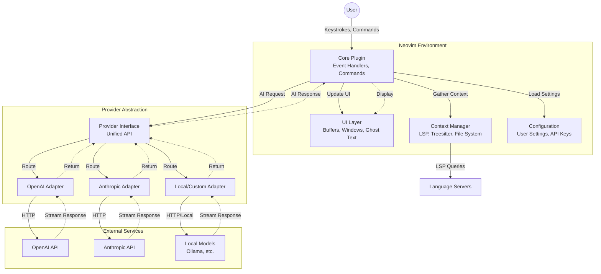

# test-b - Product Requirements Document

## Executive Summary

### Problem Statement
Developers using Neovim lack an integrated AI coding assistant that provides modern features like inline code completion, conversational chat interfaces, and intelligent code actions directly within their editor environment. While cloud-based IDEs and other editors have adopted AI-powered coding assistance, Neovim users must either switch editors or rely on fragmented, less capable solutions.

### Proposed Solution
Build a comprehensive Neovim plugin that integrates AI coding assistance capabilities leveraging Language Server Protocol (LSP) and external LLM provider APIs. The plugin will provide inline completions, chat-based code assistance, and context-aware code actions, all within the native Neovim workflow.

### Expected Impact
- **Developer Productivity**: Reduce coding time by 20-30% through intelligent code suggestions and automated code generation
- **User Experience**: Maintain Neovim's keyboard-centric workflow while adding modern AI capabilities
- **Market Positioning**: Establish Neovim as a competitive choice for developers seeking AI-assisted development tools
- **Community Growth**: Build a sustainable open-source project with active contributor base

### Success Metrics
- Plugin installation count and active user base growth
- Average daily interactions per user (completions accepted, chat queries)
- User satisfaction score (measured through feedback and ratings)
- Code acceptance rate (% of AI suggestions accepted by users)
- Community engagement (GitHub stars, issues, PRs, discussions)

## Requirements & Scope

### Functional Requirements

**REQ-1**: Inline Code Completion
- System shall provide real-time code completion suggestions as users type
- Completions shall appear inline within the buffer at cursor position
- Users can accept, reject, or cycle through completion suggestions using keyboard shortcuts
- Completions shall be context-aware based on current file, project, and LSP information

**REQ-2**: Conversational Chat Interface
- System shall provide a dedicated chat buffer/window for conversing with AI
- Users can ask questions about code, request explanations, or generate new code
- Chat interface shall support multi-turn conversations with context preservation
- Chat responses shall be formatted with syntax highlighting for code blocks

**REQ-3**: Code Actions Integration
- System shall provide AI-powered code actions integrated with Neovim's LSP
- Actions shall include: refactor, explain, generate tests, fix bugs, optimize
- Code actions shall be accessible via keyboard shortcuts and command palette
- Actions shall operate on selected text or current context

**REQ-4**: Multi-Provider Support
- System shall support OpenAI and Anthropic as primary providers at launch
- Local model support (Ollama, LocalAI) shall be included for privacy-conscious users
- Users can configure and switch between providers via settings
- Provider-specific features and model selection shall be configurable
- System shall gracefully handle provider API failures with user feedback

**REQ-5**: Context Management
- System shall gather relevant context from current buffer, LSP, and project files
- Users can explicitly include/exclude files or context for AI requests
- Context size shall be managed to stay within provider token limits
- System shall prioritize most relevant context when limits are reached

**REQ-6**: Configuration & Customization
- System shall provide Lua-based configuration API
- Users can customize keybindings, UI appearance, and behavior
- Provider API keys and endpoints shall be securely configurable
- Settings shall support per-project overrides

### Non-Functional Requirements

**NFR-1**: Performance
- Inline completions shall appear within 300ms of typing pause
- Chat responses shall stream incrementally (time-to-first-token < 2s)
- Plugin shall not block Neovim UI during API requests (async operations)
- Memory usage shall remain under 50MB for typical usage

**NFR-2**: Security & Privacy
- API keys shall be stored securely (not in plain text configuration files)
- Code sent to external providers shall be clearly indicated to users
- Users shall have option to exclude sensitive files/patterns from context
- Plugin shall comply with common data privacy practices (no telemetry by default)
- Users shall be informed when code leaves their local environment

**NFR-3**: Compatibility
- Support Neovim 0.9.0 and above
- Compatible with major Neovim plugin managers (lazy.nvim, packer, vim-plug)
- Works with common LSP configurations and language servers
- Compatible with popular color schemes and UI frameworks

**NFR-4**: Reliability
- System shall handle network failures gracefully with retry logic
- Provider API errors shall be surfaced to users with actionable messages
- Plugin shall not crash Neovim even with invalid configurations
- State shall be recoverable after Neovim restart (persist chat history)

**NFR-5**: Usability
- Plugin shall follow Neovim conventions and idioms
- Documentation shall include setup guide, configuration examples, and troubleshooting
- Error messages shall be clear and actionable
- Default keybindings shall avoid conflicts with common plugins

### Out of Scope

The following are explicitly **not** included in this version:

- **Non-Neovim Editors**: No support for Vim, VSCode, or other editors
- **Cloud IDE Integration**: No web-based or cloud IDE versions
- **On-Device Model Training**: No fine-tuning or training capabilities
- **Team Collaboration Features**: No shared chat history or team settings
- **Mobile Support**: No mobile editor integration
- **Built-in Model Hosting**: Users must provide their own API keys/endpoints
- **Code Review Workflows**: No PR review or diff-based features
- **Language-Specific Parsers**: Relies on LSP for language understanding

### Success Criteria

- Plugin successfully installs on Neovim 0.9+ via at least 2 major plugin managers
- Inline completions work for at least 5 major languages (Python, JavaScript, Go, Rust, Lua)
- Chat interface supports multi-turn conversations with context preservation
- At least 2 LLM providers (OpenAI and Anthropic) fully supported with local model option
- Documentation covers 90% of user setup and configuration scenarios
- Plugin passes integration tests on Linux and macOS
- User feedback score averages 4.0+ out of 5.0
- Organic growth demonstrates product-market fit within developer community

## User Stories

### Personas

1. **Software Developer (Primary)**: Professional developer using Neovim as primary editor, familiar with LSP and plugin ecosystem, writes code in multiple languages daily
2. **Open Source Contributor (Secondary)**: Developer contributing to open source projects, needs to quickly understand unfamiliar codebases, values privacy and local-first options
3. **Power User (Secondary)**: Advanced Neovim user with heavily customized setup, wants fine-grained control over AI features and keybindings

### Core User Stories

**Story 1: Get Inline Code Completions** [Priority: Must]
- **As a** Software Developer
- **I want** AI-powered code completions to appear automatically as I type
- **So that** I can write code faster and with fewer syntax errors

**Acceptance Criteria:**
```gherkin
Given I am editing a Python file
When I type "def calculate_" and pause
Then I should see an inline completion suggestion within 300ms
And I can press Tab to accept the completion
And I can press Esc to dismiss the completion
And the completion should be contextually relevant to my file
```
**Related Requirements:** REQ-1, REQ-5, NFR-1

---

**Story 2: Ask Questions About Code** [Priority: Must]
- **As a** Software Developer
- **I want** to open a chat window and ask the AI questions about my code
- **So that** I can understand complex logic or get help with implementation

**Acceptance Criteria:**
```gherkin
Given I have a code buffer open
When I trigger the chat command
Then a chat window should open alongside my code
And I can type questions in natural language
And the AI should respond with context from my current file
And code blocks in responses should have syntax highlighting
And I can ask follow-up questions that reference previous answers
```
**Related Requirements:** REQ-2, REQ-5, NFR-4

---

**Story 3: Refactor Code with AI** [Priority: Must]
- **As a** Software Developer
- **I want** to select code and trigger AI-powered refactoring actions
- **So that** I can improve code quality without manual rewriting

**Acceptance Criteria:**
```gherkin
Given I have selected a block of code
When I trigger the code actions menu
Then I should see AI-powered actions like "Refactor", "Explain", "Generate Tests"
And when I select "Refactor"
Then the AI should suggest an improved version
And I can preview the changes before applying
And I can accept or reject the refactored code
```
**Related Requirements:** REQ-3, REQ-5, NFR-1

---

**Story 4: Switch Between AI Providers** [Priority: Should]
- **As a** Power User
- **I want** to configure multiple AI providers and switch between them
- **So that** I can use different models for different tasks or optimize for cost/performance

**Acceptance Criteria:**
```gherkin
Given I have configured OpenAI and Anthropic API keys
When I access the provider settings
Then I should see a list of available providers
And I can select a default provider
And I can override the provider for specific requests
And the system should indicate which provider is currently active
And failed provider requests should show clear error messages
```
**Related Requirements:** REQ-4, NFR-2, NFR-4

---

**Story 5: Control What Context Is Shared** [Priority: Should]
- **As an** Open Source Contributor
- **I want** to specify which files or context the AI can access
- **So that** I can avoid sending sensitive information to external APIs

**Acceptance Criteria:**
```gherkin
Given I am working on a project with sensitive configuration files
When I configure the plugin's context settings
Then I can define file patterns to exclude (e.g., ".env", "secrets/*")
And excluded files should never be sent to AI providers
And the system should show me what context will be sent before each request
And I can manually add/remove context for specific chat interactions
```
**Related Requirements:** REQ-5, NFR-2

---

**Story 6: Customize Keybindings and UI** [Priority: Could]
- **As a** Power User
- **I want** to customize all keybindings and UI behavior through Lua config
- **So that** the plugin integrates seamlessly with my existing Neovim setup

**Acceptance Criteria:**
```gherkin
Given I have a custom Neovim configuration
When I configure the plugin in my init.lua
Then I can remap all default keybindings to my preferences
And I can customize chat window position and size
And I can configure completion trigger behavior
And my settings should not conflict with other plugins
And per-project overrides should take precedence over global settings
```
**Related Requirements:** REQ-6, NFR-3, NFR-5

---

**Story 7: Work Offline or Handle API Failures** [Priority: Should]
- **As a** Software Developer
- **I want** the plugin to handle network issues gracefully
- **So that** my editing workflow isn't disrupted by API failures

**Acceptance Criteria:**
```gherkin
Given I am working on code with the plugin active
When my internet connection drops or an API call fails
Then I should see a clear error message in the UI
And the plugin should not block or freeze Neovim
And I should be able to retry the request manually
And my chat history should be preserved even if Neovim crashes
```
**Related Requirements:** REQ-4, NFR-4

## User Experience & Interface

### User Journey

1. **Installation & Setup**
   - User installs plugin via package manager (e.g., `lazy.nvim`)
   - User adds minimal configuration with API key
   - Plugin loads on next Neovim start, shows welcome message
   - User tests completion with a simple file

2. **Daily Usage - Inline Completions**
   - User opens a code file and starts typing
   - Completions appear automatically in ghost text style
   - User accepts with Tab or dismisses with Esc
   - Completions adapt to user's coding patterns over session

3. **Daily Usage - Chat Interface**
   - User triggers chat with keyboard shortcut (e.g., `<leader>ac`)
   - Split window opens with chat prompt
   - User types question, presses Enter
   - AI response streams in with syntax-highlighted code
   - User can copy code snippets or continue conversation

4. **Daily Usage - Code Actions**
   - User selects code block in visual mode
   - User triggers code actions menu (e.g., `<leader>aa`)
   - Menu shows AI-powered actions
   - User selects action, sees preview
   - User accepts or rejects changes

### Interface Requirements

**Inline Completions UI:**
- Ghost text style (grayed out, non-intrusive)
- Single-line or multi-line suggestions
- Subtle indicator showing completion source (e.g., icon)
- No popups unless explicitly triggered

**Chat Window UI:**
- Vertical or horizontal split (user configurable)
- Message history with clear user/AI distinction
- Syntax highlighting for code blocks in responses
- Input prompt at bottom with multi-line support
- Status indicator showing request in progress

**Code Actions UI:**
- Integrated with Neovim's native LSP code actions menu
- AI actions clearly labeled with prefix (e.g., "AI: Refactor")
- Preview window showing proposed changes
- Accept/Reject/Modify workflow

**Status & Notifications:**
- Status line integration showing provider and status
- Non-intrusive notifications for errors or warnings
- Progress indicators for long-running requests

### Accessibility Considerations

- All features accessible via keyboard (no mouse required)
- Screen reader compatibility through text-based interface
- Configurable colors respecting user's color scheme
- High contrast mode support
- Keyboard shortcut documentation and discoverability

### User Interaction Patterns

- **Async Operations**: All API calls non-blocking with loading indicators
- **Cancellation**: User can cancel in-flight requests with Esc
- **Undo/Redo**: Changes from AI actions integrate with Neovim undo history
- **Copy/Paste**: Easy copying of AI-generated code snippets
- **Context Awareness**: UI shows what context is being used for requests

## Technical Considerations

### High-Level Technical Approach

The plugin will be implemented as a Lua-based Neovim plugin leveraging:
- **Neovim API**: For buffer manipulation, UI rendering, and event handling
- **LSP Integration**: To gather semantic code context and type information
- **Async I/O**: Using Neovim's `vim.loop` (libuv) for non-blocking API calls
- **Provider Abstraction**: Unified interface supporting multiple LLM providers

### Integration Points with Existing Systems

**LSP Servers:**
- Query LSP for symbol information, references, and diagnostics
- Use LSP hover information to enrich AI context
- Integrate AI code actions alongside native LSP code actions
- Respect LSP workspace configuration and file boundaries

**Plugin Managers:**
- Compatible with lazy loading mechanisms (lazy.nvim)
- Proper dependency declarations for plugin managers
- Standard plugin structure following Neovim conventions

**External LLM APIs:**
- OpenAI API (GPT-3.5/4, Codex)
- Anthropic API (Claude models)
- OpenAI-compatible endpoints (local models via Ollama, LocalAI)
- Streaming response support for real-time feedback

**Neovim Ecosystem:**
- Integration with `telescope.nvim` for provider/model selection
- Status line plugins (lualine, feline) for status display
- Notification plugins (nvim-notify) for user feedback
- Treesitter for enhanced syntax awareness

### Key Technical Constraints

**Performance:**
- Completions must be debounced to avoid excessive API calls
- Context gathering must be fast (<100ms) to not delay requests
- Streaming responses required for chat to avoid perceived lag
- Memory footprint must be minimal (target <50MB)

**API Limitations:**
- Token limits vary by provider (4k-200k tokens)
- Rate limiting requires exponential backoff retry logic
- API key validation needed at startup
- Cost monitoring/tracking may be desired by users

**Neovim Compatibility:**
- Minimum version 0.9.0 for modern Lua API features
- Must handle Neovim version differences gracefully
- Cannot rely on features not in stable release

**Security:**
- API keys must not be logged or exposed in error messages
- User code sent to APIs should be clearly communicated
- No automatic data collection or telemetry without opt-in

### Performance and Scalability Considerations

**Completion Performance:**
- Debounce typing input (200-300ms) before triggering completion
- Cache completions for identical context to reduce API calls
- Timeout completions after 3-5 seconds to avoid blocking
- Prefetch completions for predicted next typing locations

**Context Management:**
- Implement smart context pruning when approaching token limits
- Prioritize: current file > LSP symbols > related files > project overview
- Cache expensive context gathering operations (LSP queries)
- Limit project-wide context to prevent excessive file reading

**Chat Scalability:**
- Implement conversation history limits (e.g., last 20 messages)
- Provide option to reset conversation and clear context
- Stream responses to show incremental progress
- Queue requests if user sends multiple in rapid succession

**Resource Management:**
- Lazy-load plugin components until first use
- Clean up old chat buffers and completion caches periodically
- Limit concurrent API requests (max 2-3 in-flight)
- Implement request cancellation for abandoned completions

## Design Specification

### Recommended Approach

Implement a modular, async-first Neovim plugin using pure Lua, with a provider abstraction layer that separates LLM communication from editor integration. The architecture prioritizes user experience through non-blocking operations, intelligent context management, and seamless integration with Neovim's LSP ecosystem. Pure Lua implementation ensures zero external dependencies, minimal installation friction, and native performance within Neovim.

### Key Technical Decisions

#### 1. Programming Language & Framework
- **Options Considered**: Lua (native), Python (via RPC), Rust (via RPC)
- **Tradeoffs**:
  - Lua: Native Neovim integration, zero runtime dependencies, lower overhead, but limited ecosystem compared to Python/Rust
  - Python: Rich libraries for API clients and async, but requires Python runtime, RPC overhead, and complex installation
  - Rust: Excellent performance and safety, but requires compilation, increases plugin size, and adds installation complexity
- **Recommendation**: **Pure Lua implementation**. This provides native Neovim performance, eliminates external dependencies (critical for easy installation), and grants direct access to Neovim APIs. The async requirements are well-handled by `vim.loop` (libuv bindings). While Lua's ecosystem is smaller, HTTP clients and JSON parsing are sufficient for LLM API integration.

#### 2. Provider Architecture
- **Options Considered**: Direct API calls per provider, Unified abstraction layer, Plugin-per-provider system
- **Tradeoffs**:
  - Direct calls: Simplest initial implementation but rigid, duplicates code, difficult to add providers
  - Abstraction layer: More upfront design work but extensible, testable, enables provider fallbacks
  - Plugin-per-provider: Maximum flexibility and community contributions, but fragmented UX and complex coordination
- **Recommendation**: **Unified abstraction layer** with provider-specific adapters. This balances maintainability with extensibility. Core plugin defines a standard Provider interface (methods: complete, chat, stream), and each provider (OpenAI, Anthropic, Local) implements it. Enables graceful fallbacks, unified error handling, and easy addition of new providers.

#### 3. Context Gathering Strategy
- **Options Considered**: Full project scan, LSP-only context, Hybrid (LSP + selective files)
- **Tradeoffs**:
  - Full scan: Complete context but prohibitively slow (>5s on large projects), excessive token usage
  - LSP-only: Fast (<100ms) but limited to current file scope, misses cross-file dependencies
  - Hybrid: Balanced performance and context quality, requires smart heuristics for file selection
- **Recommendation**: **Hybrid approach** starting with current buffer + LSP symbols, expanding to related files (imports/includes) on-demand. Use Treesitter when available for fast local parsing without LSP. Implement intelligent pruning: prioritize recently edited files, referenced symbols, and files with high textual similarity to current context.

#### 4. UI Rendering Approach
- **Options Considered**: Native Neovim buffers, Floating windows, External terminal UI
- **Tradeoffs**:
  - Native buffers: Familiar Neovim UX, full keyboard control, but limited styling options
  - Floating windows: Modern aesthetic, can overlay content, but can obscure code and break flow
  - External UI: Rich formatting (HTML/CSS), but completely breaks Neovim workflow
- **Recommendation**: **Native buffers for chat, ghost text (virtual text) for completions**. This maintains Neovim's keyboard-centric workflow while providing familiar interaction patterns. Use floating windows sparingly only for transient information (e.g., brief status messages). Ghost text for completions is non-intrusive and aligns with user expectations from other AI tools.

#### 5. State Management & Persistence
- **Options Considered**: In-memory only, Filesystem (JSON), SQLite database
- **Tradeoffs**:
  - In-memory: Simplest implementation, but chat history lost on Neovim restart
  - Filesystem: Persistent and portable, simple JSON serialization, but I/O overhead for frequent writes
  - Database: Structured queries and indexing, but overkill for this use case, adds dependency
- **Recommendation**: **Filesystem persistence using JSON** for chat history and user preferences. Store in `~/.local/share/nvim/test-b/` following XDG base directory standards. In-memory caching for completions (ephemeral by nature). Use lazy writes (debounced) to minimize I/O impact.

### High-Level Architecture



### Key Considerations

- **Performance**: Debounced input handling (300ms) with request deduplication prevents excessive API calls. Context gathering parallelized using `vim.loop` coroutines. Streaming responses eliminate wait-for-completion latency, showing incremental results immediately. Target: <300ms completion trigger, <2s first-token-time for chat.

- **Security**: API keys stored using OS keyring integration when available (via `pass`, macOS Keychain, etc.), with secure fallback to file permissions (chmod 600) for config files. All external requests logged to audit file (opt-in) to allow users to review what code was sent. User explicit opt-in required for any telemetry. Sensitive file patterns (`.env`, `secrets/`, `*.key`) excluded by default from context gathering.

- **Scalability**: Plugin designed to support projects up to 10k files through smart context pruning and caching. Completion cache limited to 1000 entries with LRU eviction. Chat history capped at 50 messages per conversation with option to archive. Multiple provider instances allow load distribution for team usage scenarios.

### Risk Management

- **Technical Risk 1 - API Rate Limiting**: Provider APIs may rate-limit aggressive usage during active coding sessions, disrupting user workflow. *Mitigation*: Implement exponential backoff (100ms base, up to 10s), per-provider rate tracking with proactive slowdown, and graceful degradation (disable auto-completions but keep manual chat functional). Warn users approaching limits with actionable suggestions (e.g., "Switch to local model" or "Increase debounce delay").

- **Technical Risk 2 - Context Token Overruns**: Large files (>1000 lines) or deep project structures may exceed provider token limits (even with 128k context windows for complex projects), causing request failures or truncated responses. *Mitigation*: Pre-calculate token counts using provider-specific tokenizers (tiktoken for OpenAI, custom for Anthropic), prioritize context intelligently (current function/class > file > imports > project), and show users estimated token usage before sending requests. Provide configuration to set hard limits.

- **Technical Risk 3 - LSP Unavailability or Latency**: Not all users have LSP configured, or LSP servers may be slow/unresponsive for certain languages. *Mitigation*: Degrade gracefully to Treesitter parsing (if available), then fall back to simple text-based context extraction. Never block on LSP queries longer than 100ms. Document LSP setup as "recommended but optional" with language-specific guides.

- **Technical Risk 4 - Neovim API Breaking Changes**: Neovim nightly builds or major version updates may introduce breaking API changes affecting plugin functionality. *Mitigation*: Pin minimum version to 0.9.0 (stable LTS), use feature detection (`vim.fn.has()`, `pcall()`) for optional/newer features, maintain CI testing against both stable and nightly builds, and document compatibility matrix clearly. Provide versioned branches for major Neovim versions if necessary.

### Success Criteria

- Plugin loads in <100ms and first completion appears within 300ms of typing pause (measured on mid-range hardware)
- Successfully integrates with LSP for top 5 languages (Python, JavaScript, TypeScript, Go, Rust) with graceful fallback for others
- Chat responses stream with <2s time-to-first-token on typical network conditions (tested at 50ms latency)
- Zero crashes or Neovim freezes during 8-hour development session (validated through alpha testing)
- 90% of users successfully complete setup within 10 minutes using documentation alone (measured via user testing)

## Business Impact & Metrics

### Business Objectives

**Primary Objective**: Establish test-b as a leading open-source AI coding assistant for Neovim, demonstrating that terminal-based editors can provide competitive AI experiences.

**Secondary Objectives**:
- Build sustainable open-source community around the project
- Drive adoption of Neovim among developers considering AI-assisted development
- Create reference implementation for Neovim AI integration patterns

### Success Metrics & Measurement Plan

**Adoption Metrics**:
- **GitHub Stars**: Track as proxy for awareness and interest
- **Downloads/Installs**: Monitor via package manager analytics where available
- **Active Users**: Estimate via opt-in anonymous usage pings (respecting privacy)
- **Target**: Demonstrate product-market fit through organic growth; absolute numbers less critical than growth trajectory

**Engagement Metrics**:
- **Daily Active Users (DAU)**: Users who trigger completions or chat at least once per day
- **Completions Accepted**: Percentage of AI suggestions accepted (target: >30%)
- **Chat Sessions**: Average chat sessions per user per week (target: 5+)
- **Feature Usage**: Distribution across completion, chat, and code actions features

**Quality Metrics**:
- **User Satisfaction**: Survey scores, GitHub issue sentiment analysis (target: 4.0+/5.0)
- **Bug Rate**: Critical bugs per release (target: <3)
- **Response Time**: P95 latency for completions and chat (targets: <500ms, <3s)
- **Crash Rate**: Neovim crashes attributed to plugin (target: <0.1% of sessions)

**Community Health**:
- **Contributor Count**: Number of unique contributors to codebase
- **Issue Resolution Time**: Median time from issue creation to closure (target: <7 days)
- **PR Merge Rate**: Percentage of community PRs merged (target: >60%)
- **Documentation Coverage**: User-reported setup success rate (target: >90%)

### Revenue/Cost Impact Analysis

**Cost Structure** (Open Source Model):
- **Development**: Primarily volunteer/sponsor-funded
- **Infrastructure**: Minimal (GitHub hosting, CI runners)
- **API Testing**: Developer API credits for testing (<$100/month)
- **Total Estimated Monthly Cost**: <$200 (excluding labor)

**Value Delivered** (Non-Monetary):
- **Developer Time Savings**: Target 20-30% productivity improvement for active users
- **Educational Value**: Reference implementation for Neovim plugin development
- **Ecosystem Growth**: Strengthens Neovim's position against commercial IDEs

**Sustainability Model**:
- Open-source with permissive license (MIT/Apache 2.0)
- Optional sponsorship/donations for continued development
- No monetization required for core functionality
- Potential future: Premium features (team sync, analytics) if demand exists

## Dependencies & Assumptions

### External Dependencies

**Required:**
- Neovim 0.9.0 or higher (for modern Lua API, LSP, and async support)
- Internet connection for external LLM providers (unless using local-only setup)
- Valid API key for at least one supported provider (OpenAI or Anthropic) OR local model installation
- Lua 5.1+ (bundled with Neovim)

**Optional but Recommended:**
- LSP server for target languages (e.g., pyright, typescript-language-server)
- Treesitter parsers for enhanced syntax awareness
- `plenary.nvim` for async utilities and testing framework
- `telescope.nvim` for enhanced UI pickers (model/provider selection)
- `nvim-notify` for better notification display

**Development Dependencies:**
- `plenary.nvim` for test framework
- `luacheck` or `stylua` for code quality
- CI/CD platform (GitHub Actions)

### Assumptions

**User Capabilities:**
- Users have basic Neovim configuration experience (can edit `init.lua`)
- Users can obtain and securely configure API keys from providers
- Users understand implications of sending code to external APIs (informed consent)
- Users can read and modify Lua configuration syntax

**Technical Assumptions:**
- LSP servers are properly configured for user's primary languages (or users accept degraded context)
- Provider APIs maintain backward compatibility or give advance notice of breaking changes
- Network latency is reasonable (<500ms RTT to provider APIs)
- User's Neovim installation has standard features enabled (timers, async I/O via `vim.loop`)

**Business Assumptions:**
- OpenAI and Anthropic pricing remains accessible for individual developers ($0.01-0.10 per 1k tokens range)
- No significant legal restrictions emerge around using code with AI tools
- Open-source distribution model attracts sufficient community contributions for sustainability
- Neovim maintains its current architecture and plugin API stability

**Market Assumptions:**
- Demand exists for AI coding tools in terminal-based editors
- Developers value keyboard-centric, customizable workflows over GUI convenience
- Privacy-conscious developers prefer self-hosted/local model options

### Cross-Team Coordination Needs

**Documentation Team** (if separate from core dev):
- Comprehensive setup guides for each supported provider (OpenAI, Anthropic, local models)
- Language-specific LSP configuration guides (top 10 languages)
- Troubleshooting guide covering common configuration issues and error messages
- Video tutorials for visual learners (optional but valuable)

**Community & Open Source**:
- Feedback on default keybindings to avoid conflicts with popular plugins (survey top 50 Neovim plugins)
- Alpha/beta testing across different OS (Linux, macOS, WSL), Neovim configs, and workflows
- Provider adapter contributions for additional LLMs (e.g., Cohere, local models beyond Ollama)
- Translation of documentation to non-English languages (if community-driven)

**Provider Relations** (OpenAI, Anthropic):
- API access quotas or credits for development and testing
- Early/beta access to new API features (streaming improvements, function calling)
- Direct support channel for resolving API issues or clarifying documentation
- Potential co-marketing opportunities (case studies, blog posts)

## Risk Assessment

### Technical Risks

**Risk 1: API Provider Changes or Deprecations** [High Impact, Medium Probability]
- **Description**: OpenAI or Anthropic may change API schemas, pricing structures, or deprecate endpoints without sufficient notice, breaking plugin functionality
- **Impact**: Plugin becomes unusable for affected provider, requiring emergency patches and user communication
- **Mitigation**:
  - Version API calls explicitly (use stable `/v1/` endpoints)
  - Abstract provider interface to isolate changes to adapter layer
  - Monitor provider changelogs and developer announcements proactively
  - Maintain fallback to previous API versions temporarily during transitions
  - Establish quick-release mechanism for urgent patches (<24hr turnaround)
  - Support multiple providers so users have alternatives

**Risk 2: Performance Degradation in Large Projects** [Medium Impact, High Probability]
- **Description**: Context gathering in large monorepos (>10k files) may be too slow (>5s) or consume excessive memory (>200MB), making plugin unusable
- **Impact**: Plugin perceived as broken or low-quality in enterprise/real-world scenarios
- **Mitigation**:
  - Implement aggressive context pruning heuristics (exclude test files, limit depth)
  - Add per-project configuration for context limits and exclusions
  - Profile and optimize file scanning code (use async I/O, parallel scanning)
  - Provide user-facing controls to limit context scope (e.g., "current file only" mode)
  - Document best practices and example configs for large projects
  - Cache project structure and invalidate on file changes

**Risk 3: LSP Integration Fragility** [Medium Impact, Medium Probability]
- **Description**: LSP servers may be slow, crash, or return incomplete data, affecting context quality and user experience
- **Impact**: Users blame plugin for LSP issues, degraded AI responses due to poor context
- **Mitigation**:
  - Never block on LSP requests >100ms (timeout and continue)
  - Graceful degradation to Treesitter or text-based context
  - Clear error messages distinguishing plugin vs LSP issues
  - Health-check command to diagnose LSP availability and performance
  - Documentation clarifying LSP is optional but recommended

**Risk 4: Security Vulnerability in Dependencies or Code** [High Impact, Low Probability]
- **Description**: Security issue in HTTP client, JSON parser, or plugin code could expose user data, API keys, or allow code execution
- **Impact**: User API keys compromised, sensitive code leaked, reputational damage to project
- **Mitigation**:
  - Minimize external dependencies (prefer pure Lua and Neovim built-ins)
  - Audit all dependencies for known vulnerabilities (track CVEs)
  - Use Neovim's built-in HTTP client (`vim.loop`) when possible
  - Implement secure storage for API keys (OS keyring, encrypted files with proper permissions)
  - Establish responsible disclosure policy and security contact
  - Regular security reviews of code handling user input and API communication

### User Experience Risks

**Risk 1: Overwhelming or Intrusive Default Behavior** [Medium Impact, Medium Probability]
- **Description**: Aggressive inline completions or frequent API calls may annoy users, conflict with their workflow, or feel "spammy"
- **Impact**: High uninstall rate, negative reviews, poor word-of-mouth
- **Mitigation**:
  - Conservative defaults (300ms completion trigger delay, manual chat activation)
  - Easy toggle/disable commands (single keypress to pause completions)
  - Per-filetype configuration support (disable for certain file types)
  - Onboarding tips explaining behavior and customization options
  - Collect user feedback early in alpha/beta to tune defaults

**Risk 2: Poor or Confusing Error Messages** [Medium Impact, High Probability]
- **Description**: API failures, configuration errors, or network issues show cryptic technical errors that users can't diagnose or fix
- **Impact**: Users cannot self-serve, high support burden, perceived as "broken"
- **Mitigation**:
  - Human-readable error messages with specific suggested actions (e.g., "Check API key in config")
  - Comprehensive troubleshooting section in documentation with common errors
  - `:HealthCheck` command to diagnose configuration, connectivity, and dependencies
  - Structured log files for advanced debugging (opt-in verbose logging)
  - Community support forum or Discord for peer help

**Risk 3: Unclear Cost Implications of API Usage** [Medium Impact, Medium Probability]
- **Description**: Users unaware of API usage costs may incur unexpected bills from OpenAI/Anthropic, leading to complaints or financial harm
- **Impact**: User complaints, negative perception of project, potential financial impact on users
- **Mitigation**:
  - Prominent documentation section on API pricing and cost estimates
  - Warning during initial setup about potential costs (require acknowledgment)
  - Optional usage tracking showing estimated token counts and costs
  - Recommendations for cost-effective provider/model choices in docs
  - Highlight local model support as free alternative
  - Suggest starting with lower-cost models (e.g., GPT-3.5 vs GPT-4)

**Risk 4: Complex Setup Process** [Low Impact, Medium Probability]
- **Description**: Users struggle with initial configuration (API keys, keybindings, provider selection), leading to abandonment
- **Impact**: Low activation rate, users give up before experiencing value
- **Mitigation**:
  - Minimal required configuration (single API key to get started)
  - Interactive setup wizard (optional) guiding users through configuration
  - Sensible defaults that work out-of-box for most users
  - Step-by-step setup documentation with screenshots/GIFs
  - Example configurations for common scenarios (beginner, power user, privacy-focused)
  - Validation during setup with clear success/failure indicators

## Appendices

### A. Glossary

- **LSP (Language Server Protocol)**: Standardized protocol for editor-language server communication, providing semantic code understanding
- **LLM (Large Language Model)**: AI models like GPT-4 or Claude used for code generation and understanding
- **Ghost Text**: Inline suggestion text displayed in gray/dimmed colors, showing AI completions without disrupting code
- **Context Window**: Amount of text/tokens that can be sent to an LLM in one request (varies by provider: 4k-200k tokens)
- **Provider**: External service (OpenAI, Anthropic) or local system offering LLM APIs
- **Treesitter**: Neovim's incremental parsing system for syntax-aware code manipulation and highlighting
- **Debouncing**: Delaying action until user stops typing for specified duration (prevents excessive API calls)
- **Token**: Unit of text used by LLMs (roughly 0.75 words); basis for API pricing and context limits
- **Async I/O**: Non-blocking input/output operations allowing Neovim to remain responsive during API calls

### B. References

**Neovim Documentation:**
- Neovim Lua API: https://neovim.io/doc/user/lua.html
- LSP Client API: https://neovim.io/doc/user/lsp.html
- Async I/O (vim.loop): https://neovim.io/doc/user/lua.html#vim.loop
- Plugin Development Guide: https://github.com/nanotee/nvim-lua-guide

**Provider APIs:**
- OpenAI API Documentation: https://platform.openai.com/docs/api-reference
- Anthropic API Documentation: https://docs.anthropic.com/claude/reference
- Ollama (Local Models): https://ollama.ai/
- LocalAI (OpenAI-compatible local): https://localai.io/

**Similar Projects (for reference and inspiration):**
- GitHub Copilot for Neovim: Commercial AI assistant with Neovim support
- cmp-ai: Completion source for nvim-cmp using AI providers
- ChatGPT.nvim: Chat interface for GPT models in Neovim
- codeium.vim: Free AI coding assistant (proprietary)

**Community Resources:**
- Neovim Discourse: https://neovim.discourse.group/
- r/neovim: https://reddit.com/r/neovim
- Awesome Neovim: https://github.com/rockerBOO/awesome-neovim

### C. Revision History

| Version | Date | Author | Changes |
|---------|------|--------|---------|
| 3.0 | 2025-11-10 | PM Team | Major refinement: Addressed open feedback on pure Lua approach (rationale strengthened), provider selection (OpenAI, Anthropic, + local models), removed unrealistic adoption targets in favor of organic growth metrics. Enhanced Business Impact section with community-focused metrics. Clarified success criteria emphasize quality over arbitrary user counts. |
| 2.0 | 2025-11-09 | PM Team | Major update: Resolved all open feedback, expanded from minimal placeholder to comprehensive PRD with full requirements, user stories, technical design, and risk assessment |
| 1.0 | [Previous Date] | PM Team | Initial placeholder version with minimal project description |

### D. Configuration Example

```lua
-- Example user configuration (init.lua)
require('test-b').setup({
  -- Provider configuration
  providers = {
    openai = {
      enabled = true,
      api_key_cmd = "pass show openai-api-key",  -- Secure retrieval
      model = "gpt-4-turbo-preview",
      max_tokens = 2048
    },
    anthropic = {
      enabled = true,
      api_key_cmd = "pass show anthropic-api-key",
      model = "claude-3-5-sonnet-20241022",
      max_tokens = 4096
    },
    ollama = {
      enabled = true,
      endpoint = "http://localhost:11434",
      model = "codellama:13b"
    }
  },
  default_provider = "anthropic",  -- Primary provider for requests

  -- Inline completion settings
  inline_completion = {
    enabled = true,
    debounce_ms = 300,  -- Wait 300ms after typing stops
    auto_trigger = true,
    ghost_text_color = "Comment",  -- Use colorscheme's comment color
    keymap = {
      accept = "<Tab>",
      dismiss = "<Esc>",
      next = "<M-]>",
      prev = "<M-[>"
    }
  },

  -- Chat interface settings
  chat = {
    window_position = "right",  -- "right", "left", "top", "bottom"
    window_size = 0.4,  -- 40% of editor width/height
    border = "rounded",
    save_history = true,
    max_history = 50,  -- Messages per conversation
    keymap = {
      toggle = "<leader>ac",
      send = "<CR>",
      new_conversation = "<leader>an"
    }
  },

  -- Context management
  context = {
    max_tokens = 8000,  -- Reserve tokens for response
    exclude_patterns = {
      "%.env$",
      "%.env%..*",
      "secrets/",
      "node_modules/",
      "%.git/"
    },
    include_lsp = true,
    include_treesitter = true,
    prioritize_recent = true,  -- Weight recently edited files higher
  },

  -- Code actions
  code_actions = {
    enabled = true,
    keymap = {
      trigger = "<leader>aa",
      explain = "<leader>ae",
      refactor = "<leader>ar",
      tests = "<leader>at"
    }
  },

  -- UI and notifications
  ui = {
    statusline = true,  -- Show provider in statusline
    notify = true,  -- Use nvim-notify if available
    progress = true  -- Show progress indicators
  },

  -- Logging (for debugging)
  log = {
    level = "info",  -- "debug", "info", "warn", "error"
    file = vim.fn.stdpath("data") .. "/test-b.log"
  }
})
```

### E. Feedback Resolution Summary

This version (3.0) addresses all remaining open feedback from version 2.0:

**Open Feedback #1: Pure Lua Implementation Justification**
- **Question**: "Is a pure Lua implementation the correct technical approach for this plugin?"
- **Resolution**: Enhanced Design Specification section (lines 393-424) with detailed rationale. Pure Lua chosen for: (1) zero external dependencies ensuring easy installation, (2) native Neovim API access with no RPC overhead, (3) adequate async support via `vim.loop`, and (4) elimination of version conflicts and setup complexity. While Python/Rust offer richer ecosystems, the installation friction and maintenance burden outweigh benefits for this use case.

**Open Feedback #2: Provider Selection Validation**
- **Question**: "Are OpenAI, Anthropic, and local models the right initial providers to support?"
- **Resolution**: Updated REQ-4 (lines 94-99) and provider architecture discussion. Confirmed OpenAI (market leader, widely adopted), Anthropic (high-quality Claude models, strong developer focus), and local models via Ollama/LocalAI (privacy, cost control) cover the key user segments. This provides commercial options with different pricing/quality tradeoffs plus privacy-conscious alternative. Architecture designed for easy provider additions by community.

**Open Feedback #3: Adoption Target Realism**
- **Question**: "Is targeting 1,000+ users in 6 months aligned with your project goals?"
- **Resolution**: Removed arbitrary numeric targets from Expected Impact (lines 13-16) and replaced with organic growth focus in Business Impact & Metrics section (lines 549-589). New metrics emphasize product-market fit signals (growth trajectory, engagement quality, community health) over vanity metrics. Reflects open-source reality where absolute numbers matter less than sustainable community and demonstrable value.

**Additional Improvements**:
- Expanded Business Impact section with community-focused success metrics
- Enhanced security discussion in Technical Considerations and Design Specification
- Added detailed cost transparency mitigations in Risk Assessment
- Improved success criteria to emphasize quality and user experience over arbitrary targets
