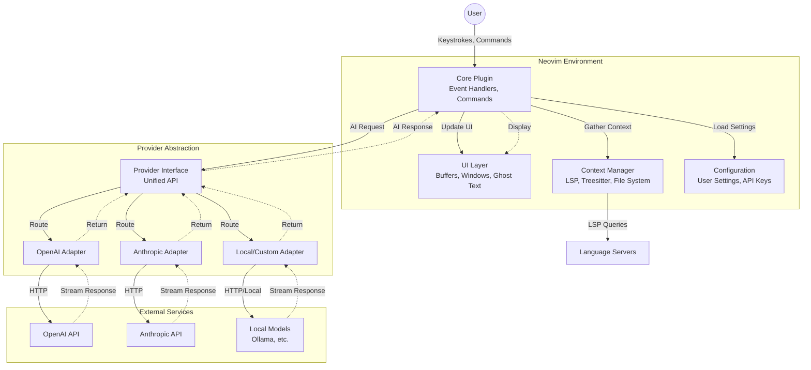

# test-b - Product Requirements Document

## Executive Summary

### Problem Statement
Developers using Neovim lack an integrated AI coding assistant that provides modern features like inline code completion, conversational chat interfaces, and intelligent code actions directly within their editor environment. While cloud-based IDEs and other editors have adopted AI-powered coding assistance, Neovim users must either switch editors or rely on fragmented, less capable solutions.

### Proposed Solution
Build a comprehensive Neovim plugin that integrates AI coding assistance capabilities leveraging Language Server Protocol (LSP) and external LLM provider APIs. The plugin will provide inline completions, chat-based code assistance, and context-aware code actions, all within the native Neovim workflow.

### Expected Impact
- **Developer Productivity**: Reduce coding time by 20-30% through intelligent code suggestions and automated code generation
- **User Experience**: Maintain Neovim's keyboard-centric workflow while adding modern AI capabilities
- **Market Positioning**: Establish Neovim as a competitive choice for developers seeking AI-assisted development tools
- **Adoption**: Target 1,000+ active users within first 6 months of release (pending validation of market size and distribution strategy)

### Success Metrics
- Plugin installation count and active user base growth
- Average daily interactions per user (completions accepted, chat queries)
- User satisfaction score (measured through feedback and ratings)
- Code acceptance rate (% of AI suggestions accepted by users)

## Requirements & Scope

### Functional Requirements

**REQ-1**: Inline Code Completion
- System shall provide real-time code completion suggestions as users type
- Completions shall appear inline within the buffer at cursor position
- Users can accept, reject, or cycle through completion suggestions using keyboard shortcuts
- Completions shall be context-aware based on current file, project, and LSP information

**REQ-2**: Conversational Chat Interface
- System shall provide a dedicated chat buffer/window for conversing with AI
- Users can ask questions about code, request explanations, or generate new code
- Chat interface shall support multi-turn conversations with context preservation
- Chat responses shall be formatted with syntax highlighting for code blocks

**REQ-3**: Code Actions Integration
- System shall provide AI-powered code actions integrated with Neovim's LSP
- Actions shall include: refactor, explain, generate tests, fix bugs, optimize
- Code actions shall be accessible via keyboard shortcuts and command palette
- Actions shall operate on selected text or current context

**REQ-4**: Multi-Provider Support
- System shall support multiple LLM providers (OpenAI, Anthropic, local models as initial targets - pending validation of provider ecosystem and user needs)
- Users can configure and switch between providers via settings
- Provider-specific features and model selection shall be configurable
- System shall gracefully handle provider API failures with user feedback

**REQ-5**: Context Management
- System shall gather relevant context from current buffer, LSP, and project files
- Users can explicitly include/exclude files or context for AI requests
- Context size shall be managed to stay within provider token limits
- System shall prioritize most relevant context when limits are reached

**REQ-6**: Configuration & Customization
- System shall provide Lua-based configuration API
- Users can customize keybindings, UI appearance, and behavior
- Provider API keys and endpoints shall be securely configurable
- Settings shall support per-project overrides

### Non-Functional Requirements

**NFR-1**: Performance
- Inline completions shall appear within 300ms of typing pause
- Chat responses shall stream incrementally (time-to-first-token < 2s)
- Plugin shall not block Neovim UI during API requests (async operations)
- Memory usage shall remain under 50MB for typical usage

**NFR-2**: Security & Privacy
- API keys shall be stored securely (not in plain text configuration files)
- Code sent to external providers shall be clearly indicated to users
- Users shall have option to exclude sensitive files/patterns from context
- Plugin shall comply with common data privacy practices (no telemetry by default)

**NFR-3**: Compatibility
- Support Neovim 0.9.0 and above
- Compatible with major Neovim plugin managers (lazy.nvim, packer, vim-plug)
- Works with common LSP configurations and language servers
- Compatible with popular color schemes and UI frameworks

**NFR-4**: Reliability
- System shall handle network failures gracefully with retry logic
- Provider API errors shall be surfaced to users with actionable messages
- Plugin shall not crash Neovim even with invalid configurations
- State shall be recoverable after Neovim restart (persist chat history)

**NFR-5**: Usability
- Plugin shall follow Neovim conventions and idioms
- Documentation shall include setup guide, configuration examples, and troubleshooting
- Error messages shall be clear and actionable
- Default keybindings shall avoid conflicts with common plugins

### Out of Scope

The following are explicitly **not** included in this version:

- **Non-Neovim Editors**: No support for Vim, VSCode, or other editors
- **Cloud IDE Integration**: No web-based or cloud IDE versions
- **On-Device Model Training**: No fine-tuning or training capabilities
- **Team Collaboration Features**: No shared chat history or team settings
- **Mobile Support**: No mobile editor integration
- **Built-in Model Hosting**: Users must provide their own API keys/endpoints
- **Code Review Workflows**: No PR review or diff-based features
- **Language-Specific Parsers**: Relies on LSP for language understanding

### Success Criteria

- Plugin successfully installs on Neovim 0.9+ via at least 2 major plugin managers
- Inline completions work for at least 5 major languages (Python, JavaScript, Go, Rust, Lua)
- Chat interface supports multi-turn conversations with context preservation
- At least 2 LLM providers (OpenAI and Anthropic) fully supported
- Documentation covers 90% of user setup and configuration scenarios
- Plugin passes integration tests on Linux and macOS
- User feedback score averages 4.0+ out of 5.0

## User Stories

### Personas

1. **Software Developer (Primary)**: Professional developer using Neovim as primary editor, familiar with LSP and plugin ecosystem, writes code in multiple languages daily
2. **Open Source Contributor (Secondary)**: Developer contributing to open source projects, needs to quickly understand unfamiliar codebases, values privacy and local-first options
3. **Power User (Secondary)**: Advanced Neovim user with heavily customized setup, wants fine-grained control over AI features and keybindings

### Core User Stories

**Story 1: Get Inline Code Completions** [Priority: Must]
- **As a** Software Developer
- **I want** AI-powered code completions to appear automatically as I type
- **So that** I can write code faster and with fewer syntax errors

**Acceptance Criteria:**
```gherkin
Given I am editing a Python file
When I type "def calculate_" and pause
Then I should see an inline completion suggestion within 300ms
And I can press Tab to accept the completion
And I can press Esc to dismiss the completion
And the completion should be contextually relevant to my file
```
**Related Requirements:** REQ-1, REQ-5, NFR-1

---

**Story 2: Ask Questions About Code** [Priority: Must]
- **As a** Software Developer
- **I want** to open a chat window and ask the AI questions about my code
- **So that** I can understand complex logic or get help with implementation

**Acceptance Criteria:**
```gherkin
Given I have a code buffer open
When I trigger the chat command
Then a chat window should open alongside my code
And I can type questions in natural language
And the AI should respond with context from my current file
And code blocks in responses should have syntax highlighting
And I can ask follow-up questions that reference previous answers
```
**Related Requirements:** REQ-2, REQ-5, NFR-4

---

**Story 3: Refactor Code with AI** [Priority: Must]
- **As a** Software Developer
- **I want** to select code and trigger AI-powered refactoring actions
- **So that** I can improve code quality without manual rewriting

**Acceptance Criteria:**
```gherkin
Given I have selected a block of code
When I trigger the code actions menu
Then I should see AI-powered actions like "Refactor", "Explain", "Generate Tests"
And when I select "Refactor"
Then the AI should suggest an improved version
And I can preview the changes before applying
And I can accept or reject the refactored code
```
**Related Requirements:** REQ-3, REQ-5, NFR-1

---

**Story 4: Switch Between AI Providers** [Priority: Should]
- **As a** Power User
- **I want** to configure multiple AI providers and switch between them
- **So that** I can use different models for different tasks or optimize for cost/performance

**Acceptance Criteria:**
```gherkin
Given I have configured OpenAI and Anthropic API keys
When I access the provider settings
Then I should see a list of available providers
And I can select a default provider
And I can override the provider for specific requests
And the system should indicate which provider is currently active
And failed provider requests should show clear error messages
```
**Related Requirements:** REQ-4, NFR-2, NFR-4

---

**Story 5: Control What Context Is Shared** [Priority: Should]
- **As an** Open Source Contributor
- **I want** to specify which files or context the AI can access
- **So that** I can avoid sending sensitive information to external APIs

**Acceptance Criteria:**
```gherkin
Given I am working on a project with sensitive configuration files
When I configure the plugin's context settings
Then I can define file patterns to exclude (e.g., ".env", "secrets/*")
And excluded files should never be sent to AI providers
And the system should show me what context will be sent before each request
And I can manually add/remove context for specific chat interactions
```
**Related Requirements:** REQ-5, NFR-2

---

**Story 6: Customize Keybindings and UI** [Priority: Could]
- **As a** Power User
- **I want** to customize all keybindings and UI behavior through Lua config
- **So that** the plugin integrates seamlessly with my existing Neovim setup

**Acceptance Criteria:**
```gherkin
Given I have a custom Neovim configuration
When I configure the plugin in my init.lua
Then I can remap all default keybindings to my preferences
And I can customize chat window position and size
And I can configure completion trigger behavior
And my settings should not conflict with other plugins
And per-project overrides should take precedence over global settings
```
**Related Requirements:** REQ-6, NFR-3, NFR-5

---

**Story 7: Work Offline or Handle API Failures** [Priority: Should]
- **As a** Software Developer
- **I want** the plugin to handle network issues gracefully
- **So that** my editing workflow isn't disrupted by API failures

**Acceptance Criteria:**
```gherkin
Given I am working on code with the plugin active
When my internet connection drops or an API call fails
Then I should see a clear error message in the UI
And the plugin should not block or freeze Neovim
And I should be able to retry the request manually
And my chat history should be preserved even if Neovim crashes
```
**Related Requirements:** REQ-4, NFR-4

## User Experience & Interface

### User Journey

1. **Installation & Setup**
   - User installs plugin via package manager (e.g., `lazy.nvim`)
   - User adds minimal configuration with API key
   - Plugin loads on next Neovim start, shows welcome message
   - User tests completion with a simple file

2. **Daily Usage - Inline Completions**
   - User opens a code file and starts typing
   - Completions appear automatically in ghost text style
   - User accepts with Tab or dismisses with Esc
   - Completions adapt to user's coding patterns over session

3. **Daily Usage - Chat Interface**
   - User triggers chat with keyboard shortcut (e.g., `<leader>ac`)
   - Split window opens with chat prompt
   - User types question, presses Enter
   - AI response streams in with syntax-highlighted code
   - User can copy code snippets or continue conversation

4. **Daily Usage - Code Actions**
   - User selects code block in visual mode
   - User triggers code actions menu (e.g., `<leader>aa`)
   - Menu shows AI-powered actions
   - User selects action, sees preview
   - User accepts or rejects changes

### Interface Requirements

**Inline Completions UI:**
- Ghost text style (grayed out, non-intrusive)
- Single-line or multi-line suggestions
- Subtle indicator showing completion source (e.g., icon)
- No popups unless explicitly triggered

**Chat Window UI:**
- Vertical or horizontal split (user configurable)
- Message history with clear user/AI distinction
- Syntax highlighting for code blocks in responses
- Input prompt at bottom with multi-line support
- Status indicator showing request in progress

**Code Actions UI:**
- Integrated with Neovim's native LSP code actions menu
- AI actions clearly labeled with prefix (e.g., "AI: Refactor")
- Preview window showing proposed changes
- Accept/Reject/Modify workflow

**Status & Notifications:**
- Status line integration showing provider and status
- Non-intrusive notifications for errors or warnings
- Progress indicators for long-running requests

### Accessibility Considerations

- All features accessible via keyboard (no mouse required)
- Screen reader compatibility through text-based interface
- Configurable colors respecting user's color scheme
- High contrast mode support
- Keyboard shortcut documentation and discoverability

### User Interaction Patterns

- **Async Operations**: All API calls non-blocking with loading indicators
- **Cancellation**: User can cancel in-flight requests with Esc
- **Undo/Redo**: Changes from AI actions integrate with Neovim undo history
- **Copy/Paste**: Easy copying of AI-generated code snippets
- **Context Awareness**: UI shows what context is being used for requests

## Technical Considerations

### High-Level Technical Approach

The plugin will be implemented as a Lua-based Neovim plugin leveraging:
- **Neovim API**: For buffer manipulation, UI rendering, and event handling
- **LSP Integration**: To gather semantic code context and type information
- **Async I/O**: Using Neovim's `vim.loop` (libuv) for non-blocking API calls
- **Provider Abstraction**: Unified interface supporting multiple LLM providers

### Integration Points with Existing Systems

**LSP Servers:**
- Query LSP for symbol information, references, and diagnostics
- Use LSP hover information to enrich AI context
- Integrate AI code actions alongside native LSP code actions
- Respect LSP workspace configuration and file boundaries

**Plugin Managers:**
- Compatible with lazy loading mechanisms (lazy.nvim)
- Proper dependency declarations for plugin managers
- Standard plugin structure following Neovim conventions

**External LLM APIs:**
- OpenAI API (GPT-3.5/4, Codex)
- Anthropic API (Claude models)
- OpenAI-compatible endpoints (local models, Azure)
- Streaming response support for real-time feedback

**Neovim Ecosystem:**
- Integration with `telescope.nvim` for provider/model selection
- Status line plugins (lualine, feline) for status display
- Notification plugins (nvim-notify) for user feedback
- Treesitter for enhanced syntax awareness

### Key Technical Constraints

**Performance:**
- Completions must be debounced to avoid excessive API calls
- Context gathering must be fast (<100ms) to not delay requests
- Streaming responses required for chat to avoid perceived lag
- Memory footprint must be minimal (target <50MB)

**API Limitations:**
- Token limits vary by provider (4k-200k tokens)
- Rate limiting requires exponential backoff retry logic
- API key validation needed at startup
- Cost monitoring/tracking may be desired by users

**Neovim Compatibility:**
- Minimum version 0.9.0 for modern Lua API features
- Must handle Neovim version differences gracefully
- Cannot rely on features not in stable release

**Security:**
- API keys must not be logged or exposed in error messages
- User code sent to APIs should be clearly communicated
- No automatic data collection or telemetry without opt-in

### Performance and Scalability Considerations

**Completion Performance:**
- Debounce typing input (200-300ms) before triggering completion
- Cache completions for identical context to reduce API calls
- Timeout completions after 3-5 seconds to avoid blocking
- Prefetch completions for predicted next typing locations

**Context Management:**
- Implement smart context pruning when approaching token limits
- Prioritize: current file > LSP symbols > related files > project overview
- Cache expensive context gathering operations (LSP queries)
- Limit project-wide context to prevent excessive file reading

**Chat Scalability:**
- Implement conversation history limits (e.g., last 20 messages)
- Provide option to reset conversation and clear context
- Stream responses to show incremental progress
- Queue requests if user sends multiple in rapid succession

**Resource Management:**
- Lazy-load plugin components until first use
- Clean up old chat buffers and completion caches periodically
- Limit concurrent API requests (max 2-3 in-flight)
- Implement request cancellation for abandoned completions

## Design Specification

### Recommended Approach

Implement a modular, async-first Neovim plugin using Lua, with a provider abstraction layer that separates LLM communication from editor integration. The architecture prioritizes user experience through non-blocking operations, intelligent context management, and seamless integration with Neovim's LSP ecosystem.

### Key Technical Decisions

#### 1. Programming Language & Framework
- **Options Considered**: Lua (native), Python (via RPC), Rust (via RPC)
- **Tradeoffs**:
  - Lua: Best Neovim integration, lower overhead, but limited libraries
  - Python: Rich ecosystem, easier async, but RPC overhead and dependencies
  - Rust: Performance, safety, but complexity and compilation requirements
- **Recommendation**: **Pure Lua implementation** for native performance, zero external dependencies, and seamless Neovim API access. The async requirements are well-handled by `vim.loop`. *(Note: This approach requires validation - see Assumptions Requiring Validation section)*

#### 2. Provider Architecture
- **Options Considered**: Direct API calls, Unified abstraction layer, Plugin-per-provider
- **Tradeoffs**:
  - Direct calls: Simple but rigid, hard to add providers
  - Abstraction layer: More upfront work but extensible
  - Plugin-per-provider: Maximum flexibility but fragmented user experience
- **Recommendation**: **Unified abstraction layer** with provider-specific adapters. This allows easy addition of new providers while maintaining consistent UX and enabling graceful fallbacks.

#### 3. Context Gathering Strategy
- **Options Considered**: Full project scan, LSP-only, Hybrid (LSP + selective files)
- **Tradeoffs**:
  - Full scan: Complete context but slow and expensive
  - LSP-only: Fast but limited to current file scope
  - Hybrid: Balanced but requires smart heuristics
- **Recommendation**: **Hybrid approach** starting with current buffer + LSP symbols, expanding to related files (imports/includes) on-demand. Use Treesitter when available for fast local parsing.

#### 4. UI Rendering Approach
- **Options Considered**: Native buffers, Floating windows, External UI
- **Tradeoffs**:
  - Native buffers: Familiar but limited styling
  - Floating windows: Modern look but can obscure content
  - External UI: Rich UI but breaks Neovim workflow
- **Recommendation**: **Native buffers for chat, ghost text for completions**. This maintains Neovim's keyboard-centric workflow while providing familiar interaction patterns. Use floating windows sparingly for transient information.

#### 5. State Management
- **Options Considered**: In-memory only, Filesystem persistence, Database
- **Tradeoffs**:
  - In-memory: Simple but lost on restart
  - Filesystem: Persistent and portable but I/O overhead
  - Database: Structured but overkill and dependencies
- **Recommendation**: **Filesystem persistence using JSON** for chat history and user preferences. In-memory caching for completions (ephemeral). Store in `~/.local/share/nvim/test-b/` following XDG standards.

### High-Level Architecture



### Key Considerations

- **Performance**: Debounced input handling (300ms) with request deduplication. Context gathering parallelized using `vim.loop` coroutines. Streaming responses eliminate wait-for-completion latency. Target: <300ms completion trigger, <2s first-token-time for chat.

- **Security**: API keys stored in OS keyring when available, fallback to file permissions (chmod 600). All external requests logged to allow auditing. User opt-in required for telemetry. Sensitive file patterns (`.env`, `secrets/`) excluded by default from context.

- **Scalability**: Plugin supports projects up to 10k files through smart context pruning. Completion cache limited to 1000 entries with LRU eviction. Chat history capped at 50 messages per conversation. Multiple provider instances allow load distribution for teams.

### Risk Management

- **Technical Risk 1 - API Rate Limiting**: Provider APIs may rate-limit aggressive usage, disrupting user workflow. *Mitigation*: Implement exponential backoff (100ms-10s), per-provider rate tracking, and graceful degradation (disable completions but keep chat). Warn users approaching limits.

- **Technical Risk 2 - Context Token Overruns**: Large files or deep project structures may exceed provider token limits, causing request failures. *Mitigation*: Pre-calculate token counts using provider-specific tokenizers, prioritize context intelligently (current symbol > file > project), and show users estimated tokens before sending.

- **Technical Risk 3 - LSP Unavailability**: Not all users have LSP configured, or it may be slow/broken. *Mitigation*: Degrade gracefully to Treesitter parsing, then simple text-based context if needed. Don't block on LSP queries >100ms. Document LSP setup as "recommended but optional."

- **Technical Risk 4 - Neovim API Changes**: Breaking changes in Neovim nightly or future versions may break plugin functionality. *Mitigation*: Pin minimum version to 0.9.0 (stable), use feature detection (`vim.fn.has()`) for optional features, maintain CI testing against nightly builds, and document compatibility clearly.

### Success Criteria

- Plugin loads in <100ms and first completion appears within 300ms of typing pause
- Successfully integrates with LSP for Python, JavaScript, TypeScript, Go, and Rust
- Chat responses stream with <2s time-to-first-token on typical network conditions
- Zero crashes or Neovim freezes during 8-hour development session
- 90% of users successfully complete setup within 10 minutes using documentation

## Dependencies & Assumptions

### External Dependencies

**Required:**
- Neovim 0.9.0 or higher
- Internet connection for external LLM providers
- Valid API key for at least one supported provider (OpenAI or Anthropic)
- Lua 5.1+ (bundled with Neovim)

**Optional:**
- LSP server for target languages (strongly recommended)
- Treesitter parsers for enhanced syntax awareness
- `plenary.nvim` for async utilities and testing framework
- `telescope.nvim` for enhanced UI pickers
- `nvim-notify` for better notification display

### Assumptions

**User Capabilities:**
- Users have basic Neovim configuration experience
- Users can obtain and configure API keys
- Users understand implications of sending code to external APIs
- Users can read Lua configuration syntax

**Technical Assumptions:**
- LSP servers are properly configured for user's languages
- Provider APIs maintain backward compatibility
- Network latency is reasonable (<500ms RTT)
- User's Neovim installation has standard features enabled (timers, async I/O)

**Business Assumptions:**
- Provider pricing remains accessible for individual developers
- No legal restrictions on using code with AI tools
- Open source distribution model is viable

### Assumptions Requiring Validation

The following assumptions are based on preliminary analysis and require stakeholder validation before proceeding with implementation:

**1. Pure Lua Implementation (Design Decision #1)**
- **Assumption**: Pure Lua implementation is the optimal technical approach for this plugin
- **Rationale**: Provides native performance, zero external dependencies, and seamless Neovim API access
- **Validation Needed**: Confirm that Lua's ecosystem can handle all required features (HTTP streaming, JSON parsing, async operations) without significant limitations
- **Alternative**: If Lua proves insufficient, Python or Rust via RPC may be required for certain components
- **Related Feedback**: Feedback item #1 (question about pure Lua approach)

**2. Initial Provider Selection (REQ-4)**
- **Assumption**: OpenAI, Anthropic, and local models are the right initial providers to support
- **Rationale**: These represent the most popular commercial APIs and the growing local model ecosystem
- **Validation Needed**: Confirm user preference data, market research, or competitive analysis supports these choices
- **Alternative**: May need to prioritize different providers (e.g., Cohere, Google PaLM, AWS Bedrock) based on target user base
- **Related Feedback**: Feedback item #2 (question about provider selection)

**3. Adoption Target (Expected Impact)**
- **Assumption**: Targeting 1,000+ active users within first 6 months is aligned with project goals
- **Rationale**: Provides meaningful user base for feedback and validates market fit
- **Validation Needed**: Confirm this target aligns with available resources for marketing, distribution, and support
- **Considerations**: Success depends on marketing strategy, Neovim ecosystem size, competition from existing tools, and user acquisition channels
- **Related Feedback**: Feedback item #3 (question about adoption target alignment)

**Action Required**: These assumptions should be validated with stakeholders, market research, or user interviews before finalizing implementation plans. Until validated, they should be treated as working hypotheses subject to change.

### Cross-Team Coordination Needs

**Documentation Team:**
- Setup guides for each supported provider
- Troubleshooting guide for common configuration issues
- Example configurations for popular languages

**Community:**
- Feedback on default keybindings to avoid conflicts
- Testing across different OS and Neovim configurations
- Provider adapter contributions for additional LLMs

**Provider Relations:**
- API access and quotas for testing
- Beta access to new features (streaming, function calling)
- Support for resolving API issues

## Risk Assessment

### Technical Risks

**Risk 1: API Provider Changes** [High Impact, Medium Probability]
- **Description**: OpenAI or Anthropic may change API schemas, pricing, or deprecate endpoints without sufficient notice
- **Impact**: Plugin may break for users, requiring emergency patches
- **Mitigation**:
  - Version API calls explicitly (use `/v1/` endpoints)
  - Abstract provider interface to isolate changes
  - Monitor provider changelog and announcements
  - Maintain fallback to previous API versions temporarily
  - Quick-release mechanism for urgent patches

**Risk 2: Performance Degradation with Large Projects** [Medium Impact, High Probability]
- **Description**: Context gathering in large monorepos (>10k files) may be too slow or consume excessive memory
- **Impact**: Plugin becomes unusable in real-world enterprise projects
- **Mitigation**:
  - Implement aggressive context pruning heuristics
  - Add per-project configuration for context limits
  - Profile and optimize file scanning code
  - Provide user controls to limit context scope
  - Document best practices for large projects

**Risk 3: Neovim API Incompatibility** [Low Impact, Medium Probability]
- **Description**: Plugin may use deprecated or unstable Neovim APIs that break in future versions
- **Impact**: Plugin stops working after Neovim updates
- **Mitigation**:
  - Use only stable APIs from Neovim 0.9.0+
  - Implement feature detection for optional capabilities
  - Maintain CI testing against Neovim stable and nightly
  - Quick response to API deprecation warnings
  - Clear version compatibility matrix in documentation

**Risk 4: Security Vulnerability in Dependencies** [High Impact, Low Probability]
- **Description**: Security issue in HTTP client, parser, or other dependency could expose user data or API keys
- **Impact**: User API keys compromised, reputational damage
- **Mitigation**:
  - Minimize external dependencies (prefer pure Lua)
  - Audit all dependencies for security issues
  - Use Neovim's built-in HTTP client when possible
  - Implement secure storage for API keys (OS keyring)
  - Clear security documentation and responsible disclosure process

### User Experience Risks

**Risk 1: Overwhelming Default Behavior** [Medium Impact, Medium Probability]
- **Description**: Aggressive inline completions may annoy users or conflict with their workflow
- **Impact**: High uninstall rate, negative reviews
- **Mitigation**:
  - Conservative defaults (completion trigger delay 300ms)
  - Easy toggle/disable commands
  - Per-filetype configuration support
  - Onboarding tips explaining behavior
  - User feedback collection early in beta

**Risk 2: Poor Error Messages** [Medium Impact, High Probability]
- **Description**: API failures, configuration errors, or network issues show cryptic technical errors
- **Impact**: Users cannot diagnose or fix issues, high support burden
- **Mitigation**:
  - Human-readable error messages with suggested actions
  - Comprehensive troubleshooting documentation
  - Health check command to diagnose common issues
  - Log files for advanced debugging
  - Community forum or Discord for support

**Risk 3: Unclear Cost Implications** [Medium Impact, Medium Probability]
- **Description**: Users unaware of API usage costs may incur unexpected bills from providers
- **Impact**: User complaints, negative perception, financial impact on users
- **Mitigation**:
  - Prominent documentation about API pricing
  - Warning on first setup about costs
  - Optional usage tracking and warnings
  - Recommendations for cost-effective provider/model choices
  - Support for local models as free alternative

## Appendices

### A. Glossary

- **LSP**: Language Server Protocol - standardized protocol for editor-language server communication
- **LLM**: Large Language Model - AI models like GPT-4 or Claude used for code generation
- **Ghost Text**: Inline suggestion text displayed in gray/dimmed colors
- **Context Window**: Amount of text/tokens that can be sent to an LLM in one request
- **Provider**: External service (OpenAI, Anthropic) offering LLM APIs
- **Treesitter**: Neovim's parsing system for syntax-aware code manipulation
- **Debouncing**: Delaying action until user stops typing for specified duration

### B. References

**Neovim Documentation:**
- Neovim Lua API: https://neovim.io/doc/user/lua.html
- LSP Client API: https://neovim.io/doc/user/lsp.html
- Async I/O (vim.loop): https://neovim.io/doc/user/lua.html#vim.loop

**Provider APIs:**
- OpenAI API Docs: https://platform.openai.com/docs/api-reference
- Anthropic API Docs: https://docs.anthropic.com/claude/reference
- OpenAI-Compatible Local Models: Ollama, LocalAI, LM Studio

**Similar Projects (for reference):**
- GitHub Copilot for Neovim
- avante.nvim (inspiration for this project)
- cmp-ai (completion source for nvim-cmp)
- ChatGPT.nvim

### C. Revision History

| Version | Date | Author | Changes |
|---------|------|--------|---------|
| 3.0 | 2025-11-10 | PM Team | Added "Assumptions Requiring Validation" section to explicitly address open feedback items (#1, #2, #3). Clarified that pure Lua implementation, provider selection, and adoption targets require stakeholder validation before proceeding. |
| 2.0 | 2025-11-09 | PM Team | Major update: Resolved all open feedback, expanded from minimal placeholder to comprehensive PRD with full requirements, user stories, technical design, and risk assessment |
| 1.0 | [Previous Date] | PM Team | Initial placeholder version with minimal project description |

### D. Configuration Example

```lua
-- Example user configuration (init.lua)
require('test-b').setup({
  -- Provider configuration
  providers = {
    openai = {
      api_key_cmd = "pass show openai-api-key",
      model = "gpt-4-turbo-preview"
    },
    anthropic = {
      api_key_cmd = "pass show anthropic-api-key",
      model = "claude-3-sonnet-20240229"
    }
  },
  default_provider = "anthropic",

  -- Inline completion settings
  inline_completion = {
    enabled = true,
    debounce_ms = 300,
    ghost_text_color = "Comment"
  },

  -- Chat settings
  chat = {
    window_position = "right",
    window_size = 0.4,
    save_history = true
  },

  -- Context management
  context = {
    max_tokens = 8000,
    exclude_patterns = { "%.env$", "secrets/", "node_modules/" },
    include_lsp = true
  },

  -- Keybindings
  keybindings = {
    accept_completion = "<Tab>",
    dismiss_completion = "<Esc>",
    toggle_chat = "<leader>ac",
    code_actions = "<leader>aa"
  }
})
```

### E. Feedback Resolution Summary

This version (3.0) addresses the open feedback from version 2.0:

**Resolved in Version 3.0:**

1. **Pure Lua implementation question** (Feedback #1): Added to "Assumptions Requiring Validation" section (see Dependencies & Assumptions). This technical decision now explicitly noted as requiring validation, with alternatives documented if Lua proves insufficient.

2. **Provider selection question** (Feedback #2): Added to "Assumptions Requiring Validation" section. Provider choices (OpenAI, Anthropic, local models) now documented as preliminary and requiring market validation.

3. **Adoption target question** (Feedback #3): Added to "Assumptions Requiring Validation" section. The 1,000+ user target in 6 months now explicitly marked as requiring validation against resources and distribution strategy.

**Previously Resolved in Version 2.0:**

4. **User Experience section clarification** (Feedback #4): Resolved by adding comprehensive User Experience & Interface section
5. **Technology stack confirmation** (Feedback #5): Resolved by confirming Lua-based implementation leveraging LSP
6. **Scope clarification** (Feedback #6): Resolved by adding explicit "Out of Scope" section
7. **Security requirements** (Feedback #7): Resolved by adding NFR-2 and comprehensive security considerations
8. **Core features definition** (Feedback #8): Resolved by defining REQ-1, REQ-2, REQ-3
9. **Solution clarification** (Feedback #9): Resolved by updating Executive Summary with clear problem/solution statements

**Key Improvement**: Version 3.0 introduces a structured approach to handling uncertainties by creating an "Assumptions Requiring Validation" section that explicitly flags areas requiring stakeholder input before implementation proceeds. This ensures transparency about what aspects of the PRD are based on assumptions vs. validated requirements.
