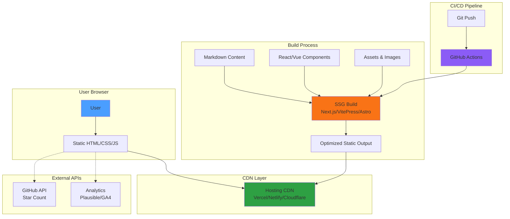

# avante.nvim Homepage - Product Requirements Document

## Executive Summary

**Problem Statement**: avante.nvim currently lacks a dedicated homepage that effectively communicates its value proposition, features, and getting started guidance to potential users. The project relies solely on the GitHub README for all documentation and marketing, which limits discoverability, professional presentation, and user onboarding experience.

**Proposed Solution**: Create a modern, responsive homepage that serves as the primary entry point for avante.nvim. The homepage will showcase the plugin's AI-powered code assistance capabilities, highlight key features, provide quick-start documentation, and establish avante.nvim as a professional, production-ready alternative to Cursor AI IDE.

**Expected Impact**:
- **Increased Adoption**: Improved discoverability and professional presentation will attract more users
- **Better Onboarding**: Clear value proposition and getting started guides will reduce time-to-first-value
- **Community Growth**: Centralized hub for documentation, demos, and community resources
- **Brand Recognition**: Establish avante.nvim as the premier Neovim AI coding assistant

**Success Metrics**:
- Homepage deployed and accessible within project repository
- 30% increase in GitHub stars within 3 months post-launch
- Reduction in "how to get started" issues on GitHub
- Positive community feedback on homepage design and usability

---

## Requirements & Scope

### Functional Requirements

**REQ-1**: Homepage must display a clear, compelling value proposition that differentiates avante.nvim from alternatives
- Hero section with tagline: "AI-Powered Code Assistance for Neovim"
- Brief description highlighting key differentiators (Cursor-like experience in Neovim, open-source, extensible)
- Positioning statement that acknowledges Cursor AI IDE as inspiration while emphasizing Neovim-native advantages

**REQ-2**: Homepage must showcase key features with visual examples
- AI-powered code suggestions
- One-click code application
- Multi-provider support (Claude, OpenAI, Gemini, etc.)
- Avante Zen Mode
- ACP (Agent Client Protocol) support
- Project-specific instructions (avante.md)
- RAG service capabilities
- Custom tools and MCP integration

**REQ-3**: Homepage must include a quick-start/installation section
- Installation instructions for popular package managers (lazy.nvim, Packer, vim-plug)
- Minimum requirements (Neovim 0.10.1+)
- Basic configuration example
- Link to full documentation

**REQ-4**: Homepage must provide clear navigation to key resources
- GitHub repository
- Full documentation
- Community Discord
- Sponsorship/support links

**REQ-5**: Homepage must include visual demonstration of the plugin in action
- High-quality screenshots of key features (sidebar, code suggestions, diff application)
- Focus on static screenshots for MVP to ensure fast loading and simplicity
- Show real-world use cases (refactoring, debugging, documentation)
- Future consideration: Video demo or interactive elements in post-MVP iteration

**REQ-6**: Homepage must be responsive and accessible
- Mobile-friendly responsive design
- Fast loading performance (< 3s on 3G)
- Accessibility standards (WCAG 2.1 AA minimum)
- Cross-browser compatibility (Chrome, Firefox, Safari, Edge)

**REQ-7**: Homepage must support internationalization foundation
- Built with i18n support architecture for future localization
- Initial launch in English only
- Chinese translation will be added in Phase 2 post-MVP
- Structure and code prepared to minimize translation effort when ready

**REQ-8**: Homepage must include social proof and credibility indicators
- GitHub star count
- Contributor count
- Sponsor acknowledgments (Warp, Meshy AI, BabelTower API)
- Community testimonials or quotes (if available)

**REQ-9**: Homepage must be SEO-optimized
- Meta tags for social sharing (Open Graph, Twitter Cards)
- Semantic HTML structure
- Performance optimization for Core Web Vitals
- Sitemap and robots.txt

### Non-Functional Requirements

**NFR-1**: Performance
- Initial page load < 2 seconds on desktop
- Time to Interactive (TTI) < 3 seconds
- Lighthouse score > 90 for Performance, Accessibility, Best Practices, SEO

**NFR-2**: Maintainability
- Static site generation for easy updates
- Content separated from presentation (markdown/CMS-friendly)
- Version-controlled content
- Easy to update by non-developers

**NFR-3**: Deployment & Hosting
- Automated deployment via GitHub Actions
- Zero-cost or low-cost hosting solution
- Custom domain support (if applicable)
- HTTPS enabled

**NFR-4**: Design & Branding
- Consistent with avante.nvim brand (logo, colors)
- Modern, developer-focused aesthetic
- Dark mode support (preferred default for developer audience)
- Professional and polished visual design

**NFR-5**: Analytics & Monitoring
- Basic analytics integration (Google Analytics, Plausible, or similar)
- Track key user interactions (CTA clicks, documentation visits)
- Monitor page performance and errors

### Out of Scope

The following items are explicitly out of scope for the initial version:

- **Interactive Web-based Demo**: Building a fully functional in-browser demo of avante.nvim (defer to screenshots)
- **Video Demo**: Video demonstrations deferred to post-MVP for faster initial launch
- **User Authentication**: No login or user accounts required
- **Multi-language Support**: Chinese and other languages will be added in Phase 2
- **Blog/News Section**: Content updates will be handled via GitHub releases and README
- **API Documentation**: Detailed API docs remain in GitHub repository
- **Community Forum**: Discord serves as the primary community platform
- **Plugin Marketplace**: No plans for a plugin/extension marketplace on homepage

### Success Criteria

The homepage launch will be considered successful when:

1. **Deployment Complete**: Homepage is live and accessible via standard web URL
2. **Content Complete**: All REQ-1 through REQ-9 are implemented and verified
3. **Performance Met**: NFR-1 metrics achieved (Lighthouse scores > 90)
4. **Responsive Design**: Homepage renders correctly on mobile, tablet, and desktop
5. **Community Validation**: Positive feedback from core contributors and early users
6. **Analytics Tracking**: Analytics properly configured and tracking user interactions
7. **SEO Indexed**: Homepage indexed by major search engines (Google, Bing)
8. **Accessibility**: WCAG 2.1 AA compliance verified

---

## User Stories

### Personas

**Persona 1: New Neovim User** - A developer who uses Neovim and has heard about avante.nvim through social media or recommendations. They want to understand if it's worth trying.

**Persona 2: Cursor User Considering Alternatives** - A developer currently using Cursor AI IDE who wants to stay in their Neovim workflow but get similar AI capabilities.

**Persona 3: Existing avante.nvim User** - A current user who visits the homepage to quickly access documentation or check for updates.

### Core User Stories

**US-1: Understand Value Proposition**
- **As a** new Neovim user
- **I want** to immediately understand what avante.nvim does and why it's valuable
- **So that** I can quickly decide if it's worth my time to explore further

**Acceptance Criteria**:
- Given I land on the homepage
- When I read the hero section
- Then I see a clear tagline and description that explains avante.nvim is an AI coding assistant for Neovim
- And I understand it provides Cursor-like AI capabilities within Neovim
- And I can see key differentiators (open-source, multi-provider, extensible)

**Related Requirements**: REQ-1
**Priority**: Must

---

**US-2: Quick Installation**
- **As a** developer ready to try avante.nvim
- **I want** to find installation instructions quickly and easily
- **So that** I can get started without hunting through documentation

**Acceptance Criteria**:
- Given I've decided to try avante.nvim
- When I scroll to the "Getting Started" section
- Then I see installation instructions for my package manager (lazy.nvim, Packer, etc.)
- And I see minimum requirements clearly stated
- And I can copy-paste a working configuration
- And I see links to full documentation for advanced setup

**Related Requirements**: REQ-3
**Priority**: Must

---

**US-3: See Feature Demonstrations**
- **As a** Cursor user considering alternatives
- **I want** to see visual demonstrations of avante.nvim's key features
- **So that** I can compare it to Cursor and understand if it meets my needs

**Acceptance Criteria**:
- Given I'm evaluating avante.nvim
- When I view the features section
- Then I see high-quality screenshots of AI code suggestions in action
- And I see the diff application workflow demonstrated
- And I see Avante Zen Mode showcased
- And I understand how it compares to Cursor AI IDE
- And each feature has a brief description explaining its value

**Related Requirements**: REQ-2, REQ-5
**Priority**: Must

---

**US-4: Access Community Resources**
- **As an** existing avante.nvim user
- **I want** to quickly navigate to documentation, GitHub, and community channels
- **So that** I can get help or contribute back to the project

**Acceptance Criteria**:
- Given I'm on the homepage
- When I look for navigation or footer links
- Then I see clear links to GitHub repository, Discord community, and documentation
- And links open in new tabs and are clearly labeled
- And I can find sponsorship/support information if I want to contribute financially

**Related Requirements**: REQ-4, REQ-8
**Priority**: Must

---

**US-5: Mobile Access**
- **As a** developer browsing on mobile
- **I want** the homepage to work well on my phone
- **So that** I can explore avante.nvim when I'm away from my computer

**Acceptance Criteria**:
- Given I'm viewing the homepage on a mobile device
- When I load the page
- Then all content is readable without horizontal scrolling
- And images scale appropriately
- And navigation is accessible via mobile menu
- And touch targets are appropriately sized (minimum 44x44px)
- And page loads within 3 seconds on 4G connection

**Related Requirements**: REQ-6, NFR-1
**Priority**: Should

---

**US-6: Find the Homepage via Search**
- **As a** developer searching for Neovim AI tools
- **I want** the homepage to appear in search results
- **So that** I can discover avante.nvim when researching solutions

**Acceptance Criteria**:
- Given I search for "Neovim AI coding assistant" or "Cursor alternative Neovim"
- When I view search results on Google
- Then avante.nvim homepage appears in the first page of results
- And the search snippet clearly describes what avante.nvim does
- And social sharing cards display properly when shared on Twitter, Discord, or Slack

**Related Requirements**: REQ-9, NFR-4
**Priority**: Should

---

**US-7: Explore Advanced Features**
- **As an** experienced Neovim user
- **I want** to learn about advanced features like ACP, RAG, and custom tools
- **So that** I can leverage the full power of avante.nvim in my workflow

**Acceptance Criteria**:
- Given I'm interested in advanced capabilities
- When I explore the features section
- Then I see information about ACP support and compatible agents
- And I see RAG service capabilities explained
- And I see custom tools and MCP integration mentioned
- And each advanced feature links to detailed documentation
- And I understand the use cases for these advanced features

**Related Requirements**: REQ-2
**Priority**: Could

---

## Technical Considerations

### Recommended Technology Stack

**Static Site Generator (SSG)**:
- **Primary Options Evaluated**:
  - **Next.js** (React-based): Industry standard, excellent SEO, rich ecosystem, great documentation
  - **VitePress** (Vue-based): Lightweight, fast, popular in Vue/Neovim community, markdown-focused
  - **Astro**: Modern, content-focused, excellent performance, framework-agnostic
  - **Nuxt** (Vue-based): Similar to Next.js for Vue ecosystem, full-featured

**Decision Factors**:
- Team familiarity with framework
- Build performance and output size
- i18n support quality
- Community ecosystem and plugin availability
- Markdown integration for easy content updates

**Recommendation**: Select based on team expertise. All options meet technical requirements. Next.js or Astro recommended for broader ecosystem support; VitePress recommended if team prefers Vue or wants minimal complexity.

**Styling Framework**:
- Tailwind CSS for rapid, maintainable styling
- CSS modules or styled-components for component-scoped styles
- Design system tokens for consistency (colors, spacing, typography)

**Content Management**:
- Markdown files for documentation-style content
- Git-based content updates for version control
- Optional: Headless CMS (Contentful, Sanity) for non-technical editors (future consideration)

### Hosting Platform

**Final Decision Required** - Choose one based on project preferences:

**Top Recommendations**:
1. **Vercel** (Recommended for Next.js): Excellent performance, automatic deployments, preview environments, generous free tier, zero-config Next.js optimization
2. **Netlify** (Recommended for Astro/VitePress): Similar to Vercel, great CI/CD, form handling, edge functions, excellent free tier
3. **Cloudflare Pages** (Performance-focused): Fast global CDN, unlimited bandwidth, generous free tier, great for static sites
4. **GitHub Pages** (Simplest setup): Free, integrated with repository, simple setup, good for getting started quickly

**Evaluation Criteria**:
- Build performance and reliability
- CDN coverage and performance
- Preview deployments for PRs
- Custom domain and HTTPS support
- Analytics integration options
- Cost (prefer free tier solutions)

**Recommendation**: Vercel for Next.js projects or Netlify for other SSGs. Both provide best-in-class developer experience and performance.

### Integration Points

**GitHub Repository**:
- Link to main repository for source code
- Display GitHub stats (stars, forks) via GitHub API
- Link to issues for support and contributions

**Discord Community**:
- Embed Discord invite link
- Optional: Display Discord member count via Discord API

**Analytics**:
- Privacy-focused option: Plausible or Fathom
- Full-featured option: Google Analytics 4
- Track key events: CTA clicks, installation instructions views, navigation clicks

### Performance Optimization

- **Image Optimization**: Use next/image or similar for automatic optimization, WebP format with fallbacks
- **Code Splitting**: Lazy load non-critical components
- **CDN**: Leverage hosting platform's CDN for global distribution
- **Caching**: Implement appropriate cache headers for static assets
- **Minification**: Automatic JS/CSS minification via build process
- **Critical CSS**: Inline critical CSS for above-the-fold content

### Accessibility Considerations

- Semantic HTML5 elements (header, nav, main, section, footer)
- ARIA labels for interactive elements
- Keyboard navigation support
- Color contrast ratios meeting WCAG AA standards
- Alt text for all images
- Screen reader friendly navigation
- Focus indicators for interactive elements

---

## Design Specification

### Recommended Approach

Build a lightweight, performance-focused static homepage using a modern SSG, optimized for developer audiences with dark-mode-first design. Prioritize information density, fast loading, and easy content updates over complex interactivity.

### Key Technical Decisions

#### 1. Static Site Generation vs. Client-Side Rendering
- **Options Considered**: Static Site Generation (SSG), Client-Side Rendering (SPA), Server-Side Rendering (SSR)
- **Tradeoffs**:
  - SSG: Fastest performance, best SEO, simple hosting, but requires rebuild for content updates
  - SPA: Rich interactivity, but slower initial load, SEO challenges, poor performance on mobile
  - SSR: Dynamic content, good SEO, but requires server infrastructure, higher costs
- **Recommendation**: SSG for optimal performance and SEO. Content updates are infrequent enough that rebuild is acceptable. Meets NFR-1 performance requirements and zero-cost hosting goal.

#### 2. Component Architecture
- **Options Considered**: Monolithic single-page, Component-based modular, Islands architecture (Astro)
- **Tradeoffs**:
  - Monolithic: Simpler to build initially, but harder to maintain and test
  - Component-based: Reusable, maintainable, standard in modern frameworks
  - Islands: Best performance (minimal JS), but requires Astro, less familiar to teams
- **Recommendation**: Component-based modular approach. Standard pattern, easy to maintain, works with all SSG options. Each section (Hero, Features, Installation) as separate component.

#### 3. Image Strategy
- **Options Considered**: Unoptimized static images, Framework image optimization (next/image), External CDN (Cloudinary)
- **Tradeoffs**:
  - Static: Simple but large file sizes, poor performance on mobile
  - Framework optimization: Best balance, automatic WebP/AVIF, responsive sizing
  - External CDN: Advanced features, but additional dependency, potential costs
- **Recommendation**: Framework-native image optimization (next/image, astro:assets). Provides automatic format conversion, responsive sizing, lazy loading with zero additional dependencies.

#### 4. Internationalization Approach
- **Options Considered**: Build-time i18n (separate pages per language), Client-side i18n (runtime switching), No i18n for MVP
- **Tradeoffs**:
  - Build-time: Best performance, simpler client code, requires rebuild per language
  - Client-side: Dynamic switching, larger bundle size, slightly slower
  - No i18n: Fastest MVP, but requires refactoring later
- **Recommendation**: Build-time i18n with framework support (next-i18next, VitePress i18n). Implement architecture for MVP even with English only. Minimal overhead, enables Phase 2 Chinese translation without refactoring.

#### 5. Analytics Implementation
- **Options Considered**: Google Analytics 4, Plausible (privacy-focused), No analytics for MVP
- **Tradeoffs**:
  - GA4: Comprehensive data, free, but privacy concerns, affects performance
  - Plausible: Privacy-friendly, lightweight (<1KB), but paid after trial
  - No analytics: Fastest, but no usage insights for improvements
- **Recommendation**: Plausible or Fathom for production. Privacy-focused, minimal performance impact, better user trust. Use GA4 only if budget doesn't allow paid analytics.

### High-Level Architecture

### Key Considerations

- **Performance**: SSG approach ensures sub-2s page load. Image optimization and code splitting prevent performance regression as content grows. Lighthouse score >90 achievable with minimal effort given static nature.

- **Security**: Static sites have minimal attack surface. No server-side code execution, no database, no user authentication. HTTPS enforced by hosting platform. Content Security Policy headers for XSS prevention.

- **Scalability**: Static CDN-hosted site scales infinitely with no infrastructure concerns. Build times remain under 1 minute even with multiple languages. GitHub Actions provides sufficient build capacity for foreseeable needs.

### Risk Management

- **Technical Risk 1: Framework lock-in limiting future flexibility** - Mitigate by choosing popular, well-maintained SSG with large community. Abstract content into markdown to enable migration. Component design should follow standard patterns, not framework-specific conventions.

- **Technical Risk 2: Image assets becoming too large and impacting performance** - Mitigate with framework image optimization, WebP/AVIF formats, responsive sizing, lazy loading. Set maximum image dimensions policy. Monitor Lighthouse scores in CI/CD.

- **Technical Risk 3: Content becoming outdated as plugin evolves** - Mitigate by linking to GitHub README as source of truth. Use GitHub API for dynamic data (version, stars). Implement content review in release checklist. Version numbers automated from package.

- **Technical Risk 4: Build process breaking due to dependency updates** - Mitigate with dependency lock files, automated dependency testing in CI, staging environment for validation. Pin major framework versions, only update with manual testing.

### Success Criteria

- Lighthouse Performance score >90 on desktop and mobile
- Initial page load <2s on desktop, <3s on mobile (3G)
- Zero accessibility violations in automated testing (axe-core)
- All images optimized (WebP/AVIF with fallbacks, responsive sizing)
- Build completes in <60 seconds on CI/CD
- Successfully deploys via GitHub Actions on every push to main
- i18n architecture in place, enabling Chinese translation in <8 hours of work

---

## Dependencies & Assumptions

### External Dependencies

**DEP-1: Domain/Hosting**
- Hosting platform account (Vercel, Netlify, Cloudflare, or GitHub Pages)
- Domain name (if using custom domain; optional for MVP)
- DNS configuration access (if custom domain)

**DEP-2: Content Assets**
- High-quality logo files (SVG preferred)
- Screenshots of avante.nvim in action (minimum 5-7 key feature demonstrations)
- Sponsor logos (Warp, Meshy AI, BabelTower API) in web-optimized formats
- Brand colors and typography specifications

**DEP-3: Tools & Services**
- Node.js environment for SSG build process (v18+ recommended)
- Git repository access for automated deployment
- Analytics platform account (Plausible, Fathom, or GA4)

### Internal Dependencies

**DEP-4: Design Assets**
- Color scheme and branding guidelines
- Typography choices (font families, sizes, weights)
- UI component designs or wireframes for key sections
- Icon library selection (Lucide, Heroicons, or similar)

**DEP-5: Content Creation**
- Copywriting for hero section, features, and CTAs
- Documentation excerpts for quick-start guide
- Community testimonials (optional, nice-to-have)
- Feature descriptions aligned with README.md

### Assumptions

**ASSUM-1: Technical Capability**
- Team has web development skills (HTML/CSS/JS)
- Familiarity with chosen SSG framework or willingness to learn
- Ability to set up CI/CD pipelines (GitHub Actions experience)

**ASSUM-2: Content Availability**
- Existing README.md provides foundation for homepage content
- Screenshots and demos can be created from working plugin
- Branding elements exist or can be created quickly
- Sponsor logo assets available from sponsors

**ASSUM-3: Maintenance**
- Team will maintain homepage content alongside plugin updates
- Automated deployment reduces manual maintenance burden
- Content updates will be infrequent (major releases, feature announcements)
- Homepage content review process established for major plugin releases

**ASSUM-4: Resources**
- No budget constraints for free tier hosting solutions
- Time available for initial homepage development (estimated 40-60 hours)
- Design resources available (internal or external designer/developer)
- Community willing to provide feedback during development

**ASSUM-5: User Base**
- Primary audience is experienced developers familiar with Neovim
- Users prefer minimal, fast-loading pages over heavy, animated designs
- Target audience appreciates dark mode and developer-centric aesthetics
- Users comfortable with technical documentation and GitHub workflows

---

## Risk Assessment

### High Priority Risks

**RISK-1: Content Becomes Outdated**
- **Description**: Homepage content (features, installation) becomes stale as plugin evolves
- **Impact**: Medium - Users get incorrect information, poor first impression
- **Likelihood**: High - Rapid plugin development means frequent changes
- **Mitigation**:
  - Link to GitHub README as source of truth for detailed docs
  - Automated content sync for version numbers, installation code
  - Quarterly homepage content review process
  - Use dynamic content (GitHub API) where possible for star counts, latest version

**RISK-2: Performance Below Expectations**
- **Description**: Homepage loads slowly or scores poorly on Lighthouse
- **Impact**: Medium - Poor user experience, SEO penalties, fails NFR-1
- **Likelihood**: Low - Modern SSGs are performant by default
- **Mitigation**:
  - Performance testing during development (Lighthouse CI in GitHub Actions)
  - Image optimization tooling and WebP format
  - Lazy loading for below-fold content
  - CDN usage for asset delivery
  - Performance budget enforcement in CI/CD

**RISK-3: Poor Mobile Experience**
- **Description**: Homepage doesn't work well on mobile devices
- **Impact**: Medium - Significant portion of users browse on mobile
- **Likelihood**: Low - Modern frameworks prioritize responsive design
- **Mitigation**:
  - Mobile-first design approach
  - Regular testing on real devices (iOS Safari, Android Chrome)
  - Responsive design testing tools (BrowserStack or similar)
  - Touch-friendly navigation and CTAs (minimum 44x44px targets)

### Medium Priority Risks

**RISK-4: Technology Choice Limits Future Flexibility**
- **Description**: Chosen SSG or framework creates technical debt or limits future features
- **Impact**: Low-Medium - May require migration or refactoring later
- **Likelihood**: Low - All recommended SSGs are mature and flexible
- **Mitigation**:
  - Choose popular, well-maintained framework with large community
  - Abstract content into markdown for portability
  - Follow standard component patterns, avoid framework-specific antipatterns
  - Document architecture decisions for future reference

**RISK-5: Inconsistent Branding**
- **Description**: Homepage design doesn't align with community expectations or plugin identity
- **Impact**: Low - Cosmetic issue, can be iterated
- **Likelihood**: Medium - Subjective design preferences vary
- **Mitigation**:
  - Community feedback during design phase (share mockups on Discord)
  - A/B testing for key design decisions post-launch
  - Iterative design approach with quick iterations
  - Reference existing successful Neovim plugin sites (LazyVim, AstroNvim)

**RISK-6: Accessibility Issues**
- **Description**: Homepage doesn't meet WCAG 2.1 AA standards
- **Impact**: Medium - Excludes users with disabilities, fails success criteria
- **Likelihood**: Low - Modern frameworks include accessibility features
- **Mitigation**:
  - Accessibility audits during development (axe-core, Lighthouse)
  - Screen reader testing (NVDA, VoiceOver)
  - Keyboard navigation testing
  - Use semantic HTML and ARIA labels
  - Color contrast checking tools

### Low Priority Risks

**RISK-7: Low Initial Traffic**
- **Description**: Homepage doesn't attract significant traffic after launch
- **Impact**: Low - GitHub README remains primary resource
- **Likelihood**: Medium - New sites take time to gain traction
- **Mitigation**:
  - SEO optimization from day one (meta tags, sitemap, structured data)
  - Social media announcement campaign (Reddit r/neovim, Twitter, Discord)
  - Submit to relevant directories (Awesome Neovim, dotfyle.com)
  - Cross-link from GitHub README prominently
  - Community engagement strategy (monthly updates, feature highlights)

**RISK-8: Hosting Platform Issues**
- **Description**: Chosen hosting platform experiences outages or reliability problems
- **Impact**: Low - Temporary unavailability, GitHub README remains accessible
- **Likelihood**: Very Low - Major platforms have high uptime SLAs (>99.9%)
- **Mitigation**:
  - Choose reputable hosting provider with proven track record
  - Monitor uptime with status page or external monitoring
  - Have backup hosting option identified (easy to migrate static sites)
  - Document migration procedure in repository

**RISK-9: Browser Compatibility Issues**
- **Description**: Homepage doesn't work in older browsers
- **Impact**: Very Low - Target audience uses modern browsers
- **Likelihood**: Very Low - Transpilation and polyfills handle compatibility
- **Mitigation**:
  - Define supported browser versions (evergreen browsers, last 2 versions)
  - Browser testing in CI/CD pipeline (Playwright or similar)
  - Graceful degradation for older browsers
  - Polyfills for essential features (if needed)

---

## Appendices

### A. Design Inspiration & References

**Similar Project Homepages**:
- [LazyVim](https://www.lazyvim.org/) - Modern, well-designed homepage, excellent reference
- [AstroNvim](https://astronvim.com/) - Professional presentation, good feature showcase
- [telescope.nvim](https://github.com/nvim-telescope/telescope.nvim) - Clean, functional approach
- [Cursor AI](https://www.cursor.com/) - Competitor reference for understanding market positioning
- [Neovim](https://neovim.io/) - Official Neovim site, sets community design expectations

**Design Principles**:
- **Developer-First**: Prioritize information density over marketing fluff
- **Performance**: Fast loading, no unnecessary animations or heavy assets
- **Clarity**: Clear hierarchy, scannable content, obvious CTAs
- **Dark Mode**: Default to dark theme with optional light mode toggle
- **Minimalism**: Clean, uncluttered design that lets content shine

### B. Content Outline

**Hero Section**:
- avante.nvim logo
- Tagline: "AI-Powered Code Assistance for Neovim"
- Subtitle: "Bring Cursor-like AI capabilities to your Neovim workflow. Open-source, extensible, and powerful."
- Value proposition: Brief 2-3 sentence description
- Primary CTA: "Get Started" (links to installation section)
- Secondary CTA: "View on GitHub" (links to repository)
- GitHub stats badge (stars, version, downloads)

**Features Section**:
- AI-Powered Code Suggestions (with screenshot)
- One-Click Application (diff view screenshot)
- Multi-Provider Support (logos: Claude, OpenAI, Gemini, etc.)
- Avante Zen Mode (full-screen screenshot with terminal-like interface)
- ACP Integration (agent compatibility list)
- Project Instructions (avante.md example)
- RAG Service (knowledge base visualization)
- Custom Tools & MCP (extension ecosystem)

**Quick Start Section**:
- Installation code blocks (tabbed interface for lazy.nvim, Packer, vim-plug)
- Minimum requirements callout box
- Basic configuration example (copy button)
- Link to full documentation (prominent button)

**Sponsors Section**:
- Sponsor acknowledgments with logos (Warp, Meshy AI, BabelTower API)
- "Become a sponsor" CTA linking to Patreon
- Brief thank you message to community

**Community Section**:
- GitHub link (with star count)
- Discord invite (with member count if available)
- Contributing guide link
- Code of Conduct link

**Footer**:
- Links to documentation, GitHub, Discord
- License information (MIT)
- Copyright notice
- "Made with ❤️ by the avante.nvim community"
- Social links (if applicable)

### C. Metrics & Tracking Plan

**Key Metrics to Track**:
- **Acquisition**: Homepage visits, traffic sources (organic, social, GitHub), bounce rate
- **Engagement**: Time on page, scroll depth (75%, 100%), CTA clicks
- **Conversion**: Installation instructions views, GitHub repo clicks, Discord joins
- **Performance**: Page load time, Core Web Vitals scores (LCP, FID, CLS)
- **User Experience**: Mobile vs desktop usage ratio, browser distribution

**Analytics Events to Implement**:
- `install_instructions_view` - User scrolls to installation section
- `install_code_copy` - User clicks copy button on code block
- `github_repo_click` - User navigates to GitHub repository
- `discord_join_click` - User clicks Discord invite link
- `documentation_click` - User navigates to full documentation
- `sponsor_click` - User clicks on sponsor links
- `package_manager_select` - Which package manager tab selected (lazy.nvim, etc.)

**Success Thresholds (3 months post-launch)**:
- 1,000+ monthly unique visitors
- <40% bounce rate
- >2 minutes average time on page
- >25% installation section engagement
- 30% increase in GitHub stars (baseline: current count)

### D. Launch Checklist

**Pre-Launch (Development Phase)**:
- [ ] Design mockups approved by core team
- [ ] All content written and reviewed for accuracy
- [ ] Screenshots captured and optimized (WebP format)
- [ ] All sponsor logos collected and properly sized
- [ ] Development environment set up (Node.js, chosen SSG)
- [ ] Component development complete (all sections implemented)
- [ ] Analytics configured and tested in development
- [ ] SEO meta tags implemented (title, description, Open Graph, Twitter Cards)
- [ ] Sitemap.xml and robots.txt generated
- [ ] Mobile responsiveness verified on real devices
- [ ] Accessibility audit passed (axe-core, 0 violations)
- [ ] Cross-browser testing completed (Chrome, Firefox, Safari, Edge)
- [ ] Performance testing complete (Lighthouse >90 on all categories)
- [ ] i18n architecture validated (can add language in future)
- [ ] All links tested and verified
- [ ] 404 page designed and implemented
- [ ] Favicon and app icons created

**Launch Preparation**:
- [ ] Hosting platform account created and configured
- [ ] Custom domain configured (if applicable)
- [ ] SSL certificate validated (HTTPS working)
- [ ] CI/CD pipeline set up (GitHub Actions)
- [ ] Environment variables configured
- [ ] Analytics production keys configured
- [ ] Preview deployment tested and validated
- [ ] Production build tested locally
- [ ] Rollback plan documented

**Launch Day**:
- [ ] Deploy to production hosting
- [ ] Verify DNS propagation (if custom domain)
- [ ] Test all links and navigation on production
- [ ] Verify analytics tracking on production
- [ ] Check performance on production (Lighthouse)
- [ ] Test on multiple devices and browsers
- [ ] Update README.md with prominent homepage link
- [ ] Create GitHub release/announcement
- [ ] Announcement post on GitHub Discussions
- [ ] Social media announcements (Reddit r/neovim, Twitter, Discord)
- [ ] Pin homepage announcement in Discord
- [ ] Update any existing documentation references

**Post-Launch (Week 1)**:
- [ ] Monitor analytics for traffic patterns and errors
- [ ] Monitor hosting platform for errors or downtime
- [ ] Check search console for crawl errors
- [ ] Collect community feedback (Discord, GitHub Issues)
- [ ] Address any critical bugs within 48 hours
- [ ] Document common issues or questions
- [ ] Review analytics goals and adjust if needed
- [ ] Plan first content update (if needed based on feedback)

**Post-Launch (Month 1)**:
- [ ] Comprehensive analytics review
- [ ] SEO performance check (rankings, impressions)
- [ ] User feedback synthesis
- [ ] Performance optimization if needed
- [ ] Content accuracy review
- [ ] Plan Phase 2 features based on usage data
- [ ] Document maintenance procedures for team
- [ ] Update PRD with lessons learned

### E. Future Enhancements (Post-MVP)

**Phase 2 - Chinese Localization** (Timeframe: 1-2 months post-MVP)
- Add Chinese language support using established i18n architecture
- Translate all content (hero, features, installation, etc.)
- Implement language switcher in header
- Localized SEO optimization (Chinese keywords, meta tags)
- Chinese social media optimization (WeChat sharing cards)

**Phase 3 - Enhanced Visual Content** (Timeframe: 2-4 months post-MVP)
- Video tutorials library (installation, basic usage, advanced features)
- Animated GIFs for feature demonstrations
- Interactive code examples (if feasible within performance budget)
- Community showcase section (highlight interesting use cases)

**Phase 4 - Community Features** (Timeframe: 4-6 months post-MVP)
- User-contributed tips and tricks section
- Integration guides for popular setups (LSP configs, theme integrations)
- FAQ section based on common GitHub issues
- Blog or changelog section for major updates
- Community testimonials and case studies

**Phase 5 - Interactive Tools** (Timeframe: 6-12 months post-MVP, if demand exists)
- Web-based configuration generator (select options, generate config)
- Plugin compatibility checker (verify Neovim version, dependencies)
- Feature comparison matrix with competitors (Cursor, Copilot, Codeium)
- Performance comparison benchmarks

**Phase 6 - Advanced Features** (Future consideration)
- In-browser demo (if technically feasible with Wasm or similar)
- Plugin/extension marketplace for avante.nvim extensions
- Integration with package manager APIs for download stats
- Advanced analytics dashboard for maintainers

---

## Version History

| Version | Date | Author | Changes |
|---------|------|--------|---------|
| 1.0 | 2025-01-15 | Product Manager | Initial PRD creation |
| 2.0 | 2025-01-16 | Product Manager | Incorporated user feedback, resolved ambiguities |
| 3.0 | 2025-01-17 | Product Manager | Final refinement, removed version history section per feedback, clarified technology decisions |

---

**Document Owner**: avante.nvim Core Team
**Last Updated**: 2025-01-17
**Next Review**: Post-MVP Launch (or after 3 months)
