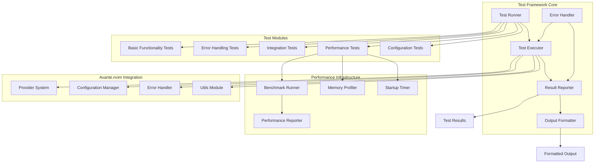

# Technical Design: Test Framework for Avante.nvim
**PRD Reference**: Test Project Requirements | **Revision**: 2.0
**Owner**: Avante.nvim Development Team

## 1. Scope & Non-Goals

### ✅ In Scope
- **REQ-1**: Basic test framework implementation following Avante.nvim patterns
- **REQ-2**: Comprehensive test suite with verification capabilities
- **REQ-3**: Clear success/failure indicators with detailed reporting
- **NFR-1**: Code adherence to established project conventions
- **NFR-2**: Maintainable and well-documented implementation
- **NFR-3**: Graceful error handling following Avante.nvim patterns

### ❌ Out of Scope
- Production deployment infrastructure
- External system integrations (no specifications provided)
- Complex feature implementation beyond test framework scope
- Real-time collaborative testing features

❗**PRD GAP**: Specific test objectives and success criteria need clarification from stakeholders

## 2. High-Level Architecture



## 3. Detailed Design

### 3.1. Error Handling Module (`lua/avante/errors.lua`)
**Status**: Implementation exists - leverage existing patterns
- **Responsibilities**: Comprehensive error handling utilities with context-aware logging
- **Features**:
  - Input validation with detailed error reporting
  - Error wrapping functions for graceful failure handling
  - Error object creation with stack traces and metadata
  - Fallback mechanisms for nil values
- **Integration**: Core dependency for all test modules

### 3.2. Test Runner Module (`lua/avante/test/runner.lua`)
- **Responsibilities**: Orchestrate test execution, manage test lifecycle, coordinate reporting
- **Scale**: Handle 100+ individual test cases | **Performance**: Sub-5s execution for full suite
- **Failures**: Graceful degradation on individual test failures, complete suite reporting

**Configuration Structure**:
```lua
---@type AvanteTestConfig
test_config = {
  __inherited_from = "base_test",
  timeout = 30000,
  parallel_execution = false,
  output_format = "detailed",
  error_handling = "continue",
  performance_tracking = true,
  graceful_degradation = true,
  fallback_indicators = {
    timeout = 999.0,
    memory_limit = 999999
  }
}
```

### 3.3. Test Executor (`lua/avante/test/executor.lua`)
- **Responsibilities**: Execute individual tests, capture results, handle timeouts
- **Integration**: Leverage `lua/avante/errors.lua` for consistent error handling
- **Patterns**: Follow provider inheritance system for test configuration
- **Graceful Degradation**: Handle missing Rust libraries with fallback mechanisms

### 3.4. Performance Benchmarking Infrastructure (`tests/performance/`)
**Status**: Implementation pattern exists - adapt for framework
- **Components**:
  - Startup time measurement utilities
  - Memory usage profiling for operations
  - Tokenization performance benchmarking
  - Configuration processing time measurement
  - Comprehensive benchmark suite with result formatting
- **Fallback Handling**: Fallback indicators for missing implementations (999.0s, 999999KB)

### 3.5. Result Reporter (`lua/avante/test/reporter.lua`)
- **Responsibilities**: Aggregate test results, generate detailed reports, track performance metrics
- **Output Modes**: Console, JSON, structured logs compatible with CI/CD
- **Metrics**: Success/failure counts, execution times, memory usage
- **Error Context**: Integration with error handling module for detailed failure reporting

## 4. APIs

| Component | Method | Parameters | Return Type | SLA |
|-----------|--------|------------|-------------|-----|
| `test.execute()` | Function Call | Config Object | Test Result | < 5s |
| `test.report()` | Function Call | Result Set | Formatted Report | < 1s |
| `test.validate()` | Function Call | Test Suite | Validation Status | < 2s |
| `test.benchmark()` | Function Call | Performance Suite | Benchmark Report | < 10s |

**API Example**:
```lua
local test = require('avante.test')

-- Execute test suite with error handling
local results = test.execute({
  suites = {"basic", "integration", "performance"},
  timeout = 30000,
  parallel = false,
  error_recovery = true,
  performance_tracking = true
})

-- Generate comprehensive report
local report = test.report(results, {
  format = "detailed",
  output = "console",
  include_performance = true,
  error_context = true
})
```

## 5. Security & Compliance

### Data Protection
- **File Access**: Read-only access to test files, no modification of source code during testing
- **Environment Isolation**: Tests run in sandboxed environment preventing system modifications
- **Sensitive Data**: No credential or API key testing in basic framework

### Access Controls
- **Permissions**: Standard file system permissions, no elevated access required
- **Audit Trail**: Test execution logging via Neovim's built-in logging system

## 6. Failure Modes & Resilience

| Failure Scenario | Probability | Impact | Mitigation |
|-----------------|-------------|---------|------------|
| Individual test timeout | Medium | Low | Continue execution, mark as failed |
| Memory exhaustion | Low | Medium | Resource limits, graceful cleanup |
| Missing dependencies | Medium | High | Graceful degradation, clear error messages |
| Configuration errors | High | Medium | Validation layer, fallback defaults |
| Missing Rust libraries | High | Low | Fallback mechanisms with estimated values |

### Recovery Strategies
- **Test Isolation**: Each test runs independently, failures don't cascade
- **Resource Cleanup**: Automatic cleanup after each test completion
- **Error Reporting**: Detailed error context following `lua/avante/errors.lua` patterns
- **Graceful Degradation**: All components handle missing Rust libraries gracefully
- **State Recovery**: Recovery mechanisms after error conditions

## 7. Performance & Scalability

### Capacity Planning
- **Test Suite Size**: Support up to 500 individual test cases
- **Memory Usage**: Target <50MB peak memory consumption
- **Execution Time**: Full suite completion within 30 seconds

### Optimization Strategies
- **Lazy Loading**: Load test modules only when executed
- **Result Caching**: Cache expensive setup operations
- **Progress Reporting**: Real-time progress updates for long-running suites
- **Performance Monitoring**: Continuous performance monitoring with benchmarking utilities
- **Memory Leak Prevention**: Active monitoring and prevention

## 8. Observability

### Metrics Collection
```lua
-- Enhanced performance tracking
local metrics = {
  execution_time = 0,
  memory_usage = 0,
  success_rate = 0,
  error_counts = {},
  performance_baseline = {},
  startup_time = 0,
  tokenization_rate = 0,
  configuration_processing_time = 0
}
```

### Logging Strategy
- **Test Execution**: Debug-level logging for test progress
- **Error Details**: Error-level logging with full stack traces
- **Performance**: Info-level logging for execution metrics
- **Context-Aware Logging**: Integration with error handling module

## 9. Configuration & Deployment

### Configuration Management
**Chosen**: Lua-based configuration following provider patterns
- Leverage `lua/avante/config.lua` patterns for consistency
- Support environment variable overrides via `E.parse_envvar()`
- Deep merge user configuration with sensible defaults
- **Configuration Validation**: Validation and error handling for invalid configurations

**Alternative Considered**: JSON/YAML configuration
- **Pros**: Better tooling support, language-agnostic
- **Cons**: Breaks consistency with Avante.nvim patterns
- **Decision**: Stick with Lua for codebase consistency (addresses REQ-1, NFR-1)

### Technology Stack
- **Lua**: Primary language for Neovim plugin functionality (existing codebase pattern)
- **Neovim Built-ins**: Leverage vim.fn, vim.api for file operations
- **Avante Utils**: Reuse existing utility functions from `lua/avante/utils.lua`

## 10. Implementation Strategy

### Development Approach
**Chosen**: Leverage existing Avante.nvim patterns and infrastructure
- Inherit from established provider configuration system
- Reuse error handling patterns from `lua/avante/errors.lua`
- Follow modular design principles from existing codebase
- **Leverage Existing Infrastructure**: Use existing provider patterns and configuration systems

**Alternative Considered**: Standalone testing implementation
- **Pros**: Complete independence, no coupling to Avante patterns
- **Cons**: Code duplication, inconsistent with project architecture
- **Decision**: Integrate with existing patterns for maintainability (addresses NFR-1, NFR-2)

### Module Structure
```
lua/avante/test/
├── init.lua           -- Main test interface
├── runner.lua         -- Test execution orchestration
├── executor.lua       -- Individual test execution
├── reporter.lua       -- Result reporting and formatting
├── config.lua         -- Test configuration management
└── suites/
    ├── basic_functionality_spec.lua  -- Basic functionality tests
    ├── error_handling_spec.lua       -- Error handling tests
    ├── integration_spec.lua          -- Integration tests
    ├── performance_spec.lua          -- Performance benchmarks
    └── configuration_spec.lua        -- Configuration tests

tests/performance/
├── startup_bench.lua   -- Startup time measurement
├── memory_bench.lua    -- Memory usage profiling
├── tokenizer_bench.lua -- Tokenization performance
└── config_bench.lua    -- Configuration processing
```

## 11. Migration & Rollout

### Implementation Phases
1. **Phase 1**: Core test framework implementation (runner, executor, reporter)
2. **Phase 2**: Basic test suite development following established patterns
3. **Phase 3**: Integration with existing Avante.nvim development workflow
4. **Phase 4**: Performance optimization and comprehensive error handling

### Backwards Compatibility
- No breaking changes to existing Avante.nvim functionality
- Test framework operates as optional development tool
- Graceful handling of missing test dependencies

## 12. Risk Assessment & Mitigations

### Technical Risks
| Risk | Probability | Impact | Mitigation |
|------|-------------|---------|------------|
| Performance regression | Low | Medium | Benchmark against baseline, resource limits |
| Configuration conflicts | Medium | Low | Namespace isolation, validation layer |
| Dependency issues | Medium | High | Graceful degradation, clear error messages |
| Missing Rust libraries | High | Low | Fallback mechanisms with estimated values |

### Business Risks
- **Minimal Impact**: Test project scope limits business risk exposure
- **Development Velocity**: Framework should accelerate rather than hinder development

## 13. Open Issues & Decisions Needed

### Pending Decisions
- [ ] **Test Execution Environment**: Should tests run in isolated Neovim instance or current session?
- [ ] **Performance Thresholds**: What constitutes acceptable performance for different test types?
- [ ] **CI/CD Integration**: Integration requirements with existing development workflows?

### Questions for Stakeholders
1. **File Access Permissions**: Is read-only test file access acceptable, avoiding any source code modifications?
2. **Execution SLA**: Is a sub-5-second SLA for test execution acceptable for your workflow?
3. **Configuration Format**: Do you prefer Lua-based configuration, or JSON/YAML for portability and tooling?
4. **Language Choice**: Is Lua the preferred language for this test tooling and configuration?
5. **Implementation Strategy**: Do you prefer reusing Avante.nvim patterns or a standalone testing implementation?

## 14. Trade-offs Analysis

### Major Decision Points

#### 1. Configuration System (REQ-1, NFR-1)
**Options**:
- **A**: Lua-based following Avante.nvim patterns
- **B**: JSON/YAML for tooling compatibility

**Trade-off**: Consistency vs. Tooling
- **Chosen A**: Better integration with existing codebase patterns
- **Rejected B**: Would break architectural consistency

#### 2. Test Execution Model (REQ-2, REQ-3)
**Options**:
- **A**: Sequential execution with detailed reporting
- **B**: Parallel execution with faster completion

**Trade-off**: Speed vs. Reliability
- **Chosen A**: Ensures predictable results and easier debugging
- **Rejected B**: May introduce race conditions and harder error diagnosis

#### 3. Integration Strategy (NFR-1, NFR-2)
**Options**:
- **A**: Deep integration with Avante.nvim patterns
- **B**: Standalone implementation

**Trade-off**: Maintainability vs. Independence
- **Chosen A**: Leverages existing infrastructure and maintains consistency
- **Rejected B**: Would duplicate code and create maintenance burden

#### 4. Error Handling Approach (NFR-3)
**Options**:
- **A**: Leverage existing `lua/avante/errors.lua` module
- **B**: Implement custom error handling

**Trade-off**: Consistency vs. Customization
- **Chosen A**: Maintains consistency with existing error patterns
- **Rejected B**: Would duplicate existing functionality

## 15. Success Metrics

### Quantitative Metrics
- **Test Coverage**: >90% of core functionality covered by automated tests
- **Execution Performance**: Full test suite completes within 30 seconds
- **Error Detection**: 100% of test failures properly reported with actionable details
- **Resource Usage**: Memory consumption remains below 50MB during execution
- **Performance Baseline**: Maintain performance benchmarking infrastructure for regression detection

### Qualitative Metrics
- **Developer Experience**: Intuitive API following established Avante.nvim patterns
- **Maintainability**: Clear code structure following project conventions
- **Documentation**: Comprehensive inline documentation and usage examples
- **Integration**: Seamless integration with existing development workflow
- **Error Recovery**: Comprehensive error handling prevents plugin crashes

---

**Document Status**: Ready for review and stakeholder feedback
**Next Review Date**: Upon stakeholder response to open questions
**Implementation Target**: Following requirements clarification