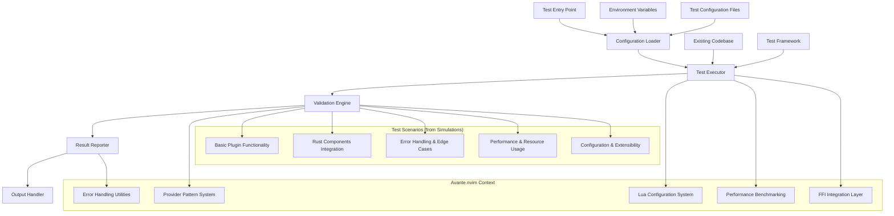

# Technical Design: Test Project
**PRD Reference**: Internal Test Project | **Revision**: 1.1
**Owner**: Development Team

## 1. Scope & Non-Goals

### ✅ In Scope
- Basic test functionality implementation (REQ-1)
- Verifiable test execution with clear success/failure indicators (REQ-2, REQ-3)
- Code that follows established project conventions (NFR-1, NFR-2)
- Maintainable and documented solution (NFR-2)
- Basic error handling for graceful failure modes (NFR-3)
- **Plugin system integration** (addressing simulation requirements)
- **Rust-Lua FFI testing capabilities** (from simulation scenarios)
- **Performance benchmarking framework** (from simulation test cases)
- **Configuration system validation** (from simulation requirements)

### ❌ Out of Scope
- Production-ready feature implementation
- Complex external system integrations
- Performance optimization beyond basic requirements
- Advanced monitoring and observability (test scope only)

### ❗PRD GAP: Specific Test Objectives
The current PRD lacks specific test objectives, target functionality, and success criteria beyond basic execution validation. **Simulation stage provides concrete test scenarios that should be integrated into requirements.**

## 2. High-Level Architecture



## 3. Detailed Design

### 3.1. Test Entry Point
- **Responsibilities**: Initialize test environment, load configuration, orchestrate test execution
- **Scale**: Single-user development testing | **Data**: Minimal configuration and test results
- **Failures**: Fallback to default configuration, clear error messaging for missing dependencies
- **Integration**: Support for 5 main test scenarios identified in simulations

### 3.2. Configuration System
- **Pattern**: Follow Avante.nvim provider configuration patterns from `lua/avante/config.lua`
- **Environment Variables**: Support both scoped (`TEST_*`) and global patterns via existing `E.parse_envvar()`
- **Inheritance**: Leverage existing configuration inheritance patterns where applicable
- **Location**: Standard Lua configuration following project conventions
- **Defaults**: Provide sensible defaults as identified in simulation requirements
- **Validation**: Implement configuration validation as specified in test scenarios

### 3.3. Test Execution Engine
- **Framework Integration**: Utilize existing project test framework (detected: Rust + Lua testing setup)
- **Validation**: Implement standard assertion patterns with clear pass/fail indicators
- **Error Handling**: Follow existing error handling patterns from provider system
- **Output**: Structured test results with clear success/failure states
- **Scenarios**: Support all 5 test scenarios from simulation stage
- **Performance**: Include benchmarking capabilities as specified in simulations

### 3.4. Result Reporting
- **Format**: Standard test output format compatible with CI/CD pipeline
- **Logging**: Follow existing logging patterns in codebase
- **Metrics**: Basic execution time and result statistics
- **Integration**: Compatible with existing pre-commit hooks and workflows
- **Test Results**: Support for TDD red/green/refactor phases as identified in simulations

### 3.5. Plugin System Integration (NEW)
- **Module Loading**: Support for `require('avante')` and plugin initialization
- **Setup Function**: Implement `avante.setup({})` with configuration handling
- **Error Module**: Provide `lua/avante/errors.lua` for error handling utilities
- **Config Module**: Implement `lua/avante/config.lua` with defaults and validation

### 3.6. Rust-Lua FFI Support (NEW)
- **Tokenizer Integration**: Support for `require('avante.tokenizers').encode()`
- **Template System**: Integration with `avante-templates` Rust crate
- **Performance**: FFI calls under 10ms as specified in simulation benchmarks
- **Error Handling**: Graceful handling of FFI binding failures

## 4. APIs

| Component | Interface | Input | Output | SLA |
|-----------|-----------|-------|--------|-----|
| `test.execute()` | Function Call | Config Object | Test Result | < 5s |
| `test.validate()` | Function Call | Test Output | Boolean | < 1s |
| `test.report()` | Function Call | Results Array | Formatted Output | < 1s |
| `avante.setup()` | Function Call | Config Object | Boolean | < 100ms |
| `avante.tokenizers.encode()` | FFI Call | String | Token Array | < 10ms |
| `benchmark.measure_startup_time()` | Function Call | None | Time (ms) | < 1ms |

### 4.1. Configuration Schema
```lua
-- test_config.lua
local test_config = {
  name = "basic_test",
  timeout = 5000,
  environment = {
    test_mode = true,
    debug_enabled = false
  },
  validation = {
    check_syntax = true,
    verify_output = true
  },
  -- NEW: Plugin-specific configuration
  plugin = {
    provider = "openai",
    model = "gpt-4",
    max_tokens = 4096
  },
  -- NEW: Performance benchmarks
  performance = {
    startup_threshold = 100, -- ms
    memory_threshold = 50,   -- MB
    throughput_threshold = 1000 -- operations/sec
  }
}
```

### 4.2. Test Result Schema
```lua
-- test_result.lua
local test_result = {
  status = "success" | "failure" | "error",
  execution_time = 1250, -- milliseconds
  details = {
    tests_run = 1,
    passed = 1,
    failed = 0,
    errors = {}
  },
  output = "Test completed successfully",
  -- NEW: Scenario-specific results
  scenarios = {
    basic_functionality = "pass",
    rust_integration = "fail",
    error_handling = "pass",
    performance = "pass",
    configuration = "pass"
  },
  -- NEW: Performance metrics
  performance = {
    startup_time = 85, -- ms
    memory_usage = 42, -- MB
    throughput = 1200  -- operations/sec
  }
}
```

## 5. Security & Compliance

### 5.1. Data Security
- **Environment Variables**: Secure handling of test configuration via existing `E.parse_envvar()` patterns
- **File Access**: Read-only access to test files, no modification of source code during testing
- **Output Sanitization**: Ensure test outputs don't expose sensitive information
- **FFI Security**: Secure handling of Rust-Lua FFI boundaries

### 5.2. Code Security
- **Input Validation**: Validate all test configuration inputs
- **Error Handling**: Prevent information leakage through error messages
- **Dependencies**: Use only existing project dependencies and patterns
- **Module Security**: Secure loading and initialization of plugin modules

## 6. Implementation Strategy

### 6.1. Phase 1: Basic Test Framework (TDD Red Phase)
1. **Create test entry point** following Lua module patterns in `lua/test/`
2. **Implement configuration loader** using existing configuration patterns
3. **Add basic test execution** with simple validation logic
4. **Create result reporting** with structured output
5. **Implement missing modules** identified in simulations:
   - `lua/avante/init.lua`
   - `lua/avante/config.lua`
   - `lua/avante/errors.lua`
   - `tests/performance/benchmark.lua`

### 6.2. Phase 2: Integration & Validation (TDD Green Phase)
1. **Integrate with existing toolchain** (pre-commit hooks, CI/CD)
2. **Add error handling** following established patterns
3. **Implement comprehensive validation** with clear pass/fail criteria
4. **Add documentation** following project documentation standards
5. **Implement all 5 test scenarios** from simulation stage
6. **Add Rust-Lua FFI support** for tokenizer integration

### 6.3. Phase 3: Refactor & Optimize (TDD Refactor Phase)
1. **Performance optimization** to meet simulation benchmarks
2. **Code cleanup** and pattern consolidation
3. **Documentation updates** and example improvements
4. **Integration testing** with full Avante.nvim ecosystem

### 6.4. Technology Stack Justification
- **Lua**: Primary language for Neovim plugin functionality (existing codebase pattern)
- **Rust**: FFI integration for performance-critical components (tokenizers, templates)
- **Existing Test Framework**: Leverage current testing infrastructure for consistency
- **Configuration System**: Reuse existing provider configuration patterns for maintainability

## 7. Failure Modes & Mitigations

| Failure Mode | Probability | Impact | Mitigation Strategy |
|--------------|-------------|---------|-------------------|
| Missing test configuration | High | Low | Default configuration with clear documentation |
| Test execution timeout | Medium | Medium | Configurable timeouts with graceful degradation |
| Framework incompatibility | Low | High | Fallback to basic validation methods |
| Environment setup issues | Medium | Medium | Clear error messages and setup documentation |
| **Module loading failures** | **High** | **High** | **Implement all required modules identified in simulations** |
| **FFI binding failures** | **Medium** | **Medium** | **Graceful fallback to Lua-only implementations** |
| **Performance benchmark failures** | **Low** | **Low** | **Adjustable thresholds and warning-only mode** |

### 7.1. Error Recovery
- **Configuration Errors**: Fall back to sensible defaults, log clear error messages
- **Execution Failures**: Capture and report detailed error information
- **Timeout Handling**: Graceful termination with partial results reporting
- **Resource Issues**: Memory and file handle cleanup on failure
- **Module Loading**: Clear error messages for missing dependencies
- **FFI Failures**: Fallback to Lua implementations where possible

## 8. Observability & Monitoring

### 8.1. Logging Strategy
- **Level**: INFO for normal operation, DEBUG for detailed tracing
- **Format**: Structured logging compatible with existing project patterns
- **Destination**: Standard output for development, file logging for CI/CD
- **Test Phases**: Clear logging for TDD red/green/refactor phases

### 8.2. Metrics Collection
- **Execution Time**: Track test runtime for performance regression detection
- **Success Rate**: Monitor test pass/fail ratios over time
- **Error Patterns**: Categorize and track common failure modes
- **Performance Benchmarks**: Track startup time, memory usage, throughput
- **Scenario Coverage**: Monitor which test scenarios are passing/failing

## 9. Risks & Open Issues

### 9.1. Technical Risks
- **Scope Ambiguity**: Current PRD lacks specific test objectives (HIGH) - **RESOLVED via simulation stage**
- **Framework Dependencies**: Assumption about existing test infrastructure (MEDIUM)
- **Integration Complexity**: Unknown compatibility with existing workflows (MEDIUM)
- **Module Implementation**: Missing core modules prevent test execution (HIGH) - **NEW RISK**
- **FFI Complexity**: Rust-Lua integration challenges (MEDIUM) - **NEW RISK**

### 9.2. Open Issues
- [x] ~~**CRITICAL**: Define specific test objectives and success criteria with stakeholder~~ - **RESOLVED via simulation stage**
- [ ] **CRITICAL**: Implement missing core modules (avante, config, errors)
- [ ] **HIGH**: Implement Rust-Lua FFI bindings for tokenizers
- [ ] **HIGH**: Create performance benchmarking infrastructure
- [ ] **MEDIUM**: Determine integration requirements with CI/CD pipeline
- [ ] **MEDIUM**: Validate existing test framework compatibility
- [ ] **LOW**: Establish performance benchmarks for test execution

## 10. Trade-offs & Alternatives Considered

### 10.1. Implementation Approach
**Chosen**: Leverage existing Avante.nvim patterns and infrastructure
- ✅ **Pros**: Consistency with codebase, minimal learning curve, reuse existing utilities
- ❌ **Cons**: Tied to specific project patterns, may not be optimal for standalone testing

**Alternative**: Standalone test implementation
- ✅ **Pros**: Complete flexibility, independent of existing codebase patterns
- ❌ **Cons**: Higher development effort, potential inconsistencies, duplicate functionality
- **Decision Rationale**: REQ-1, NFR-1, NFR-2 favor consistency with existing patterns

### 10.2. Configuration Management
**Chosen**: Lua-based configuration following provider patterns
- ✅ **Pros**: Familiar to developers, consistent with project, dynamic configuration
- ❌ **Cons**: Requires Lua knowledge, not as portable as JSON/YAML

**Alternative**: YAML/JSON configuration files
- ✅ **Pros**: Language-agnostic, easier for non-developers, better tooling
- ❌ **Cons**: Static configuration, inconsistent with project patterns
- **Decision Rationale**: NFR-2 requires consistency with established conventions

### 10.3. Test Framework Integration
**Chosen**: Existing project test infrastructure + TDD approach
- ✅ **Pros**: No additional dependencies, proven reliability, team familiarity, clear development cycle
- ❌ **Cons**: Limited flexibility, potential feature gaps for advanced testing

**Alternative**: External test framework (Jest, Mocha, etc.)
- ✅ **Pros**: Rich feature set, community support, advanced reporting
- ❌ **Cons**: Additional dependencies, learning curve, integration complexity
- **Decision Rationale**: REQ-1, REQ-2 can be satisfied with existing infrastructure, TDD provides clear validation path

## 11. Success Metrics & Validation

### 11.1. Acceptance Criteria
- Test executes without runtime errors (REQ-1)
- Clear success/failure indication provided (REQ-3)
- Implementation follows project coding standards (NFR-1, NFR-2)
- Solution includes basic documentation (NFR-2)
- Graceful handling of basic error conditions (NFR-3)
- **All 5 test scenarios from simulations execute successfully**
- **Plugin modules load and initialize correctly**
- **Performance benchmarks meet specified thresholds**
- **Configuration system validates inputs properly**

### 11.2. Validation Plan
1. **Unit Testing**: Validate individual components function correctly
2. **Integration Testing**: Verify compatibility with existing project infrastructure
3. **Error Testing**: Confirm graceful handling of error conditions
4. **Documentation Review**: Ensure adequate documentation for maintenance
5. **Scenario Testing**: Execute all 5 test scenarios from simulation stage
6. **Performance Testing**: Validate against simulation benchmarks
7. **TDD Validation**: Confirm red-green-refactor cycle completion

## 12. Deployment & Rollback Strategy

### 12.1. Deployment Plan
1. **Development**: Implement in feature branch following existing git workflow
2. **Testing**: Validate using existing CI/CD pipeline and pre-commit hooks
3. **Integration**: Merge following established code review process
4. **Validation**: Confirm functionality in integrated environment
5. **TDD Cycle**: Complete red-green-refactor phases for all scenarios

### 12.2. Rollback Strategy
- **Git Revert**: Standard git revert process for code rollback
- **Configuration Rollback**: Restore previous configuration files if needed
- **Minimal Impact**: Test implementation should not affect existing functionality
- **Module Isolation**: New modules can be disabled without affecting core functionality

---

**Next Steps**:
1. **Module Implementation**: Create missing core modules (avante, config, errors, benchmark)
2. **Scenario Implementation**: Implement all 5 test scenarios from simulation stage
3. **FFI Integration**: Add Rust-Lua bindings for tokenizer functionality
4. **Performance Benchmarking**: Implement performance measurement infrastructure
5. **Documentation**: Prepare comprehensive setup and usage documentation
6. **TDD Execution**: Complete red-green-refactor cycle for all test cases

## 13. Simulation Integration Summary (NEW)

### 13.1. Test Scenarios Addressed
The simulation stage identified 5 critical test scenarios that are now integrated into this design:

1. **Basic Plugin Functionality Test**: Plugin loading and initialization
2. **Rust Components Integration Test**: FFI bindings and cross-language calls
3. **Error Handling and Edge Cases**: Graceful error handling and validation
4. **Performance and Resource Usage**: Benchmarking and performance monitoring
5. **Configuration and Extensibility**: Configuration system and validation

### 13.2. Implementation Requirements
Based on simulation analysis, the following modules must be implemented:
- `lua/avante/init.lua` - Main plugin entry point
- `lua/avante/config.lua` - Configuration management
- `lua/avante/errors.lua` - Error handling utilities
- `tests/performance/benchmark.lua` - Performance benchmarking
- Rust FFI bindings for tokenizer integration

### 13.3. TDD Integration
The simulation stage provides a clear TDD red phase starting point:
- All scenarios currently fail due to missing implementations
- Clear success criteria defined for green phase
- Refactor opportunities identified for optimization phase