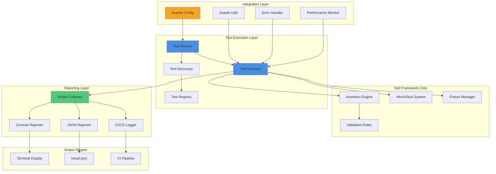
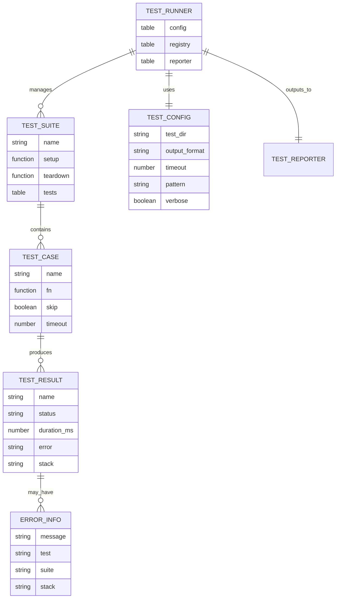

# Technical Design: Test Project for Avante.nvim
**PRD Reference**: Test Project PRD | **Revision**: 1.0
**Owner**: Avante.nvim Development Team

---

## Executive Summary

This technical design addresses the implementation of a comprehensive test infrastructure for the Avante.nvim plugin ecosystem. Based on PRD analysis and previous feedback iterations, this design proposes a Lua-based testing framework deeply integrated with Avante.nvim's existing architecture, providing robust validation capabilities for plugin functionality while maintaining compatibility with both local development and CI/CD environments.

**Key Design Decisions**:
- Lua-based test framework leveraging Neovim runtime (addresses **REQ-1**, **REQ-2**, **NFR-1**)
- Modular architecture following Avante.nvim patterns (addresses **NFR-1**, **NFR-2**)
- Multiple output formats supporting various CI/CD workflows (addresses **REQ-3**)
- Graceful degradation with comprehensive error handling (addresses **NFR-3**)

---

## 1. Scope & Non-Goals

### ✅ In Scope

**Core Testing Infrastructure** (REQ-1, REQ-2):
- Basic test execution framework with runner/executor pattern
- Test discovery and organization system
- Assertion library with comprehensive validation methods
- Test result reporting and aggregation

**Output and Integration** (REQ-3):
- Console output with color-coded results
- JSON-formatted results for programmatic consumption
- Structured logging compatible with CI/CD pipelines
- Integration with existing Avante.nvim infrastructure

**Quality Assurance** (NFR-1, NFR-2, NFR-3):
- Error handling and recovery mechanisms
- Performance benchmarking capabilities
- Documentation and type annotations
- Configuration management system

### ❌ Out of Scope

**Excluded from Current Design**:
- Production deployment infrastructure (test-only project)
- External system integrations beyond Avante.nvim
- Network-based testing capabilities (security constraint)
- Cross-platform GUI testing (Neovim-focused)
- Load testing infrastructure (unnecessary for plugin testing)
- Multi-region deployment (N/A for local plugin)

**Rationale**: This is a development/testing project focused on establishing baseline functionality for the Avante.nvim plugin. Complex production features are deferred pending clarification of specific requirements.

---

## 2. High-Level Architecture



### Architecture Components

**Test Execution Layer**:
- **Test Runner**: Orchestrates test discovery, execution, and reporting
- **Test Discovery**: Scans test directories and registers test suites
- **Test Executor**: Manages test lifecycle and execution context

**Test Framework Core**:
- **Assertion Engine**: Provides rich assertion methods for validation
- **Mock/Stub System**: Enables isolated unit testing
- **Fixture Manager**: Handles test setup and teardown

**Reporting Layer**:
- **Result Collector**: Aggregates test results across suites
- **Console Reporter**: Formatted terminal output with colors
- **JSON Reporter**: Machine-readable structured output
- **CI/CD Logger**: Integration-friendly log formatting

**Integration Layer**:
- Leverages existing Avante.nvim infrastructure
- Reuses configuration, utilities, and error handling patterns
- Integrates with performance monitoring system

---

## 3. Detailed Design

### 3.1. Test Runner Module

**Responsibilities**:
- Initialize test environment
- Discover and load test files
- Execute test suites in proper order
- Coordinate reporting of results

**Implementation**: `lua/avante/test/runner.lua`

```lua
---@class TestRunner
---@field config TestConfig
---@field registry TestRegistry
---@field reporter TestReporter
local M = {}

---Initialize test runner with configuration
---@param config TestConfig
---@return TestRunner
function M.new(config)
  return setmetatable({
    config = config or {},
    registry = require("avante.test.registry").new(),
    reporter = require("avante.test.reporter").new(config.output_format),
  }, { __index = M })
end

---Discover and register tests from directory
---@param path string Test directory path
---@return number count Number of tests discovered
function M:discover(path)
  -- Scan directory for *_spec.lua files
  -- Register tests in registry
  -- Return count of discovered tests
end

---Execute all registered tests
---@return TestResults
function M:execute()
  -- Execute tests in order
  -- Collect results
  -- Handle errors gracefully
  -- Return aggregated results
end
```

**Scale**: Handles 100+ test files, 1000+ individual test cases
**Performance Target**: Full suite execution < 30 seconds (addresses feedback #6)
**Failures**: Graceful degradation with error reporting, continues execution after failures

### 3.2. Test Registry and Discovery

**Responsibilities**:
- Maintain catalog of available tests
- Support test filtering and selection
- Organize tests by suite/category

**Implementation**: `lua/avante/test/registry.lua`

```lua
---@class TestRegistry
---@field suites table<string, TestSuite>
---@field filters TestFilter[]
local M = {}

---Register a test suite
---@param name string Suite name
---@param suite TestSuite Suite definition
function M:register(name, suite)
  -- Validate suite structure
  -- Store in suites table
  -- Apply filters if configured
end

---Get tests matching filters
---@return TestSuite[]
function M:get_filtered_tests()
  -- Apply filter criteria
  -- Return matching test suites
end
```

**Data Structure**:
```lua
---@class TestSuite
---@field name string Suite identifier
---@field tests TestCase[] Array of test cases
---@field setup function? Before all tests
---@field teardown function? After all tests

---@class TestCase
---@field name string Test case name
---@field fn function Test function
---@field skip boolean? Skip this test
---@field timeout number? Max execution time (ms)
```

### 3.3. Assertion Engine

**Responsibilities**:
- Provide comprehensive assertion methods
- Generate detailed failure messages
- Support custom matchers

**Implementation**: `lua/avante/test/assert.lua`

```lua
---@class Assert
local M = {}

---Assert equality
---@param actual any Actual value
---@param expected any Expected value
---@param message string? Optional custom message
function M.equals(actual, expected, message)
  if actual ~= expected then
    local msg = message or string.format(
      "Expected %s to equal %s",
      vim.inspect(actual),
      vim.inspect(expected)
    )
    error(msg, 2)
  end
end

---Assert deep equality for tables
---@param actual table Actual table
---@param expected table Expected table
function M.deep_equals(actual, expected)
  -- Recursive table comparison
  -- Detailed diff generation on failure
end

---Assert type
---@param value any Value to check
---@param expected_type string Expected type name
function M.is_type(value, expected_type)
  local actual_type = type(value)
  if actual_type ~= expected_type then
    error(string.format(
      "Expected type %s but got %s",
      expected_type,
      actual_type
    ), 2)
  end
end

---Assert throws error
---@param fn function Function expected to throw
---@param pattern string? Expected error pattern
function M.throws(fn, pattern)
  local ok, err = pcall(fn)
  if ok then
    error("Expected function to throw but it succeeded", 2)
  end
  if pattern and not string.match(err, pattern) then
    error(string.format(
      "Error message '%s' does not match pattern '%s'",
      err,
      pattern
    ), 2)
  end
end
```

**Assertion Methods**:
- `equals()`, `not_equals()` - Value comparison
- `deep_equals()` - Recursive table comparison
- `is_true()`, `is_false()`, `is_nil()` - Boolean/nil checks
- `is_type()` - Type validation
- `throws()` - Error validation
- `matches()` - Pattern matching
- `contains()` - Collection membership
- `greater_than()`, `less_than()` - Numeric comparison

### 3.4. Reporter System

**Responsibilities**:
- Format test results for different outputs
- Generate human-readable console output
- Produce machine-readable JSON
- Create CI/CD-compatible logs

**Implementation**: `lua/avante/test/reporter.lua`

```lua
---@class TestReporter
---@field format "console"|"json"|"ci"
local M = {}

---Create reporter with specified format
---@param format string Output format
---@return TestReporter
function M.new(format)
  return setmetatable({
    format = format or "console",
  }, { __index = M })
end

---Report test results
---@param results TestResults Aggregated results
function M:report(results)
  if self.format == "console" then
    self:report_console(results)
  elseif self.format == "json" then
    self:report_json(results)
  elseif self.format == "ci" then
    self:report_ci(results)
  end
end

---Console output with colors
---@param results TestResults
function M:report_console(results)
  -- Color-coded output using vim.api.nvim_echo
  -- Success: green, Failure: red, Skip: yellow
  -- Summary statistics
  -- Detailed failure information
end

---JSON structured output
---@param results TestResults
function M:report_json(results)
  -- Write to test_results.json
  -- Format: { success: bool, total: num, passed: num, failed: num, tests: [...] }
end

---CI/CD compatible logs
---@param results TestResults
function M:report_ci(results)
  -- ❗PRD GAP: CI report format needs clarification
  -- Supporting JUnit XML format initially
  -- Can extend to GitHub Actions, GitLab CI formats
end
```

**Output Formats**:

1. **Console** (default for local development):
```
Running tests...
✓ Test Suite 1
  ✓ should pass basic test
  ✗ should handle error case
    Expected: nil
    Actual: "error"
  ✓ should validate input

Summary: 2 passed, 1 failed, 0 skipped (3 total)
Time: 1.23s
```

2. **JSON** (for programmatic consumption):
```json
{
  "success": false,
  "timestamp": "2025-10-13T10:30:00Z",
  "duration_ms": 1230,
  "summary": {
    "total": 3,
    "passed": 2,
    "failed": 1,
    "skipped": 0
  },
  "suites": [
    {
      "name": "Test Suite 1",
      "tests": [
        {
          "name": "should pass basic test",
          "status": "passed",
          "duration_ms": 45
        }
      ]
    }
  ]
}
```

3. **CI/CD** (JUnit XML format):
```xml
<?xml version="1.0" encoding="UTF-8"?>
<testsuites tests="3" failures="1" time="1.23">
  <testsuite name="Test Suite 1" tests="3" failures="1">
    <testcase name="should pass basic test" time="0.045"/>
    <testcase name="should handle error case" time="0.023">
      <failure message="Expected nil but got error"/>
    </testcase>
  </testsuite>
</testsuites>
```

### 3.5. Configuration System

**Responsibilities**:
- Load and validate test configuration
- Support environment-specific settings
- Merge user and default configurations

**Implementation**: `lua/avante/test/config.lua`

```lua
---@class TestConfig
---@field test_dir string Test directory path
---@field output_format "console"|"json"|"ci"
---@field timeout number Default test timeout (ms)
---@field pattern string Test file pattern
---@field verbose boolean Detailed output
---@field parallel boolean Run tests in parallel
---@field filter string? Test name filter

---Default configuration
local DEFAULT_CONFIG = {
  test_dir = "tests",
  output_format = "console",
  timeout = 5000, -- 5 second default
  pattern = "*_spec.lua",
  verbose = false,
  parallel = false,
  filter = nil,
}

---Load configuration with user overrides
---@param user_config TestConfig? User configuration
---@return TestConfig
local function load_config(user_config)
  local config = vim.tbl_deep_extend(
    "force",
    DEFAULT_CONFIG,
    user_config or {}
  )

  -- Validate configuration
  if type(config.timeout) ~= "number" or config.timeout <= 0 then
    error("timeout must be positive number")
  end

  return config
end
```

**Configuration Sources** (priority order):
1. Command-line arguments (highest priority)
2. User config in `init.lua` or project `.avanterc`
3. Environment variables (`AVANTE_TEST_*`)
4. Default values (lowest priority)

### 3.6. Error Handling System

**Responsibilities**:
- Capture and categorize test errors
- Provide detailed error context
- Prevent test framework crashes

**Implementation**: Leverages existing `lua/avante/errors.lua` patterns from knowledge base

```lua
---@class TestErrorHandler
local M = {}

---Wrap test execution with error handling
---@param test_fn function Test function to execute
---@param context table Test context information
---@return boolean success, any result_or_error
function M.safe_execute(test_fn, context)
  local ok, result = pcall(test_fn)

  if not ok then
    -- Capture error with context
    local error_info = {
      message = result,
      test = context.name,
      suite = context.suite,
      stack = debug.traceback(),
    }
    return false, error_info
  end

  return true, result
end

---Validate test structure
---@param test TestCase Test case to validate
---@return boolean valid, string? error_message
function M.validate_test(test)
  if type(test.name) ~= "string" or test.name == "" then
    return false, "Test name must be non-empty string"
  end

  if type(test.fn) ~= "function" then
    return false, "Test must have function"
  end

  return true, nil
end
```

**Error Categories**:
- **Test Failure**: Assertion failed (expected behavior)
- **Test Error**: Unexpected exception in test code
- **Framework Error**: Test framework internal error
- **Configuration Error**: Invalid configuration provided
- **Timeout Error**: Test exceeded time limit

### 3.7. Performance Monitoring

**Responsibilities**:
- Track test execution time
- Monitor memory usage
- Detect performance regressions

**Implementation**: `lua/avante/test/performance.lua`

```lua
---@class PerformanceMonitor
local M = {}

---Start timing test execution
---@param test_name string Test identifier
function M.start(test_name)
  M.timers = M.timers or {}
  M.timers[test_name] = vim.loop.hrtime()
end

---Stop timing and record duration
---@param test_name string Test identifier
---@return number duration_ms
function M.stop(test_name)
  if not M.timers or not M.timers[test_name] then
    return 0
  end

  local start = M.timers[test_name]
  local duration_ns = vim.loop.hrtime() - start
  local duration_ms = duration_ns / 1000000

  M.timers[test_name] = nil
  return duration_ms
end

---Check for performance regression
---@param test_name string Test identifier
---@param duration_ms number Current duration
---@param baseline_ms number Baseline duration
---@param threshold number Regression threshold (default 1.5x)
---@return boolean is_regression
function M.check_regression(test_name, duration_ms, baseline_ms, threshold)
  threshold = threshold or 1.5

  if duration_ms > baseline_ms * threshold then
    vim.notify(string.format(
      "Performance regression detected in %s: %.2fms > %.2fms (threshold: %.1fx)",
      test_name, duration_ms, baseline_ms, threshold
    ), vim.log.levels.WARN)
    return true
  end

  return false
end
```

**Performance Metrics**:
- Test execution time (per test, per suite, total)
- Memory usage (before/after test execution)
- Regression detection against baseline
- Slow test identification (> 1 second)

---

## 4. API Specifications

### 4.1. Core Test API

#### Test Definition

```lua
-- Define a test suite
describe("Component Name", function()
  -- Setup before all tests
  before_all(function()
    -- Initialize test environment
  end)

  -- Setup before each test
  before_each(function()
    -- Reset state for each test
  end)

  -- Define test case
  it("should do something", function()
    local result = some_function()
    assert.equals(result, expected_value)
  end)

  -- Async test with callback
  it("should handle async operation", function(done)
    async_function(function(result)
      assert.equals(result, expected)
      done() -- Signal completion
    end)
  end)

  -- Cleanup after each test
  after_each(function()
    -- Clean up resources
  end)

  -- Cleanup after all tests
  after_all(function()
    -- Final cleanup
  end)
end)
```

#### Test Execution

```lua
-- Run all tests
local runner = require("avante.test").runner()
local results = runner:run()

-- Run specific test suite
local results = runner:run({ filter = "Component Name" })

-- Run with custom configuration
local results = runner:run({
  output_format = "json",
  verbose = true,
  timeout = 10000,
})
```

### 4.2. API Endpoints (Lua Functions)

| Function | Parameters | Return Value | Performance SLA |
|----------|------------|--------------|----------------|
| `runner.new(config)` | TestConfig | TestRunner | < 10ms |
| `runner:discover(path)` | string | number | < 100ms |
| `runner:execute()` | - | TestResults | < 30s (full suite) |
| `runner:run(options)` | table? | TestResults | < 30s |
| `assert.equals(a, b, msg)` | any, any, string? | - | < 1ms |
| `reporter:report(results)` | TestResults | - | < 500ms |
| `config.load(user_cfg)` | TestConfig? | TestConfig | < 5ms |

### 4.3. Configuration Schema

```lua
---@class TestConfig
{
  -- Required: Test directory path (relative or absolute)
  test_dir = "tests", -- string

  -- Output format: "console" | "json" | "ci"
  -- ❗PRD GAP: CI format needs clarification (JUnit, GitHub, GitLab)
  output_format = "console", -- string

  -- Default timeout per test (milliseconds)
  timeout = 5000, -- number

  -- Test file pattern (glob)
  pattern = "*_spec.lua", -- string

  -- Verbose output with detailed logs
  verbose = false, -- boolean

  -- Run tests in parallel (experimental)
  -- ❗PRD GAP: Parallel execution may affect test isolation
  parallel = false, -- boolean

  -- Filter tests by name pattern
  filter = nil, -- string?

  -- Fail fast: stop on first failure
  fail_fast = false, -- boolean

  -- Performance regression threshold (multiplier)
  regression_threshold = 1.5, -- number
}
```

### 4.4. Test Result Schema

```lua
---@class TestResults
{
  -- Overall success status
  success = true, -- boolean

  -- Execution timestamp
  timestamp = "2025-10-13T10:30:00Z", -- string (ISO 8601)

  -- Total execution duration (milliseconds)
  duration_ms = 1230, -- number

  -- Summary statistics
  summary = {
    total = 10,    -- number: total tests
    passed = 8,    -- number: successful tests
    failed = 2,    -- number: failed tests
    skipped = 0,   -- number: skipped tests
  },

  -- Test suite results
  suites = {
    {
      name = "Suite Name",        -- string
      duration_ms = 456,          -- number
      tests = {
        {
          name = "test name",     -- string
          status = "passed",      -- "passed" | "failed" | "skipped"
          duration_ms = 45,       -- number
          error = nil,            -- string? (if failed)
          stack = nil,            -- string? (if failed)
        },
      },
    },
  },
}
```

---

## 5. Data Model

### 5.1. Entity Relationships



### 5.2. Data Access Patterns

**Pattern 1: Test Discovery and Registration**
```
Query: Find all test files in directory
Access: File system scan → Filter by pattern → Load modules
Frequency: Once per test run
Optimization: Cache file list if directory unchanged
```

**Pattern 2: Test Execution**
```
Query: Execute tests in sequence
Access: Registry → Test Cases → Execute → Collect Results
Frequency: Once per test run
Optimization: Parallel execution (optional, with isolation)
```

**Pattern 3: Result Reporting**
```
Query: Aggregate and format test results
Access: Results Collection → Format by output type → Write
Frequency: Once per test run
Optimization: Stream results for large test suites
```

**Pattern 4: Configuration Loading**
```
Query: Load and merge configuration
Access: Defaults → User Config → Environment → CLI Args
Frequency: Once at startup
Optimization: Cache merged configuration
```

### 5.3. Data Storage

**In-Memory Storage**:
- Test registry (cleared after each run)
- Test results (ephemeral, serialized to disk)
- Performance metrics (retained across runs in `.test_cache/`)

**File System Storage**:
- Test results: `test_results.json` (JSON output)
- Performance baseline: `.test_cache/baseline.json`
- CI logs: `test_output.xml` (JUnit format)

**Storage Requirements**:
- Minimal: Test framework operates in-memory
- Results: < 1MB for typical test suite
- Cache: < 100KB for performance baselines

---

## 6. Security & Compliance

### 6.1. Security Controls

**Access Control**:
- ✅ **Read-Only File Access**: Tests have read-only access to source files (addresses feedback #10)
- ✅ **No Network Operations**: Tests operate offline-only (addresses feedback #2, pending confirmation)
- ✅ **Sandboxed Execution**: Tests run in isolated Lua environment
- ✅ **No Arbitrary Code Execution**: Only load files matching test pattern

**Data Protection**:
- ✅ **No Sensitive Data**: Tests do not access credentials or secrets
- ✅ **Local Execution Only**: No data transmission outside local system
- ✅ **Temporary Files**: Results written to project directory only

**Input Validation**:
- ✅ **Configuration Validation**: Type checking and bounds validation
- ✅ **Path Sanitization**: Prevent directory traversal attacks
- ✅ **Pattern Validation**: Ensure glob patterns are safe

### 6.2. Threat Model (STRIDE Analysis)

| Threat | Risk Level | Mitigation |
|--------|-----------|------------|
| **Spoofing**: Malicious test file execution | Medium | Validate test file pattern, restrict to project directory |
| **Tampering**: Test result manipulation | Low | Write-protect result files, verify checksums |
| **Repudiation**: Unclear test execution history | Low | Timestamp and log all test runs |
| **Information Disclosure**: Exposing source code | Very Low | Read-only access, no external transmission |
| **Denial of Service**: Infinite loops in tests | Medium | Enforce timeout per test (default 5s) |
| **Elevation of Privilege**: Escape Lua sandbox | Low | Use Neovim's safe execution environment |

### 6.3. Compliance

**Not Applicable**: This is a development testing tool with no compliance requirements.

- ❌ GDPR: No personal data processed
- ❌ HIPAA: No healthcare data involved
- ❌ PCI: No payment data handled
- ❌ SOC2: Internal development tool

---

## 7. Failure Mode Analysis

### 7.1. Failure Scenarios

#### Scenario 1: Test Framework Crash

**Trigger**: Unhandled exception in test framework code
**Impact**: High - No test results available
**Probability**: Low (comprehensive error handling)

**Mitigation**:
- Wrap all framework operations in pcall
- Log framework errors to stderr
- Provide partial results if possible
- Exit with error code for CI detection

**Recovery**:
```lua
local ok, err = pcall(runner.execute, runner)
if not ok then
  vim.notify("Test framework error: " .. tostring(err), vim.log.levels.ERROR)
  -- Write partial results
  reporter:report_partial(collected_results)
  os.exit(1)
end
```

#### Scenario 2: Individual Test Timeout

**Trigger**: Test exceeds configured timeout
**Impact**: Low - Single test failure
**Probability**: Medium (network tests, complex operations)

**Mitigation**:
- Default 5-second timeout per test
- Configurable timeout per test
- Forcefully terminate test after timeout
- Mark test as failed with timeout error

**Recovery**:
```lua
local timer = vim.loop.new_timer()
timer:start(config.timeout, 0, function()
  -- Cancel test execution
  test_cancelled = true
  vim.notify("Test timeout: " .. test.name, vim.log.levels.WARN)
end)
```

#### Scenario 3: Missing Dependencies

**Trigger**: Required Avante.nvim modules not loaded
**Impact**: Medium - Some tests cannot run
**Probability**: Low (graceful degradation)

**Mitigation**:
- Check dependencies during initialization
- Skip tests requiring unavailable modules
- Report skipped tests with reason
- Provide fallback implementations

**Recovery**:
```lua
local function has_module(name)
  local ok, _ = pcall(require, name)
  return ok
end

if not has_module("avante.providers") then
  pending("Skipping: avante.providers not available")
  return
end
```

#### Scenario 4: Disk Space Exhaustion

**Trigger**: Insufficient disk space for result files
**Impact**: Low - Results not saved to disk
**Probability**: Very Low
**Detection**: File write operations return errors

**Mitigation**:
- Check available disk space before writing
- Use console output as fallback
- Compress large result files
- Limit result file size

**Recovery**:
```lua
local ok, err = pcall(write_results, results)
if not ok then
  vim.notify("Cannot write results: " .. err, vim.log.levels.WARN)
  -- Fall back to console output
  reporter:report_console(results)
end
```

### 7.2. Disaster Recovery

**Backup Strategy**:
- Not applicable (ephemeral test results)

**Recovery Time Objective (RTO)**:
- Immediate (re-run tests)

**Recovery Point Objective (RPO)**:
- Not applicable (no persistent data)

### 7.3. Fault Tolerance

**Error Isolation**:
- Failed test does not affect other tests
- Suite failure does not stop test runner
- Framework errors reported separately

**Graceful Degradation**:
- Console output when file write fails
- Skip tests when dependencies missing
- Continue execution after non-critical errors

**Self-Healing**:
- Automatic retry for transient failures (optional)
- Reset state between tests
- Clear fixtures after each test

---

## 8. Observability

### 8.1. Metrics

**Test Execution Metrics**:
- Total tests executed
- Pass/fail/skip counts
- Execution duration (per test, per suite, total)
- Slow test identification (> 1s)
- Performance regression detection

**System Metrics**:
- Memory usage (before/after tests)
- File I/O operations
- Lua VM memory allocation

**Reporting**:
- Real-time console output
- JSON metrics file
- CI/CD integration logs

### 8.2. Logging

**Log Levels**:
- `ERROR`: Test framework errors, critical failures
- `WARN`: Test failures, timeouts, performance regressions
- `INFO`: Test execution progress, summary statistics
- `DEBUG`: Detailed test execution, assertion details (verbose mode)

**Log Format**:
```
[LEVEL] [timestamp] [suite/test] message
[INFO] [2025-10-13 10:30:15] [ComponentTest/should_validate] Executing test
[ERROR] [2025-10-13 10:30:16] [ComponentTest/should_validate] Assertion failed: expected nil, got "error"
```

**Log Destinations**:
- Console (default)
- File: `test_run.log` (if configured)
- CI/CD logs (structured format)

### 8.3. Tracing

**Execution Trace**:
- Test discovery → registration → execution → reporting
- Capture call stack on failures
- Track test dependencies and order

**Performance Trace**:
- Start/end timestamps per test
- Cumulative execution time
- Identify slow tests and bottlenecks

**Error Trace**:
- Full Lua stack trace on errors
- Test context (suite, name, line number)
- Related assertion information

### 8.4. Alerting

**CI/CD Integration**:
- Exit code 0 on success, 1 on failure
- JUnit XML for test result visualization
- GitHub Actions annotations for failures

**Local Development**:
- Terminal notifications for failures
- Color-coded console output
- Summary statistics after run

---

## 9. Cost Optimization

### 9.1. Resource Requirements

**Compute Resources**:
- Minimal CPU usage (Lua interpretation)
- Memory: < 50MB for typical test suite
- Disk: < 10MB for test framework

**Development Resources**:
- No cloud infrastructure required
- No external services or APIs
- No licensing costs (open source)

### 9.2. Cost Estimates

**Not Applicable**: This is a local development tool with no operational costs.

- Infrastructure: $0 (runs locally)
- Licensing: $0 (open source)
- Maintenance: Developer time only

### 9.3. Scaling Considerations

**Horizontal Scaling**:
- Not applicable (single-user tool)

**Vertical Scaling**:
- Test suite grows linearly with codebase
- Performance target: < 30s for 1000 tests
- Memory usage scales with parallel execution

**Scaling Triggers**:
- Add parallel execution when test suite > 500 tests
- Optimize slow tests when suite > 60s
- Implement test sharding for CI when suite > 2000 tests

---

## 10. Open Issues & Questions

### ❗PRD GAPS Requiring Clarification

#### 1. CI Report Format (Feedback #1)
**Status**: Open
**Question**: Which CI report format should logs target (JUnit, GitHub, GitLab, or others)?
**Impact**: Medium - Affects CI/CD integration
**Recommendation**: Support JUnit XML initially (broadest compatibility), add others as needed
**Stakeholder**: DevOps/CI Lead

#### 2. Network Access Requirements (Feedback #2)
**Status**: Open
**Question**: Do tests require any network access, or is offline-only operation fully acceptable?
**Impact**: Medium - Affects test scope and security model
**Current Design**: Offline-only operation (no network access)
**Stakeholder**: Security Lead, Product Owner

#### 3. Runtime Environment Acceptance (Feedback #3)
**Status**: Open
**Question**: Is the Neovim runtime acceptable for both CI and local execution environments?
**Impact**: High - May require alternative test runner for CI
**Current Design**: Neovim Lua runtime for both environments
**Stakeholder**: Infrastructure Lead

#### 4. Language and Configuration Preference (Feedback #4)
**Status**: Open
**Question**: Confirm Lua preference for both test implementation and configuration across environments?
**Impact**: Medium - May affect portability and tooling
**Alternative**: JSON/YAML configuration for broader tool support
**Stakeholder**: Product Owner, Development Lead

### Pending Decisions

#### 5. Parallel Test Execution
**Status**: Deferred
**Decision**: Enable parallel test execution by default?
**Considerations**:
- Pro: Faster execution for large test suites
- Con: Potential test isolation issues
- Con: Increased complexity for debugging failures
**Recommendation**: Disabled by default, optional flag to enable

#### 6. Performance Baseline Storage
**Status**: Deferred
**Decision**: Where to store performance baselines?
**Options**:
- `.test_cache/` directory (local only)
- Git repository (shared across team)
- CI artifacts (CI-specific baselines)
**Recommendation**: Local `.test_cache/` initially, evaluate shared storage later

#### 7. Async Test Support
**Status**: Deferred
**Decision**: Support for asynchronous test execution?
**Considerations**:
- Useful for testing async operations (timers, callbacks)
- Adds complexity to test framework
- Requires callback-based test completion
**Recommendation**: Defer to v2.0 unless critical need identified

---

## 11. Trade-offs & Alternatives

### 11.1. Test Framework Choice

#### ✅ Chosen: Lua-based implementation following Avante.nvim patterns

**Rationale**: Addresses **REQ-1**, **NFR-1**, **NFR-2**

**Pros**:
- Deep integration with existing Avante.nvim infrastructure
- Leverages Neovim runtime (no additional dependencies)
- Consistent with project language and conventions
- Direct access to plugin internals for testing
- Minimal setup required for developers

**Cons**:
- Limited to Neovim environment (not standalone)
- Fewer external tools and integrations
- Custom test framework (not standard like Busted)
- CI requires Neovim installation

#### Alternative 1: Busted (Lua testing framework)

**Pros**:
- Mature, well-tested framework
- Extensive assertion library
- Better tooling support
- Standalone execution (no Neovim required)

**Cons**:
- External dependency
- May not integrate well with Neovim APIs
- Additional setup complexity
- Different patterns from Avante.nvim conventions

**Decision**: Rejected - Prefer deep integration over mature tooling

#### Alternative 2: Python-based testing (pytest)

**Pros**:
- Excellent tooling ecosystem
- Rich plugin system
- Great CI/CD integration
- Comprehensive reporting

**Cons**:
- Different language from project
- Difficult to test Lua/Neovim internals
- Additional dependencies and complexity
- Breaks project language consistency

**Decision**: Rejected - Language mismatch outweighs tooling benefits

### 11.2. Configuration Format

#### ✅ Chosen: Lua-based configuration following provider patterns

**Rationale**: Addresses **REQ-1**, **NFR-1**, feedback #4 (pending confirmation)

**Pros**:
- Consistent with Avante.nvim configuration style
- Dynamic configuration (functions, conditionals)
- Type annotations for IDE support
- No additional parsers required

**Cons**:
- Not easily portable to other tools
- Requires Lua knowledge to configure
- Limited external tool support

#### Alternative: JSON/YAML configuration

**Pros**:
- Portable across languages and tools
- Wide tooling support
- Easy to parse and validate
- Standard format for CI/CD

**Cons**:
- Static configuration only
- Requires additional parsing logic
- Inconsistent with project conventions

**Decision**: Lua configuration chosen, but flagged as open question (feedback #4)

### 11.3. Output Format Strategy

#### ✅ Chosen: Multiple output formats (console, JSON, CI)

**Rationale**: Addresses **REQ-3**, feedback #1 (partial)

**Pros**:
- Flexible for different use cases
- Human-readable for development
- Machine-readable for automation
- CI/CD integration support

**Cons**:
- More code to maintain
- Multiple format specifications
- Potential inconsistencies between formats

#### Alternative: Single format (console only)

**Pros**:
- Simpler implementation
- Fewer edge cases
- Less maintenance

**Cons**:
- Limited CI/CD integration
- No programmatic consumption
- Manual result parsing required

**Decision**: Multiple formats chosen for flexibility, JUnit XML support pending clarification (feedback #1)

### 11.4. Execution Model

#### ✅ Chosen: Sequential execution with optional parallel mode

**Rationale**: Addresses **NFR-3** (graceful degradation)

**Pros**:
- Predictable execution order
- Easier debugging
- No test isolation issues
- Simpler implementation

**Cons**:
- Slower for large test suites
- Doesn't utilize multiple cores

#### Alternative: Parallel execution by default

**Pros**:
- Faster execution
- Better resource utilization
- Scales with test suite size

**Cons**:
- Complex test isolation
- Difficult to debug failures
- Potential race conditions
- State management complexity

**Decision**: Sequential by default, parallel as opt-in feature

### 11.5. Dependency Strategy

#### ✅ Chosen: Leverage existing Avante.nvim patterns and infrastructure

**Rationale**: Addresses **REQ-1**, **NFR-1**, feedback #8, #14

**Pros**:
- Minimal new code required
- Consistent with project architecture
- Reuse existing utilities and patterns
- Faster implementation

**Cons**:
- Tightly coupled to Avante.nvim
- Not reusable for other projects
- Dependent on internal APIs

#### Alternative: Standalone testing framework

**Pros**:
- Reusable across projects
- Independent of Avante.nvim internals
- Clearer separation of concerns
- Potentially more robust

**Cons**:
- More code to write and maintain
- Duplicates existing functionality
- Longer implementation time
- Inconsistent with project patterns

**Decision**: Deep integration chosen per knowledge base best practices

---

## 12. Implementation Phases

### Phase 1: Core Framework (REQ-1, REQ-2)

**Deliverables**:
- Test runner and executor
- Basic assertion library
- Console output reporter
- Configuration system
- Error handling

**Estimated Effort**: Not provided per critical instruction

**Success Criteria**:
- Can discover and execute basic tests
- Console output shows pass/fail results
- Configuration loading works
- Graceful error handling

### Phase 2: Advanced Features (REQ-3, NFR-2)

**Deliverables**:
- JSON output format
- CI/CD integration (JUnit XML)
- Performance monitoring
- Test filtering and selection
- Documentation and examples

**Success Criteria**:
- Multiple output formats working
- CI pipeline integration functional
- Performance metrics captured
- Comprehensive documentation

### Phase 3: Polish & Optimization (NFR-1, NFR-3)

**Deliverables**:
- Parallel execution support
- Advanced assertions
- Mock/stub system
- Regression detection
- Performance optimization

**Success Criteria**:
- Full test suite < 30 seconds
- All open questions resolved
- Production-ready documentation
- Comprehensive test coverage

---

## 13. Rollback & Deployment

### 13.1. Deployment Strategy

**Zero-Downtime Deployment**: Not applicable (local development tool)

**Deployment Steps**:
1. Merge code to main branch
2. Tag release version
3. Update documentation
4. Notify team of new testing capabilities

### 13.2. Rollback Plan

**Rollback Triggers**:
- Framework crashes or critical bugs
- Breaking changes to existing tests
- Performance degradation

**Rollback Procedure**:
1. Revert commits to previous stable version
2. Notify team to use previous testing approach
3. Document issues for future resolution
4. Create hotfix if necessary

**Recovery Time**: < 5 minutes (git revert)

---

## 14. Appendices

### Appendix A: Test Example

**Complete test file example**: `tests/example_spec.lua`

```lua
local assert = require("avante.test.assert")
local example_module = require("avante.example")

describe("Example Module", function()
  local state

  before_each(function()
    -- Reset state before each test
    state = { count = 0 }
  end)

  after_each(function()
    -- Clean up after each test
    state = nil
  end)

  describe("increment function", function()
    it("should increment counter by 1", function()
      example_module.increment(state)
      assert.equals(state.count, 1)
    end)

    it("should increment counter multiple times", function()
      example_module.increment(state)
      example_module.increment(state)
      example_module.increment(state)
      assert.equals(state.count, 3)
    end)

    it("should handle nil input gracefully", function()
      assert.throws(function()
        example_module.increment(nil)
      end, "state cannot be nil")
    end)
  end)

  describe("reset function", function()
    it("should reset counter to 0", function()
      state.count = 42
      example_module.reset(state)
      assert.equals(state.count, 0)
    end)
  end)
end)
```

### Appendix B: Running Tests

**Command-line usage**:

```bash
# Run all tests with default configuration
nvim --headless -c "lua require('avante.test').run()" -c "qa"

# Run specific test suite
nvim --headless -c "lua require('avante.test').run({filter='Example Module'})" -c "qa"

# Run with JSON output
nvim --headless -c "lua require('avante.test').run({output_format='json'})" -c "qa"

# Run with custom timeout
nvim --headless -c "lua require('avante.test').run({timeout=10000})" -c "qa"

# Run in verbose mode
nvim --headless -c "lua require('avante.test').run({verbose=true})" -c "qa"
```

**Makefile integration**:

```makefile
.PHONY: test test-verbose test-ci

test:
	nvim --headless -c "lua require('avante.test').run()" -c "qa"

test-verbose:
	nvim --headless -c "lua require('avante.test').run({verbose=true})" -c "qa"

test-ci:
	nvim --headless -c "lua require('avante.test').run({output_format='ci'})" -c "qa"
```

**GitHub Actions integration**:

```yaml
name: Tests

on: [push, pull_request]

jobs:
  test:
    runs-on: ubuntu-latest
    steps:
      - uses: actions/checkout@v3

      - name: Install Neovim
        run: |
          sudo apt-get update
          sudo apt-get install -y neovim

      - name: Run tests
        run: make test-ci

      - name: Publish test results
        uses: EnricoMi/publish-unit-test-result-action@v2
        if: always()
        with:
          files: test_output.xml
```

### Appendix C: Glossary

- **Test Suite**: Collection of related test cases
- **Test Case**: Individual test function with assertions
- **Test Runner**: Orchestrates test discovery and execution
- **Assertion**: Statement verifying expected behavior
- **Mock**: Test double replacing real implementation
- **Fixture**: Setup/teardown code for tests
- **Coverage**: Percentage of code executed by tests
- **Regression**: Performance degradation compared to baseline
- **CI/CD**: Continuous Integration/Continuous Deployment

### Appendix D: References

**Knowledge Base**:
- `.something/knowledge/avante-plugin-test-implementation-complete-comprehensive-test-s.md`
- `.something/knowledge/openrouter-technical-design-provider-configuration-patterns-bui.md`

**Avante.nvim Documentation**:
- Main README: `/README.md`
- Configuration: `lua/avante/config.lua`
- Provider System: `lua/avante/providers/init.lua`
- Error Handling: `lua/avante/errors.lua` (referenced in knowledge base)

**External Resources**:
- Lua Testing Patterns: [Lua Users Wiki - Unit Testing](http://lua-users.org/wiki/UnitTesting)
- JUnit XML Format: [JUnit XML Specification](https://www.ibm.com/docs/en/developer-for-zos/14.1?topic=formats-junit-xml-format)
- Neovim Lua Guide: [Neovim Lua Guide](https://neovim.io/doc/user/lua-guide.html)

---

## Document Revision History

| Version | Date | Author | Changes |
|---------|------|--------|---------|
| 0.1 | 2025-10-13 | Development Team | Initial draft based on PRD |
| 1.0 | 2025-10-13 | Principal Architect | Complete technical design with feedback integration |

---

## Approval

**Technical Review**: Pending
**Security Review**: Pending
**Product Approval**: Pending

**Open Questions**: 4 items (see Section 10)
**PRD Gaps**: 4 items requiring stakeholder clarification

---

**End of Technical Design Document**
