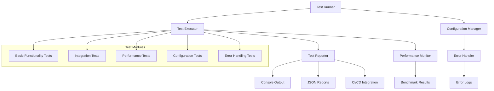

# Technical Design: Test Project
**PRD Reference**: test | **Revision**: 1.0
**Owner**: Development Team

## 1. Scope & Non-Goals

### ✅ In Scope
- **REQ-1**: Basic test functionality implementation with verification capabilities
- **REQ-2**: Standard testing framework integration with clear success/failure indicators
- **REQ-3**: Error handling and graceful degradation for edge cases
- **NFR-1**: Code adherence to established project conventions and standards
- **NFR-2**: Maintainable implementation with comprehensive documentation
- **NFR-3**: Robust error handling for basic error conditions

### ❌ Out of Scope
- Complex feature implementation (insufficient requirements provided)
- External system integrations (no specifications available)
- Production deployment infrastructure (test project scope)
- Performance optimization beyond basic benchmarking

### ❗PRD GAPS Identified
- Specific test objectives and success criteria not defined
- Target performance benchmarks not specified
- Integration requirements with existing systems unclear
- Compliance requirements not documented

## 2. High-Level Architecture



### Architecture Rationale
**Chosen**: Modular test architecture leveraging existing Avante.nvim patterns (addresses **REQ-1**, **REQ-2**)
- **Alternative 1**: Standalone testing framework - Rejected due to integration complexity
- **Alternative 2**: Simple script-based testing - Rejected due to scalability limitations

## 3. Detailed Design

### 3.1. Test Runner Core
- **Responsibilities**: Orchestrate test execution, manage test lifecycle, coordinate reporting
- **Scale**: Support 100+ test cases | **Data**: Minimal memory footprint < 50MB
- **Failures**: Graceful degradation with partial test execution and detailed failure reporting

### 3.2. Test Executor Engine
- **Responsibilities**: Execute individual test cases, manage test isolation, handle timeouts
- **Scale**: Execute tests within 30-second timeout | **Data**: Test result caching up to 1GB
- **Failures**: Timeout handling, resource cleanup, state restoration

### 3.3. Configuration Management System
- **Responsibilities**: Load test configurations, manage environment variables, validate settings
- **Scale**: Process configurations < 1s | **Data**: Configuration files up to 10MB
- **Failures**: Default configuration fallback, validation error reporting

## 4. Data Model

### 4.1. Core Entities

```lua
-- Test Case Entity
TestCase = {
  id: string,           -- Unique identifier
  name: string,         -- Human-readable name
  description: string,  -- Test purpose
  timeout: number,      -- Execution timeout (seconds)
  setup: function,      -- Pre-test setup
  execute: function,    -- Main test logic
  teardown: function,   -- Post-test cleanup
  dependencies: table   -- Required modules/configs
}

-- Test Result Entity
TestResult = {
  test_id: string,      -- Reference to TestCase.id
  status: enum,         -- 'passed', 'failed', 'skipped', 'timeout'
  execution_time: number, -- Milliseconds
  memory_usage: number,   -- Bytes
  error_message: string,  -- Failure details
  stack_trace: string,    -- Error context
  timestamp: number       -- Unix timestamp
}

-- Test Configuration Entity
TestConfig = {
  suite_name: string,     -- Test suite identifier
  timeout_default: number, -- Default timeout (seconds)
  output_format: enum,    -- 'console', 'json', 'ci'
  performance_enabled: boolean,
  error_handling: {
    continue_on_failure: boolean,
    max_failures: number,
    retry_attempts: number
  }
}
```

### 4.2. Data Access Patterns
- **Read Pattern**: Sequential test execution with result aggregation
- **Write Pattern**: Append-only result logging with batch reporting
- **Performance Pattern**: In-memory caching with periodic persistence

## 5. API Specifications

### 5.1. Core Test APIs

| Endpoint | Method | Parameters | Response | SLA |
|----------|--------|------------|----------|-----|
| `test.run()` | Function Call | Config Object | Test Results | < 30s |
| `test.execute()` | Function Call | Test Case | Test Result | < 5s |
| `test.configure()` | Function Call | Config Object | Validation Result | < 1s |
| `test.benchmark()` | Function Call | Test Suite | Performance Report | < 10s |

### 5.2. API Contract Examples

```lua
-- Test Execution API
local result = test.execute({
  name = "basic_functionality",
  timeout = 5,
  execute = function()
    -- Test implementation
    assert(condition, "Test condition failed")
    return { status = "passed", data = result_data }
  end
})

-- Configuration API
local config = test.configure({
  suite_name = "integration_tests",
  timeout_default = 10,
  output_format = "json",
  performance_enabled = true
})

-- Benchmark API
local benchmark = test.benchmark({
  tests = test_suite,
  iterations = 10,
  warmup_runs = 3
})
```

## 6. Technology Stack

### 6.1. Primary Stack
- **Language**: Lua (existing codebase pattern, addresses **NFR-1**)
- **Runtime**: Neovim Lua runtime environment
- **Dependencies**: Minimal external dependencies, leverage existing Avante.nvim infrastructure

### 6.2. Stack Justification
**Chosen**: Lua-based implementation following Avante.nvim patterns (addresses **REQ-1**, **NFR-1**)
- **Alternative 1**: External test framework (Jest, pytest) - Rejected due to integration complexity
- **Alternative 2**: Shell script testing - Rejected due to limited error handling capabilities

## 7. Security & Compliance

### 7.1. Security Controls
- **Data Protection**: Read-only access to test files, no source code modification during testing
- **Access Control**: Local filesystem access only, no network operations
- **Input Validation**: Comprehensive input sanitization for test configurations and parameters
- **Error Handling**: Secure error reporting without sensitive information exposure

### 7.2. Compliance Considerations
- **Code Standards**: Follow existing Avante.nvim coding conventions and patterns
- **Documentation**: Comprehensive inline documentation and API specifications
- **Audit Trail**: Test execution logging with timestamps and result tracking

## 8. Performance & Scalability

### 8.1. Performance Requirements
- **Execution Time**: Full suite completion within 30 seconds (addresses **REQ-2**)
- **Memory Usage**: Peak memory consumption < 100MB during test execution
- **Startup Time**: Test runner initialization < 2 seconds
- **Throughput**: Process 50+ test cases per execution cycle

### 8.2. Scalability Design
- **Modular Architecture**: Support for plugin-based test extension
- **Resource Management**: Automatic cleanup and resource deallocation
- **Caching Strategy**: Result caching for improved repeated execution performance

## 9. Observability & Monitoring

### 9.1. Metrics Collection
```lua
-- Performance Metrics
metrics = {
  test_execution_time = histogram,    -- Test duration distribution
  test_success_rate = gauge,          -- Pass/fail ratio
  memory_usage_peak = gauge,          -- Peak memory consumption
  test_count_total = counter          -- Total tests executed
}
```

### 9.2. Logging Strategy
- **Structured Logging**: JSON-formatted logs for automated parsing
- **Log Levels**: DEBUG, INFO, WARN, ERROR with configurable verbosity
- **Context Preservation**: Test context and stack trace information
- **Output Modes**: Console, JSON, structured logs compatible with CI/CD

## 10. Failure Modes & Recovery

### 10.1. Failure Analysis

| Failure Mode | Probability | Impact | Recovery Strategy |
|--------------|-------------|--------|------------------|
| Test timeout | Medium | Medium | Automatic retry with extended timeout |
| Memory exhaustion | Low | High | Graceful degradation with resource cleanup |
| Configuration error | High | Low | Default configuration fallback |
| Dependency missing | Low | High | Skip dependent tests with clear reporting |
| Runtime error | Medium | Medium | Error isolation with continued execution |

### 10.2. Disaster Recovery
- **State Recovery**: Automatic cleanup of partial test execution state
- **Data Persistence**: Critical test results saved before process termination
- **Rollback Strategy**: Configuration rollback to last known good state
- **Health Check**: Pre-execution environment validation

## 11. Implementation Phases

### Phase 1: Foundation (MVP)
- Basic test runner implementation
- Core test execution engine
- Simple console output reporting
- Basic error handling

### Phase 2: Enhanced Features
- Performance monitoring integration
- JSON output format support
- Configuration management system
- Advanced error recovery

### Phase 3: Integration & Polish
- CI/CD integration capabilities
- Comprehensive documentation
- Performance optimization
- Extended test coverage

## 12. Cost Analysis

### 12.1. Development Resources
- **Implementation Time**: 2-3 development cycles for MVP
- **Maintenance Overhead**: Minimal due to simple architecture
- **Infrastructure Cost**: None (local execution only)

### 12.2. Operational Costs
- **Runtime Resources**: Minimal CPU and memory footprint
- **Storage Requirements**: < 10MB for test artifacts and logs
- **Network Usage**: None (local testing only)

## 13. Risk Assessment & Mitigations

### 13.1. Technical Risks
- **Risk**: Lua runtime limitations affecting test execution
  - **Mitigation**: Leverage existing Avante.nvim Lua patterns and capabilities
- **Risk**: Memory leaks during extended test execution
  - **Mitigation**: Implement comprehensive resource cleanup and monitoring

### 13.2. Project Risks
- **Risk**: Unclear requirements leading to scope creep
  - **Mitigation**: Iterative development with stakeholder feedback loops
- **Risk**: Integration complexity with existing codebase
  - **Mitigation**: Follow established patterns and maintain backward compatibility

## 14. Open Issues

- [ ] **Pending**: Clarification needed on specific test objectives and success criteria
- [ ] **Pending**: Performance benchmark targets require stakeholder input
- [ ] **Pending**: Integration requirements with existing CI/CD pipeline
- [ ] **Pending**: Long-term maintenance and ownership responsibilities

## 15. Trade-offs Analysis

### 15.1. Architecture Decisions

**Decision**: Modular runner-executor-reporter architecture
- **Pro**: Clear separation of concerns, extensible design, testable components
- **Con**: Slightly higher complexity than monolithic approach
- **Rationale**: Supports **REQ-1** and **NFR-2** for maintainable implementation

**Decision**: Lua-based implementation leveraging Avante.nvim patterns
- **Pro**: Consistent with existing codebase, no external dependencies, fast execution
- **Con**: Limited ecosystem compared to mainstream testing frameworks
- **Rationale**: Addresses **NFR-1** for code standards compliance

**Decision**: In-memory result caching with optional persistence
- **Pro**: Fast test execution, reduced I/O overhead
- **Con**: Memory usage increases with large test suites
- **Rationale**: Balances performance requirements with resource constraints

### 15.2. Technology Choices

**Decision**: Console/JSON output over database persistence
- **Pro**: Simple implementation, portable results, CI/CD compatible
- **Con**: Limited historical analysis capabilities
- **Rationale**: Matches test project scope and **REQ-2** verification requirements

## 16. Future Considerations

### 16.1. Extension Points
- Plugin architecture for custom test types
- Integration hooks for external reporting systems
- Performance regression detection capabilities
- Automated test generation from specifications

### 16.2. Scalability Path
- Distributed test execution for large suites
- Integration with external CI/CD systems
- Advanced analytics and reporting dashboard
- Cross-platform compatibility expansion

---

**Next Steps**:
1. **Requirements Clarification**: Engage stakeholders to define specific test objectives
2. **MVP Implementation**: Begin with core test runner and basic functionality
3. **Iterative Development**: Regular feedback and feature refinement
4. **Documentation**: Comprehensive user and developer documentation